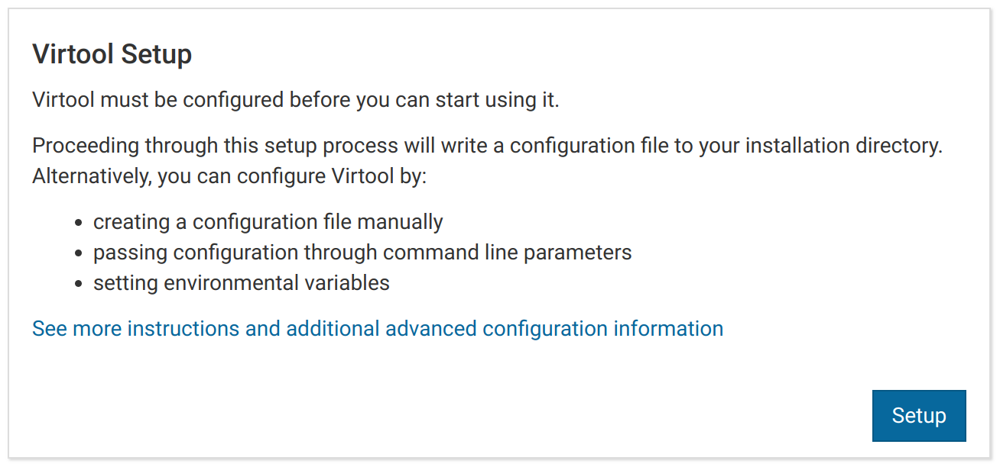
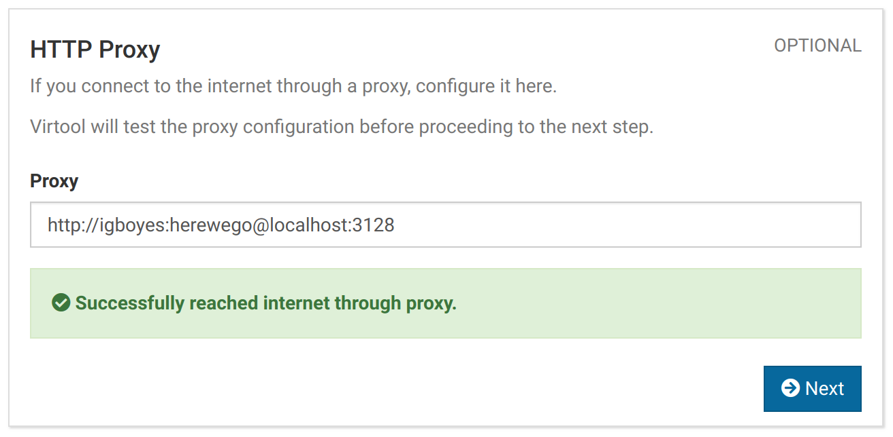
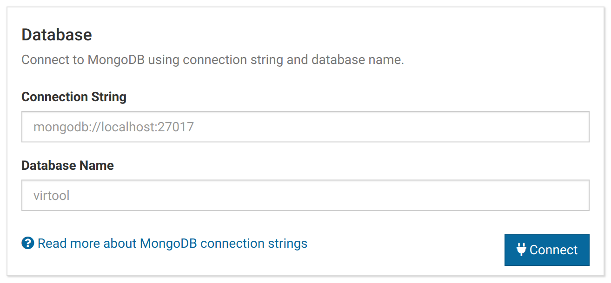
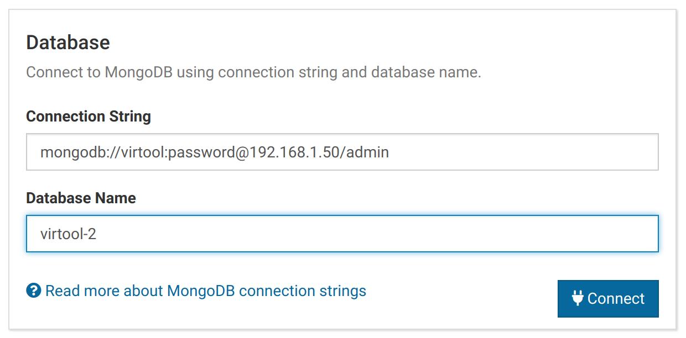
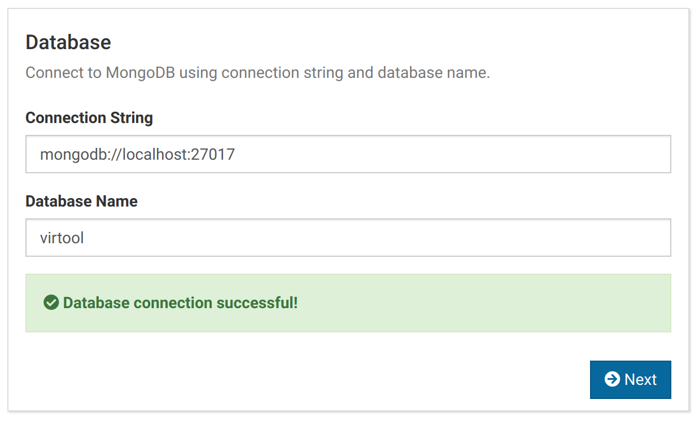
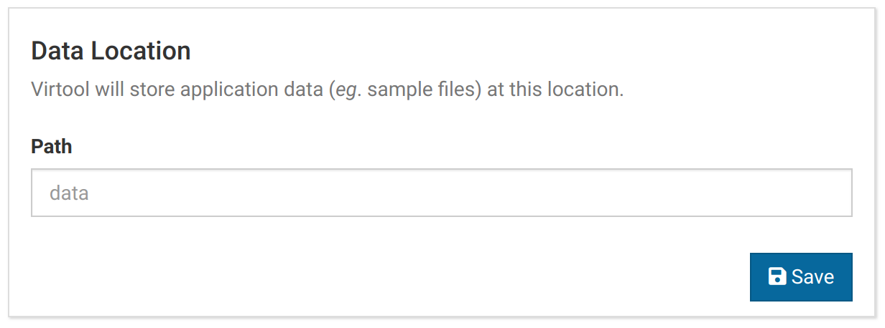
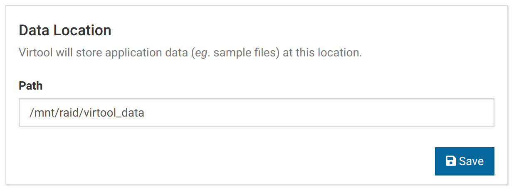
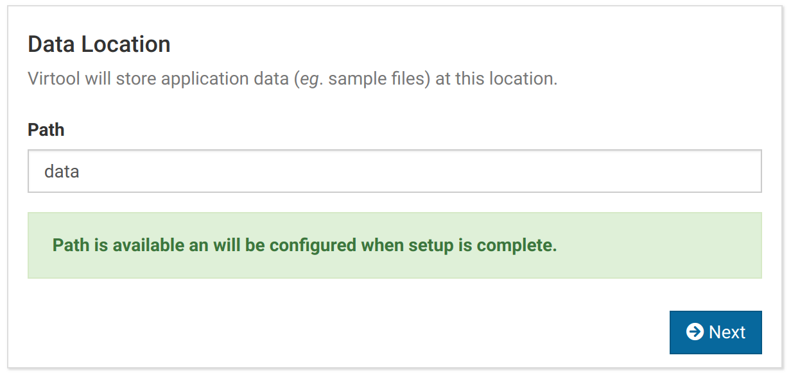
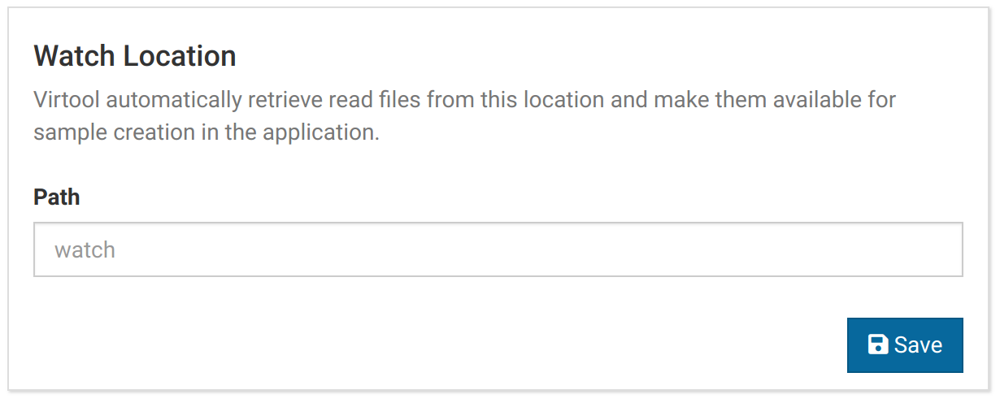
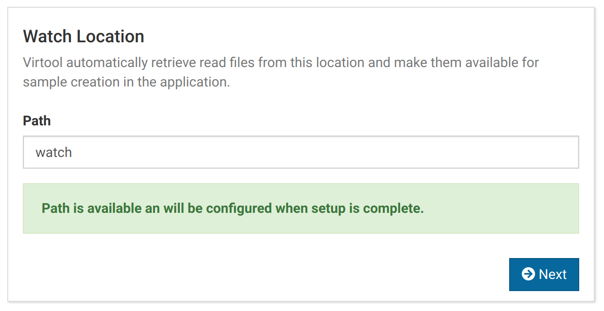

# Run

After installing Virtool, the server can be started by issuing the following command in the Virtool install directory.

```shell
./run
```

Use `./run --help` to see an overview of additional command line arguments Virtool can accept.

By default, the server listens at `localhost:9950`. When you visit this address for the first time, you will have to complete a one-time setup interface.



This will allow you to configure the essential settings required for Virtool to run. Click the _Setup_ button to begin.

# Connect to a Proxy

If you connect to the internet through a proxy, you can configure it here.

**You can skip this step if you don't use a proxy**.



{}
HTTPS proxies are not currently supported.
{}

# Connect to MongoDB

MongoDB must be [installed and running](setup.md#MongoDB) before you can use Virtool.

Once MongoDB is ready, you can configure a connection to it using a [MongoDB connection string and database name](https://docs.mongodb.com/manual/reference/connection-string). When setup is complete, a new database will be created using the provided name.



The placeholder values can be used by clicking <i class="fas fa-plug"></i> **Connect** without changing the form. You can also specify a different address, authentication, or authentication database for your connection by changing the connection string.

Virtool will return and error if there is already a database with the provided **Database Name**.



You will see something like the following when the connection is successful:



{}

We highly recommend enabling authentication for MongoDB.

The MongoDB connection string is stored in plaintext in the application configuration file. [Configure Virtool using environmental variables](/docs/manual/gs_configuration) to keep your connection string safe.

{}

# Add First User {#first_user}

An administrative user account must be created during setup. After setup, this account can be used to add more user accounts and populate Virtool with data. The first user account can be added using the following form.


When the form has been submitted successfully, you should see something like this:


{}
We strongly recommend **not** making this account a generic adminstrative account. Doing so defeats Virtool's built-in auditing, which is designed in accordance with [ISO 17025:2005](https://www.iso.org/standard/39883.html). Each account should correspond to an individual user.
{}

# Set Data Location {#data_path}

The data location is where Virtool stores bioinformatic data including uploaded Illumina libraries, imported sample data, and reference indexes. The path should be located on a storage device that offers good speed, capacity, and redundancy.

Paths beginning with `/` will be assumed to be absolute paths. All other paths will be interpreted relative to the Virtool installation directory.



By default the path will be set to `data` and will be created in the Virtool installation directory. This configuration should only be used for testing purposes. Use a path on a separate RAID volume or network attached storage (NAS) to store data securely.



When the data path has been successfully configured, you should see something like this:



{}

**Errors will occur if:**

- the executing user does not have permission to write to the data path
- the data path already exists and is not empty

{}

# Set Watch Location {#watch_path}

The primary method for making Illumina FASTQ files available to Virtool for sample creation is by uploading them through the web interface.

It is also possible to set a path accessible to the server that will be watched for new read files. Any FASTQ files dropped in this watch directory will be pulled into Virtool and made available for sample creation.

By default the data path will be set to `watch` and will be created in the Virtool installation directory.



When the watch location has been successfully configured, you will see something like this:



{}
Files dropped in the watch directory will be removed once they have been pulled into Virtool. Do not place your only copy of a sample FASTQ file in the watch path.

There is an [issue open on GitHub](https://github.com/virtool/virtool/issues/1284) to change this.
{}

# Save and Restart

Once all setup sections have been completed, a summary will be displayed and a <i class="fas fa-redo-alt"></i> **Save and Restart** button will be be enabled.

Clicking the button will apply all of the summarized actions and restart the server. You can login for the first time with the user profile you created during setup.

# Manual Setup

It is possible to configure Virtool without completing the graphical setup process.

Passing the `--no-setup` argument when running Virtool will skip the setup process and use default configuration values or values from [manual configuration sources](/docs/manual/gs_configuration/).

{}
**It is not currently possible to create a user outside of setup.** [This will be fixed in the near future](https://github.com/virtool/virtool/issues/1314).

For now, run the graphical setup to configure a user, then reconfigure Virtool manually.
{}
