# View Administration

1. Click on your username in the navigation bar

    A dropdown menu will appear.

    

2. Click on **Administration**

    The following view will appear. Here, you can modify application settings, manage users, and apply Virtool software updates.

    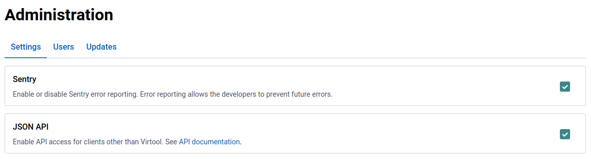

# Settings

Settings are used to control application behaviour. Virtool currently has very simple settings.

## Sentry

[Sentry](https://sentry.io) is a service Virtool developers use for automatically gathering error reports from Virtool instances.

It is possible to opt out of sending error reports by unchecking the Sentry option. This change requires a server reload to take effect.

**Please consider leaving this setting enabled as it is invaluable for fixing bugs and improving the user experience.**

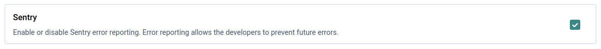

## API

Virtool can expose an HTTP JSON API that enables integration with other services or automation using tools such as `curl`.

Make sure the **JSON API** option is checked to enable the API. This change requires a server reload to take effect.

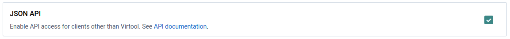

# Users

Managing users is complex enough that it has its own section. See the [Users Guide](/docs/manual/ug_users) for more information.

# View Updates

1. Check the navigation bar to see if an update is available

    An update is available when the  icon visible in the main navigation bar:

    

2. Clicking the  icon or navigate to **Administration | Updates**

    You will see further information about the update(s).

    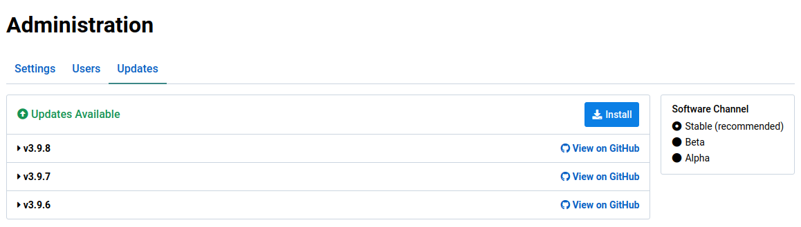

3. Click on an update to see the release notes

    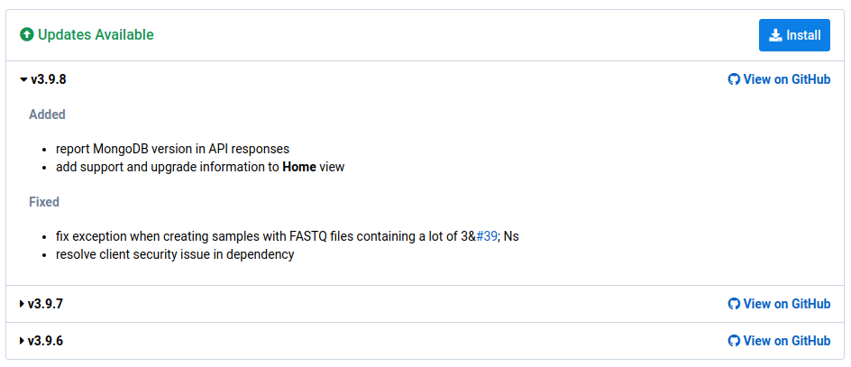

# Install Updates

1. Navigate to the **Home** view and note the current version

    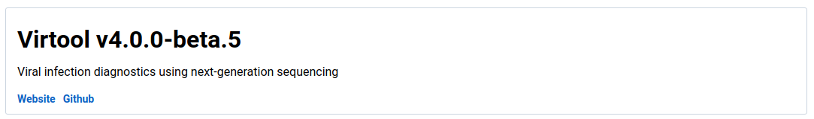

2. Navigate to the **Administration | Updates** view

    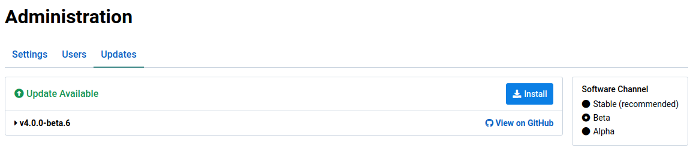

3. Click the  button

    This will open the update install dialog. It shows the changes that will be applied as a result of applying the update.

    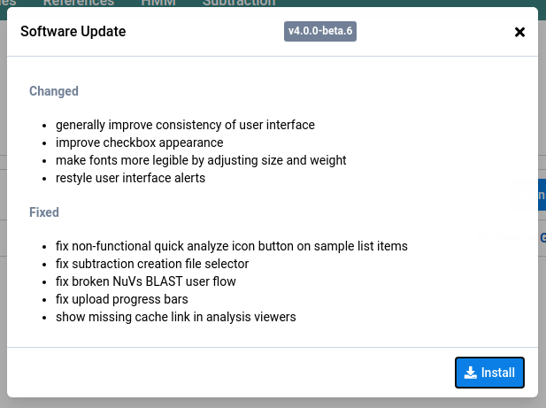

4. Click the  button to install the updates

    A progress dialog will appear and advance as the download and install of the update progresses.

    

5. Virtool will restart when the update process is complete.

    This can take some time because application data is updated for the new version on start. The required time depends on the size of the Virtool instance database.

    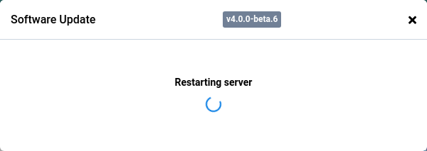

    The updates view will look something like this when the instance is up-to-date:

    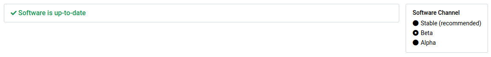

6. Check that the installation version is up-to-date after the server restart.

    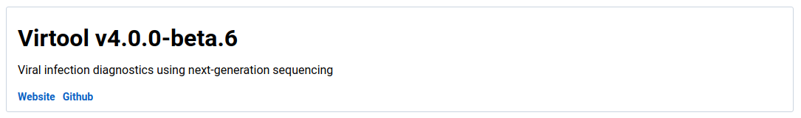

# Set Update Channel

Changing update channels allow your Virtool instance to apply updates that are not quite ready for production.

The _alpha_ and _beta_ channels should only be used by Virtool developers, testers, or advanced users.

| Channel | Description                                                                          |
| ------- | ------------------------------------------------------------------------------------ |
| stable  | appropriate for most Virtool users; production tested by Virtool developers          |
| beta    | feature-complete but still requires fixes and polish for stable release              |
| alpha   | contains bugs or missing functionality that can compromise your data or installation |

1. Navigate to the **Home** view and note the current version

    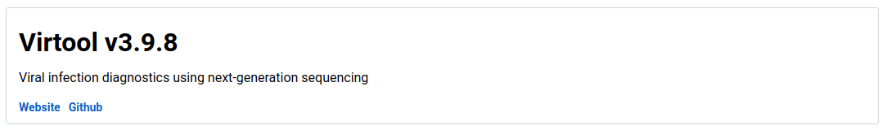

2. Navigate to the **Administration | Updates** view

    Only **Stable** updates will be shown when that channel is selected. In this case, v3.9.8 is the latest **stable** release.

    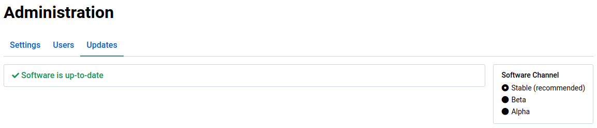

3. Select the **Beta** channel

    This will allow updates on the **beta** channel to be shown and installed. When the channel is changed, beta releases for v4.0.0 are shown. These updates have been released since v3.9.8.

    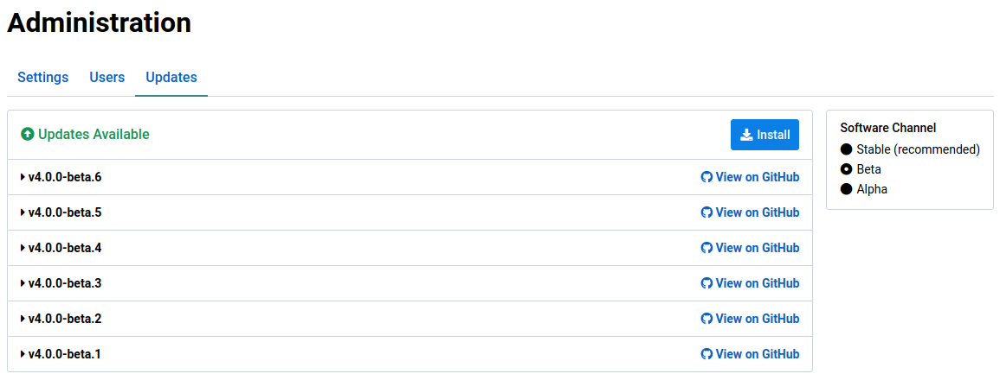

# Versioning

The Virtool project uses [semantic versioning](https://semver.org/). A Virtool version number looks like this: **v3.2.1**.

| Number | Description                                                     | Backwards Compatible |
| ------ | --------------------------------------------------------------- | :------------------: |
| 3      | the MAJOR version; not backwards compatbile with older versions |          No          |
| 2      | the MINOR version; introduces major feature changes or fixes    |         Yes          |
| 1      | the PATCH version; bug fixes with no features introduced        |         Yes          |


Using the built-in update manager will ensure that only compatible updates are applied.

You only have to worry about update versions if you are running Virtool in a non-standard manner such as Docker or you are manually updating (not recommended).


By _backwards compatible_, we mean that the version can use data generated by a previous version of Virtool with the same MAJOR version. For example:

>  v3.2.1 → v3.1.2

>  v3.2.1 → v3.0.1

>  v3.2.1 → v2.3.4

>  v3.2.1 → v1.2.1

The only exception to this rule is the first release of a new MAJOR version (_eg_. v4.0.0). The first release of a new major version is backwards compatible with the previous major version.

During the first start of the software update, the database and data files will be updated for compatiblility with future releases of the new MAJOR version (_eg._ 4.1.0).

## Examples

 _Upgrading v3.12.2 to v4.0.0_

This works because the first release of a new MAJOR version is backwards compatible with the previous MAJOR version (v3=).

 _Upgrading v3.12.2 to v4.1.0_

This does not work because **only** the first release of a new MAJOR version (v4.0.0) is backwards compatible with the previous MAJOR version (v3.\*.\*).

 _Upgrading v2.12.5 to v4.0.0_

This does not work because the first release of a new MAJOR version (v4.0.0) is backwards only with the previous MAJOR version (v3.\*.\*).
