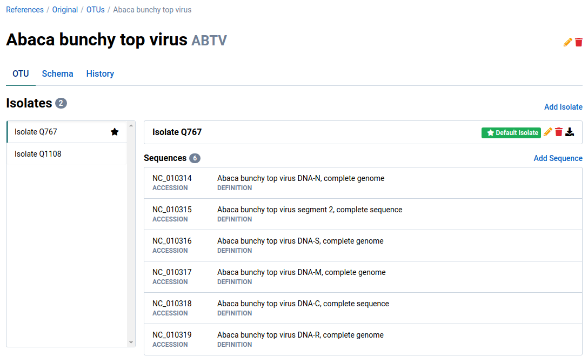
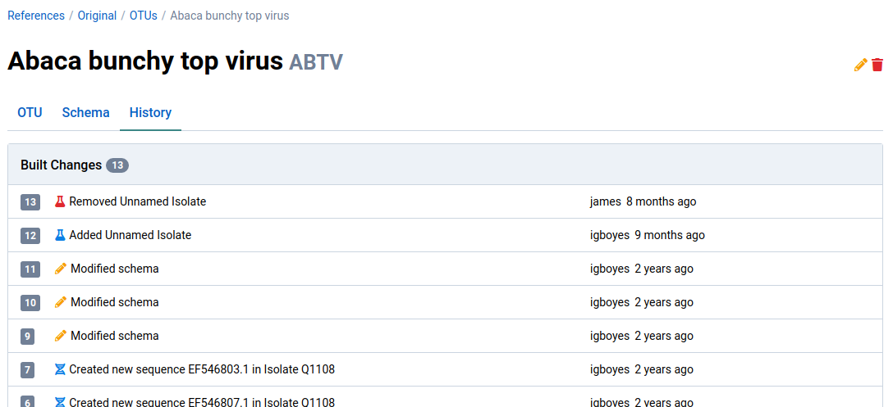
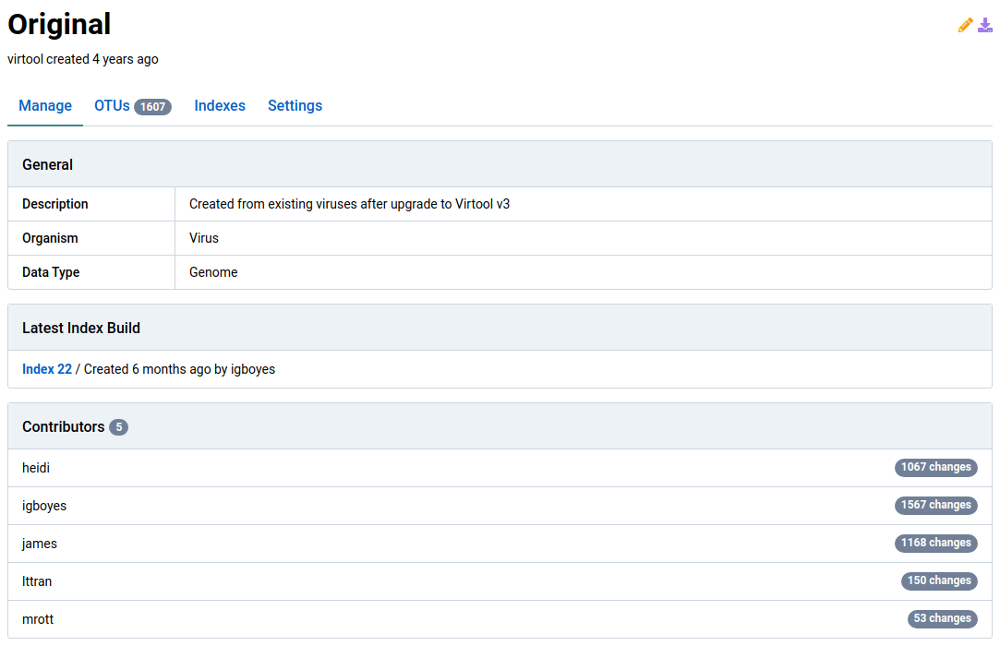
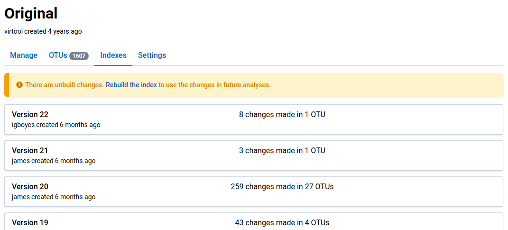
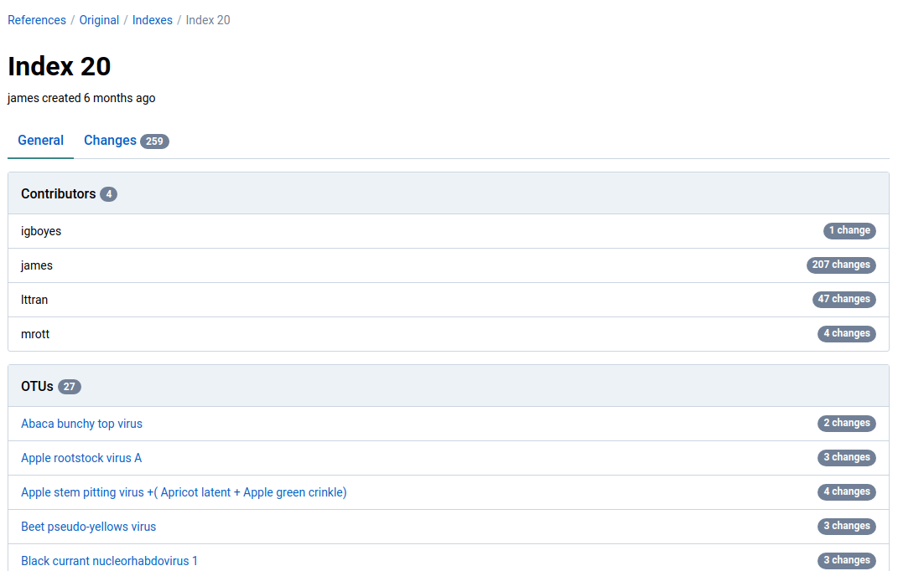
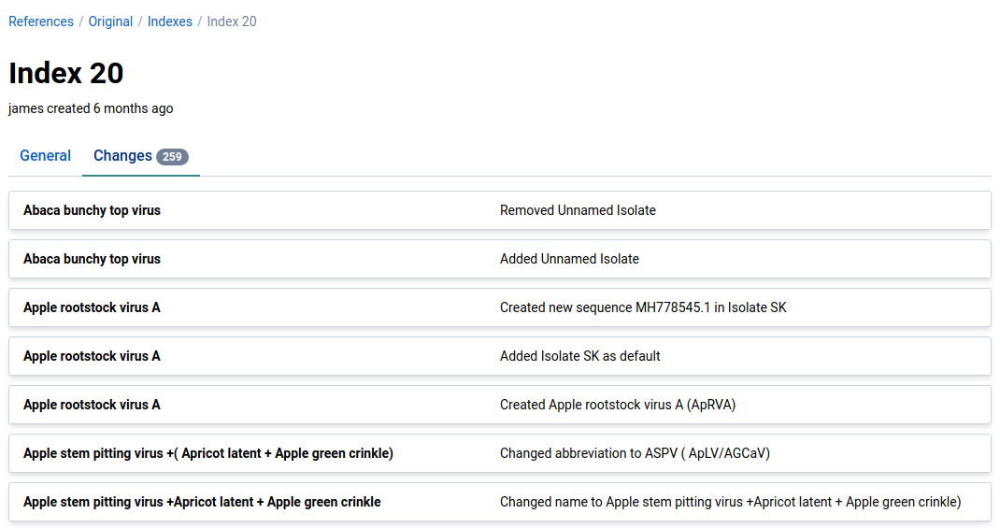
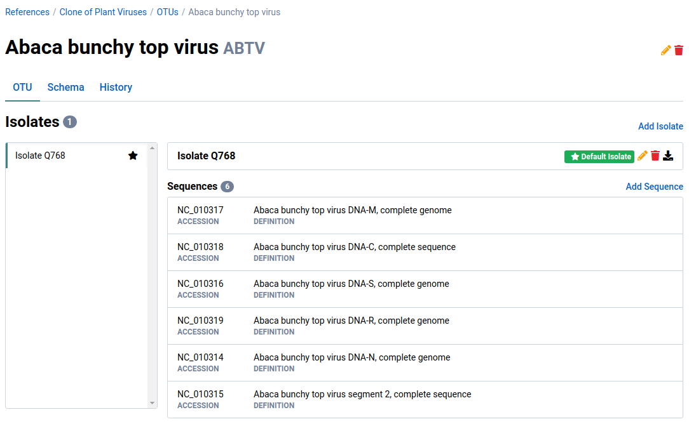
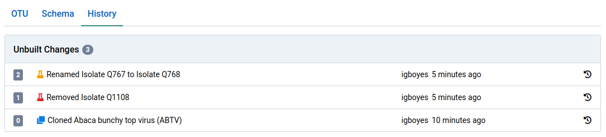

# Overview

History refers to the tracked changes made to OTUs. When any aspect of an OTU is changed, a history _change_ record is created.

Changes can be considered in several different contexts. One is at the OTU-level, where the changes describe the entire life of that OTU record. Changes can also be considered as a descriptor of indexes. An index can be thought of as a collection of changes to a selection of OTUs.

Here is an example of a change being recorded when an isolate is removed from an OTU:



# View OTU Changes

1. Navigate to the detail view for an OTU

    

2. Click on the **History** tab

    This shows all changes ever made to the OTU.

    

# View Index Changes

1. Navigate to the detail view for a reference

    

2. Click on the **Indexes** tab to list the indexes for the reference

    

3. Click on an index

    We clicked on index **Version 20**. The index detail page provide an overview of the changes included in the index.

    

4. Click on the **Changes** tab

    This view shows an exhaustive list of all changes made on each OTU in the index.

    

# Revert Changes {#revert}

You can revert any **unbuilt** changes made to an OTU.

Changes included in a complete index build cannot be reverted, therefore it is a good idea to be certain of any changes before starting an index build.

1. Navigate to the detail page for an OTU

    Note that the OTU has one isolate called _Isolate Q768_.

    

2. Click on the **History** tab to view the history for the OTU

    The history for this OTU shows that it was cloned from another reference, then one of its isolates was removed (_Q1108_) and the other was renamed from _Q767_ to _Q768_.

    

3. Click the  icon to revert a change

    Any succeeding changes will also be removed.

    

4. Navigate back to the **OTU** tab

    The reversions will be reflected in the OTU data. In this example, the previously removed isolate (_Q1108_) is restored and the other isolate (_Q767_) has its previous name back.

    
