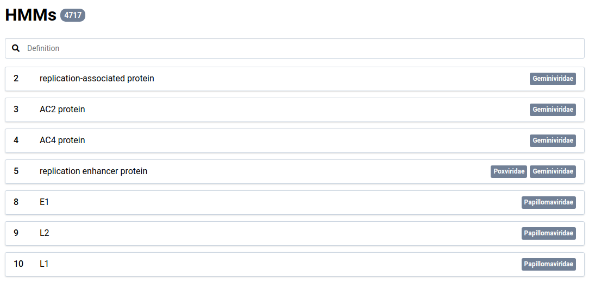
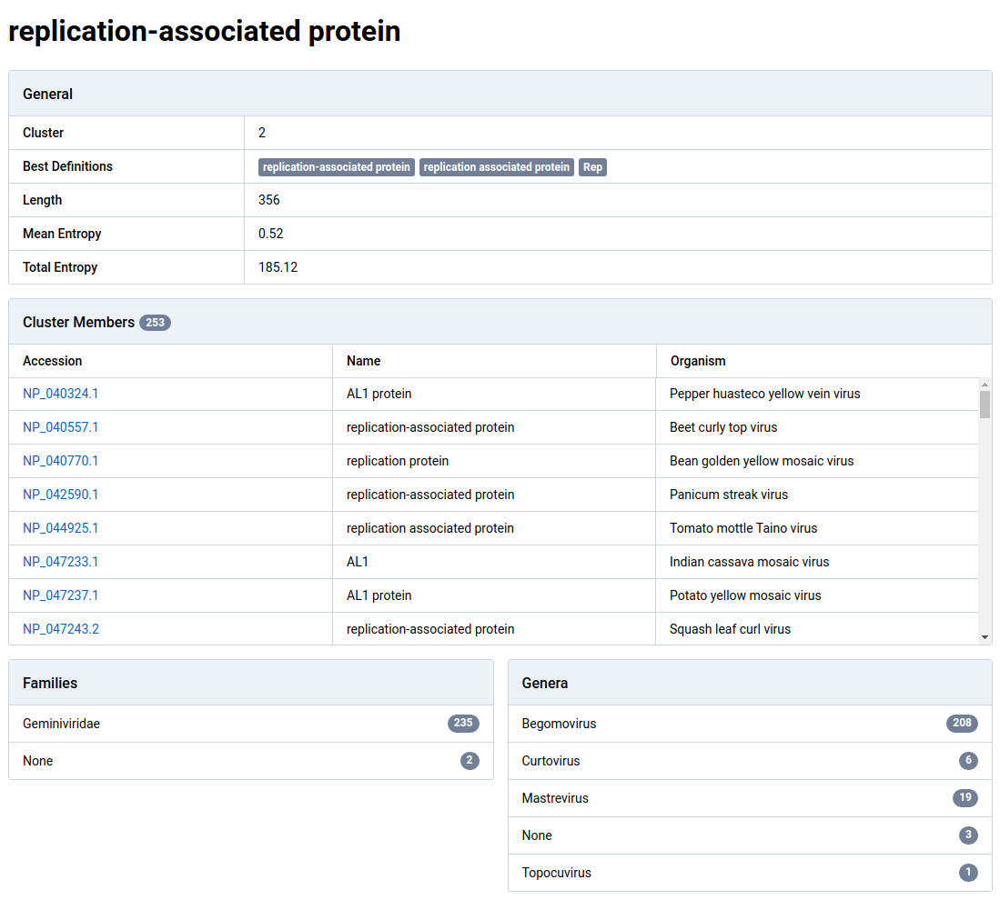
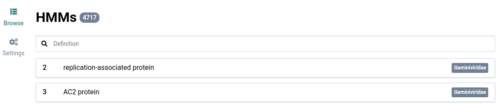
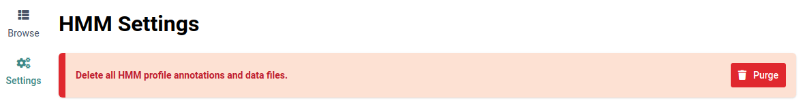

Profile hidden Markov models (HMM) are used in Virtool to discover potential novel viruses using the [NuVs workflow](/docs/manual/sci_nuvs).

# Install Official Models {#official}

1. Go to **HMM** in the main navigation bar

    

    If no HMM reference data has been installed, you will see the following:

    

2. Click the  button to begin downloading the data

    It could take some time to download and install the data.

    

3. Wait for the install to complete

    When the data is ready you can browse the annotations and use the NuVs analysis algorithm.

    

# Explore Annotations {#annotations}

You can browse the annotations used in NuVs results.

1. After HMM data has been installed, go to **HMM** in the main navigation bar

    

2. Use the search bar to find HMMs by annotative name (_eg_. RNA replicase)

    

3. Click on an HMM item to view its details.

    The fields in the HMM detail view describe the profile and the protein sequences that were used for its creation.

    

    |                      |                                                                                                                                        |
    | -------------------- | -------------------------------------------------------------------------------------------------------------------------------------- |
    | **Cluster**          | A unique integer identifier for the cluster                                                                                            |
    | **Best Definitions** | The three most common protein definitions found in the cluster member protein annotations.                                             |
    | **Length**           | The length of the motif identified in the profile.                                                                                     |
    | **Mean Entropy**     |                                                                                                                                        |
    | **Total Entropy**    |                                                                                                                                        |
    | **Cluster Members**  | A list of the proteins included in the cluster used to construct the profile HMM.                                                      |
    | **Families**         | The taxonomic families represented in the cluster and their cluster member counts. Cluster members without families are tagged _None_. |

# Purge HMM Data

It is possible to delete all HMM data from the disk and database. This is used primary during testing and development.

You will be able to reinstall the HMM data once the deletion process is complete.

1. Go to **HMM** in the main navigation bar

    

2. Click on **Settings** in the left sidebar

    

3. Click the  button

    You will be redirected to the HMM list view. The installation message will now be shown again because all HMM data has been deleted.

    
