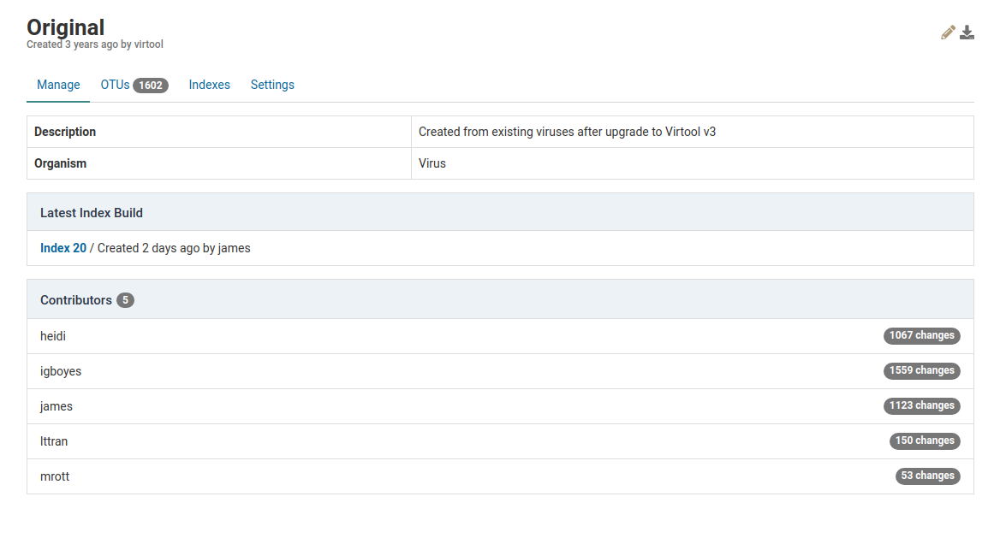
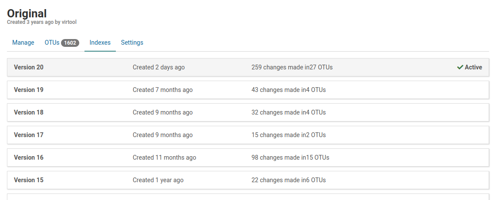
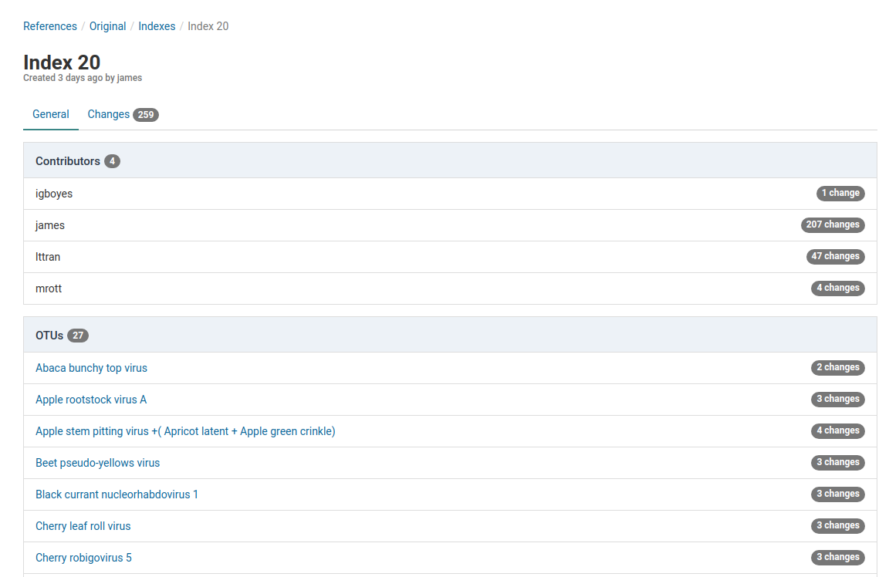
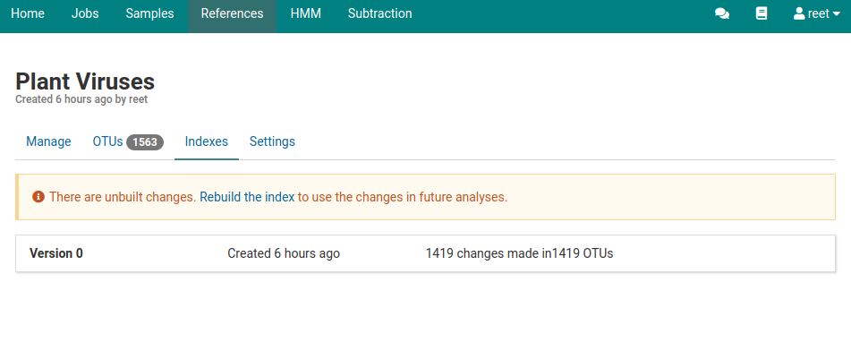
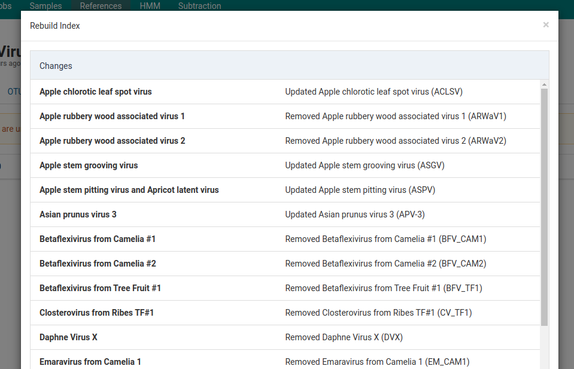

# Overview

Indexes are versioned snapshots of all of the OTUs in a reference at points in time. In the background, indexes are associated with optimized read mapping indices managed by Virtool.

When changes are made to OTUs, the index is rebuilt to include those changes in future analysis jobs. Each analysis is tied to a specific index (version) of its target reference.

# View Indexes

You can view the indexes that have been built for a specific reference

1. Click the **References** tab in the top navigation bar.

    Check the reference list to see what the latest built index is for the reference.

    The **Latest Build** box shows the latest index build. This index will be used for any analyses started using that reference. In the example above, the latest index is **Index 20**.

    

2. Click on the reference

    You will be able to view the **Latest Index Build** for the reference you are using.

    

3. Click on the **Indexes** tab under the reference's name

    Here you will see all the index versions for that reference. The top index will be the latest version.

    

# View a Specific Index

1. Click on an index to view its details

    In this view, we can view all the OTUs that changed and who contributed to the changes.

    

2. Click on the **Changes** tab

    Here all 259 changes are listed. The list shows all OTUs and what changes were made to them.

    

# Rebuild Index

When changes are made to reference, a new index must be built before the changes will be used in analyses.

1. You will see an alert in the **OTUs** and **Indexes** views when an index build is required

    

2. Click the **Rebuild the index** link

    The **Rebuild Index** dialog will appear and will list all the changes that will be included in the index.

    

3. To start making these changes and rebuilding the index, click  on the bottom of the dialog box

    This will start an index build job.

    

4. Once the job is complete have been made, there will be a new index record that is now  **Active**.

    
