# Overview

In Virtool, references are collections of OTUs (organization taxonomic unit), their isolates, and genomic sequences.

Virtool references are fully editable and tracked. The data is used to identify potential pathogen infections in Illumina libraries derived from your samples.

## Structure

An OTU typically represents a single pathogen species.

Each OTU is itself a collection of _isolates_. In Virtool, isolates include strains, genotypes, or variants of the same OTU. An isolate can have one or more genome sequences attached to it.

An OTU must contain one or more isolates and each isolate must have one or more sequences attached to it.

Here is the structure of a single viral OTU containing one isolate and its sequences:

## Isolate Naming

Virtool isolates are named with two pieces of information: the source type and source name. This naming system was inspired by the way isolate information is stored in Genbank records.

A **source type** is the first word in the isolate name and is a classification keyword used by the publisher of the sequence. Examples include _strain_, _genotype_, _culture_, and _variant_. The use of the **source type** keywords are not standardized in Genbank.

A **source name** is the unique second part of the isolate name that identifies the isolate.

Here are some examples of isolate names, source types, and source names:

| Name             | Source Type | Source Name |
| ---------------- | ----------- | ----------- |
| Isolate A        | Isolate     | A           |
| Isolate Shenyang | Isolate     | Shenyang    |
| Variant B        | Variant     | B           |
| Genotype 6       | Genotype    | 6           |

## Schemas

In Virtool, OTU _schemas_ are a way of defining what each isolate in the OTU should look like.

Schemas allow you to define what sequence segments should be present in isolates created for the OTU. Once a schema is defined, users will be to mark each sequence in the isolate with the segment it represents. Assigning a segment to a sequence has the follow effects:

-   sequences in the OTU detail view are sorted according to the schema order
-   sequences in the OTU detail view sequence headers display the segment name instead of the definition
-   sequences coverage charts in Pathoscope are sorted by the schema order

## History

All changes made to OTUs are tracked. Change records include a description of what was changed, the timestamp, and the user responsible.

The history for an OTU can be viewed in its detail view under the **History** tab. Changes are separated into those that have been made since the last index build (**Unbuilt Changes**) and those included in previous builds (**Built Changes**) by clicking on the  icon.

[See more information about history](/docs/manual/guide/history).

# Browse OTUs

The OTUs that belong to a Virtool reference can be easily browsed and edited. To start browsing member OTUs for a given reference:

1. Click on **References** in the main navigation bar

    This will show a list of all references.

    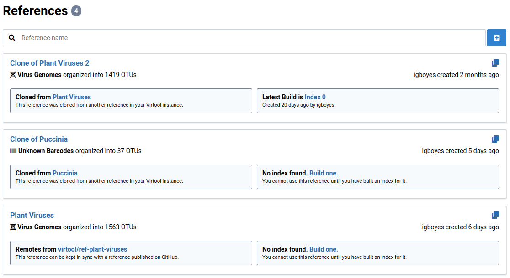

2. Click the reference of interest

    This will open the detail view for the reference.

    

3. Navigate to the OTUs tab

    This view shows the OTUs that belong to the reference

    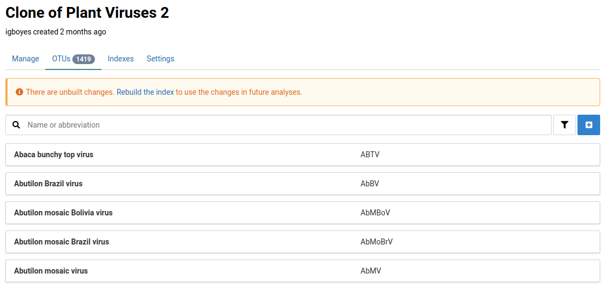

4. Click on an OTU item to view its detail page

    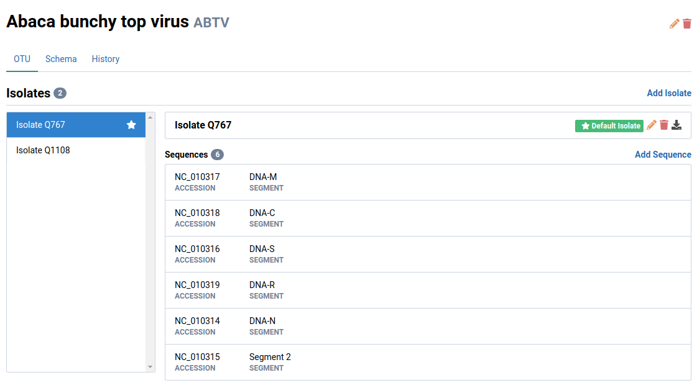

# Create an OTU

Creating a new OTU for a given reference requires only a name. You can optionally provide an abbreviation like those commonly used for viruses.

1. Click the  button under the OTUs tab

    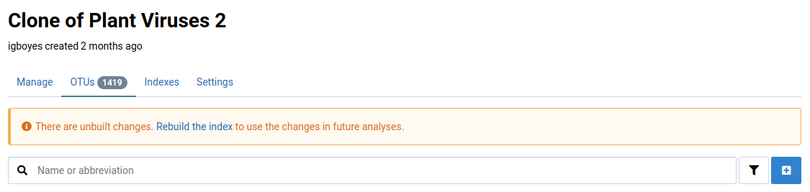

    A dialog will appear with a form for creating a new OTU.

    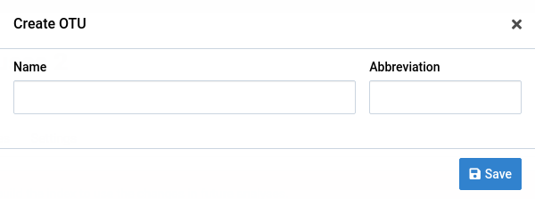

2. Enter a name and optionally an abbreviation for the new virus

    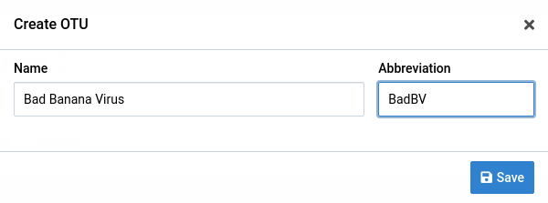

3. Click the  button to create the new OTU

    It should now appear in the list of OTUs for this reference.

    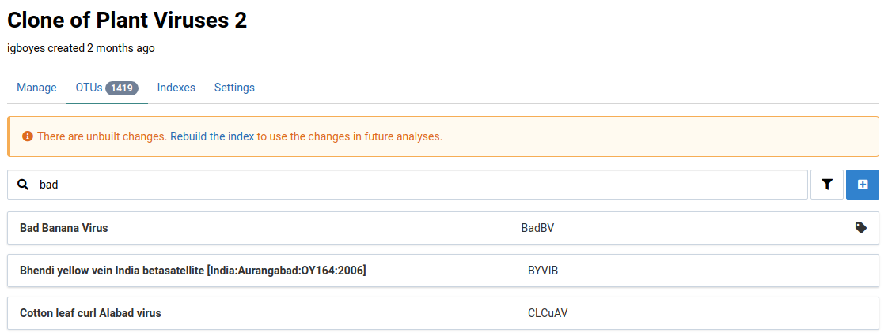

4. Click on the newly created OTU

    This will navigate to the OTU's detail view. Notice that there is a warning indicating that the OTU is not ready for use in analyses.

    

# Edit an OTU

The name or abbreviation for an OTU can be changed after its creation.

1. Navigate to the detail view for the OTU you want to edit

    

2. Click on the  icon in the top-right

    This will display the edit dialog. **Note that you will not see this icon if you don't have modification rights on the parent reference**.

    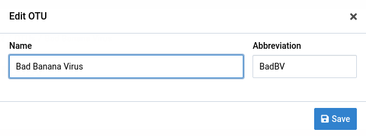

3. Change any of the fields and click the  button

    We will change the abbreviation in this example.

    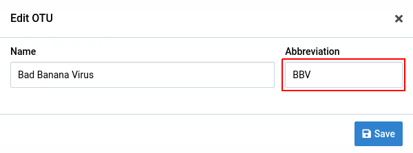

# Remove an OTU

1. Navigate to the detail view for the OTU you want to delete.

    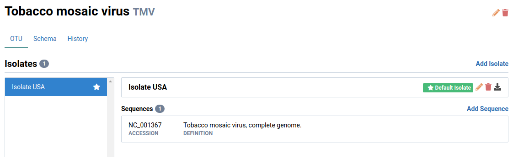

2. Click on the topmost  next to the OTU name

    A dialog box like the one below will show up to confirm the deletion of the OTU.

    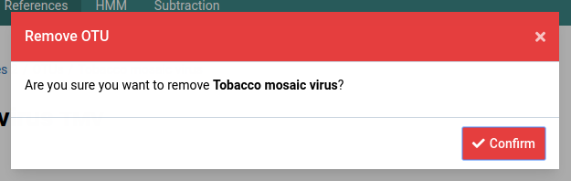

3. Click the  button to permanently remove the OTU

    The OTU will be removed from the **OTUs** list and the index must be rebuilt to include this change in future analyses.

    

# Add an Isolate

Isolates are how sequence data are organized within the OTU record. Read about isolates in the [section overview](#overview).

1. Navigate to the detail view for an OTU

    

2. Click on  to the right of the **Isolates** heading

    This will display a dialog for creating isolates.

    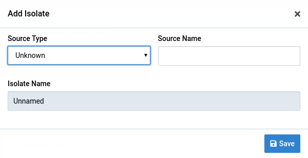

3. Fill the form with your **source type** and **source name** values

    Notice that the **Isolate Name** field changes with the other two fields. Both fields are optional and the isolate name will be **Unnamed** if they are both empty. Multiple isolates in a single OTU can have the same name.

    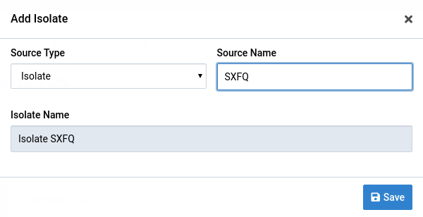

4. Save the changes by clicking the  button

    The new isolate will appear in the isolate editor

    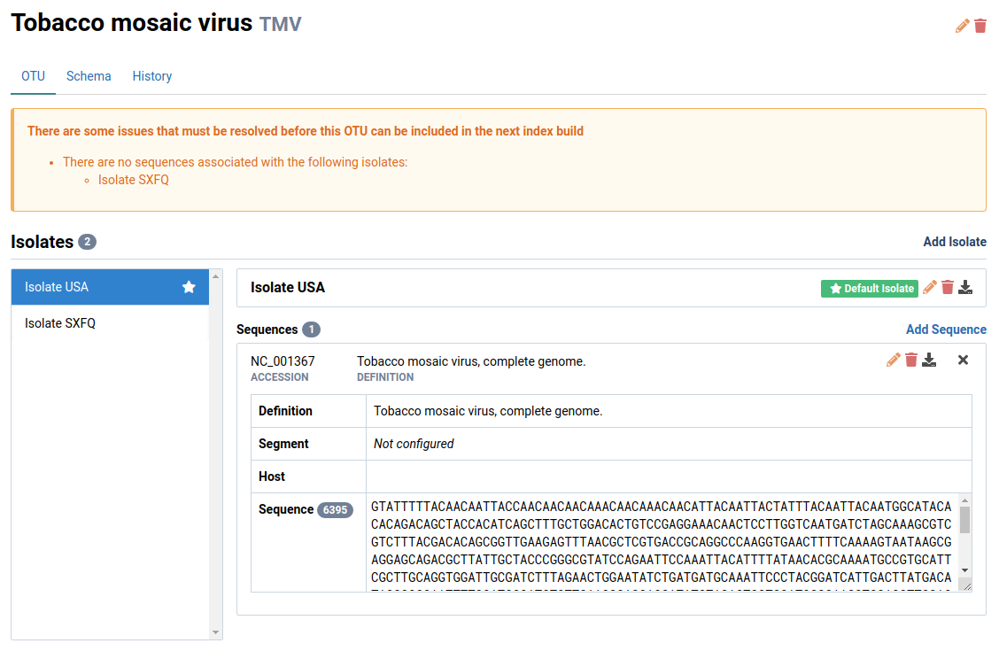

# Edit an Isolate

1. Navigate to the OTU whose isolate you would like to edit

    

2. Select the isolate you want to edit

    We will select _Isolate SXFQ_ in this example. This isolate is new and has no sequences associated with it.

    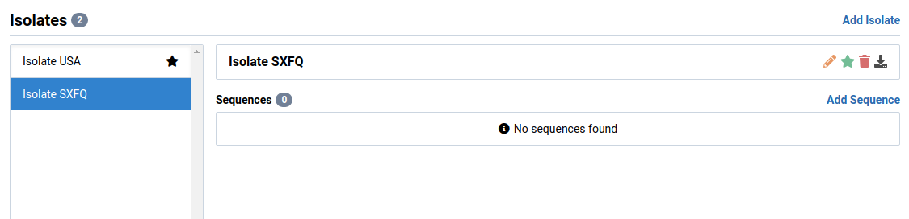

3. Click on the  icon next to the isolate

    A dialog box will show up like the one below. The fields are populated with the current isolate data.

    

4. Make the necessary changes to the isolate

    In this example, we changed the source name to _TMV-WS06_.

    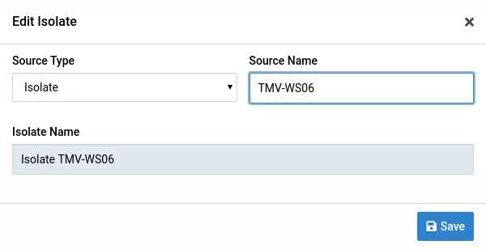

5. Click the  button

    The new changes will be reflected in the detail view page of the OTU.

    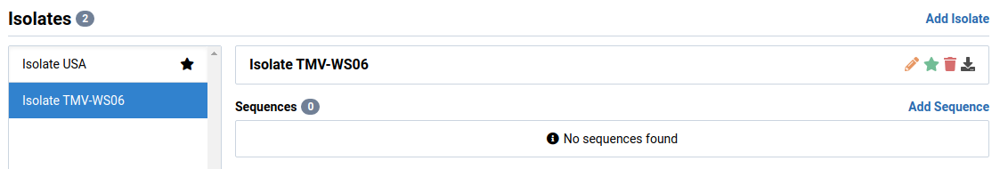

# Remove an Isolate

1. Select the isolate you would like to remove

    

2. Click on the  next to the isolate name

    A removal confirmation dialog like the one shown below will appear.

    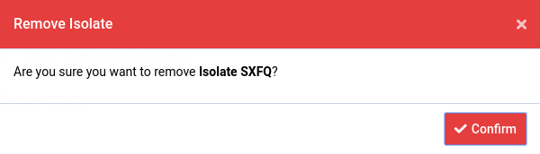

3. Click the  button to permanently delete the isolate

    The isolate should now be removed from the **Isolates** list.

    

# Add a Sequence

1. Select the isolate you want to add a sequence to

    

2. Click the  link near the **Sequences** heading

    This will display the **Add Sequence** dialog

    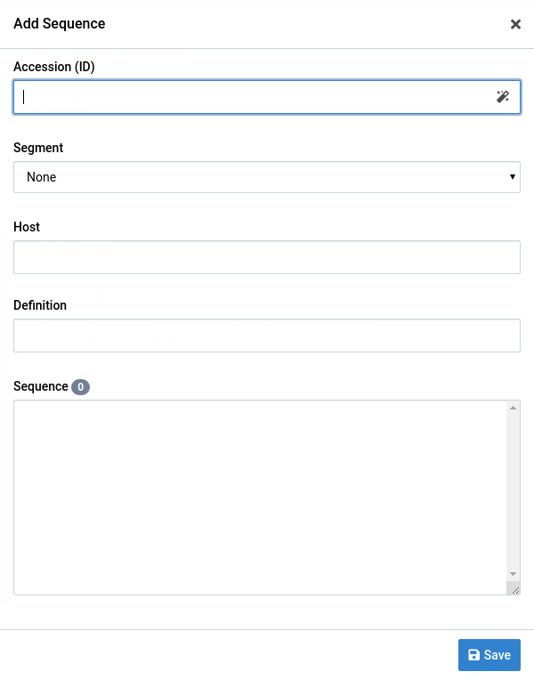

3. Fill out the form fields

    You can pull sequence records from GenBank by entering a valid GenBank accession in the **Accession** field and clicking the  icon.

    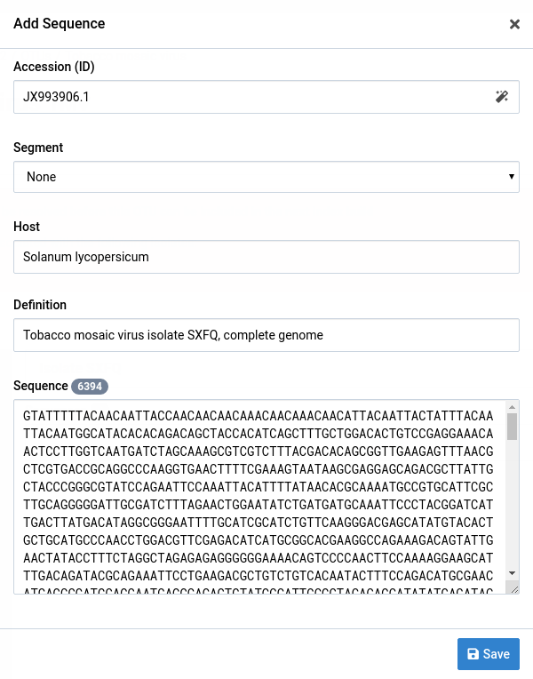

4. Click the  button to create the new virus

    It will appear in the isolate editor.

    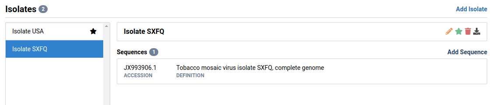

5. Click on the sequence entry to expand it

    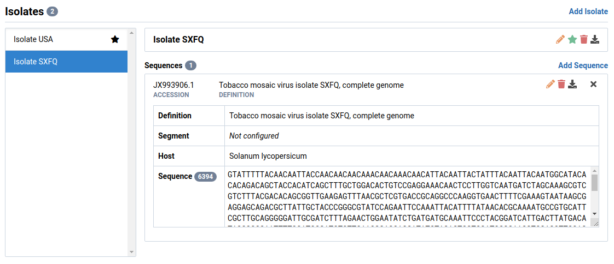

# Edit a Sequence

1. Select the isolate and sequence you want to edit

    Here we have selected sequence _JX993906.1_ in _Isolate SXFQ_.

    

2. Click the  icon in the sequence header

    The **Edit Sequence** dialog will appear.

    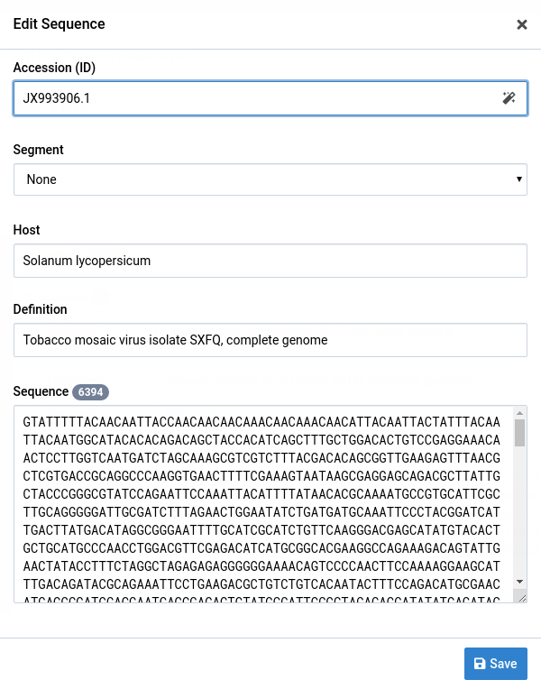

3. Make your changes to the sequence

    Here we changed the host field from _Solanum lycopersicum_ to _Tomato_.

    

4. Click  to save your edits

    Notice that the changes have been applied on the sequence record.

    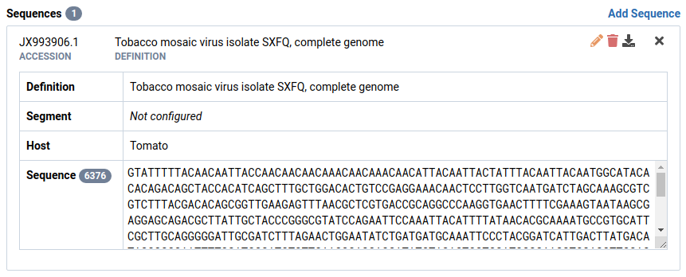

# Remove a sequence

1. Select the sequence you want to remove

    Here we have selected sequence _JX993906.1_ in _Isolate SXFQ_.

    

2. Click on the  next to the sequence header

    A dialog box like the one shown below will show up.

    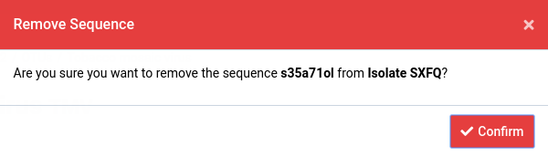

3. Click  to permanently delete the isolate

    The sequence should now be removed from the **Sequences** list.

    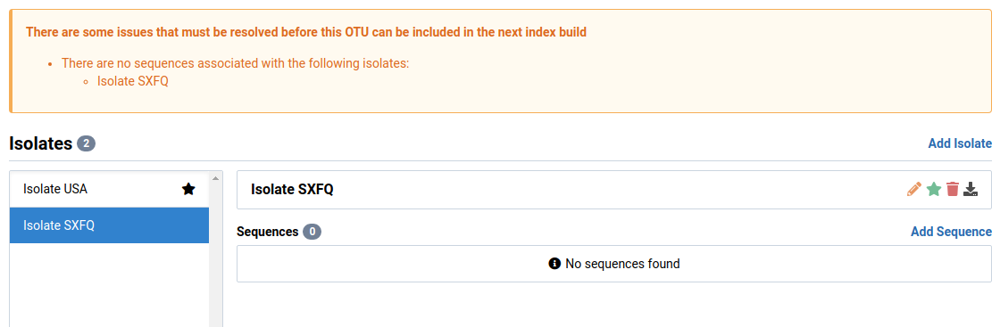

# Add a Segment

1. Navigate to an OTU you want to define a schema for

    We will look at Abutilon mosaic virus (AbMV) in this example. Notice that AbMV has two genome segments: _DNA-A_ and _DNA-B_.

    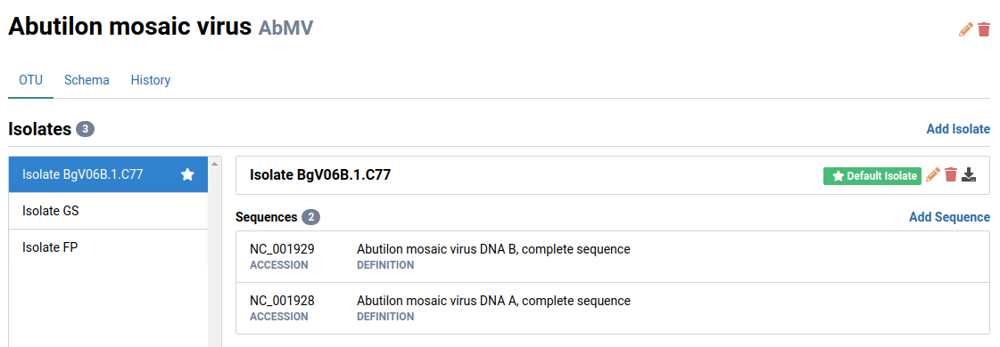

2. Navigate to the **Schema** tab.

    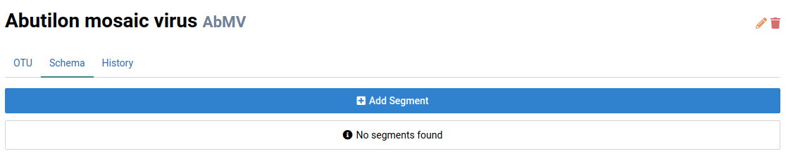

3. Click the  button

    The **Add Segment** dialog box will appear.

    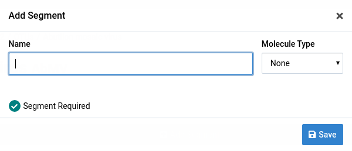

4. Fill the form field

    Give the segment a name and select a **Molecule Type**. AbMV has a circular single-stranded DNA genome.

    The **Segment Required** checkbox indicates that the segment must be present in an isolate for is to be valid.

    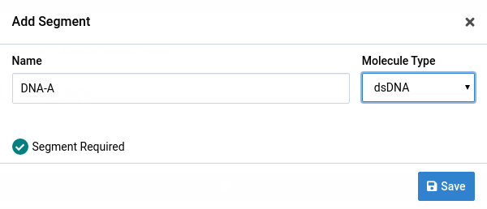

5. Click the  button to add the segment

    The new _DNA-A_ segment will be displayed in the schema list.

    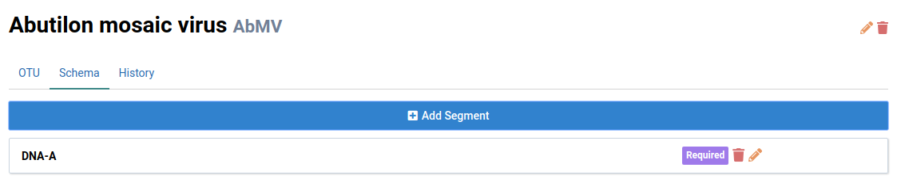

6. Add _DNA-B_ to finish populating the schema

    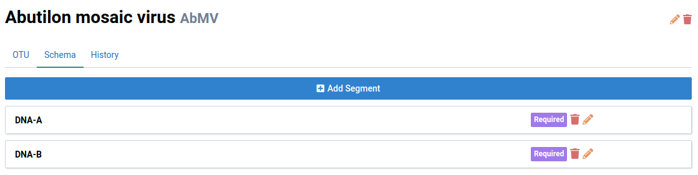

# Edit a Segment

1. Locate the segment you want to edit

    We will change the name of _DNA-A_.

    

2. Click the  icon

    The **Edit Segment** dialog will appear. The form will be populated with the current segment data.

    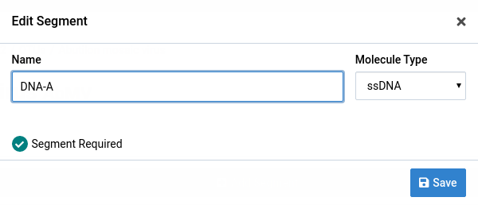

3. Make your changes to the segment

    Here, we changed the name from _DNA-A_ to _DNA A_.

    

4. Click the  button

    The changes made will be reflected under the **Schema** tab.

    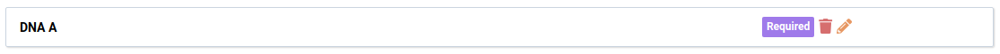

# Use a Segment

Once you have defined a schema for an OTU, you can set a segment on each isolate sequence when adding or editing them.

1. Check the schema for the OTU

    We have defined _DNA-A_ and _DNA-B_ for AbMV. The segments are ordered alphabetically.

    

2. Navigate to the **OTU** tab and select and isolate

    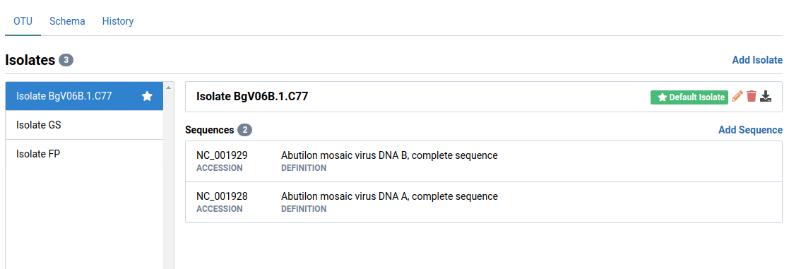

3. Select a sequence

    Here, we have selected _NC_001929_. Notice that the **Segment** field is _Not configured_.

    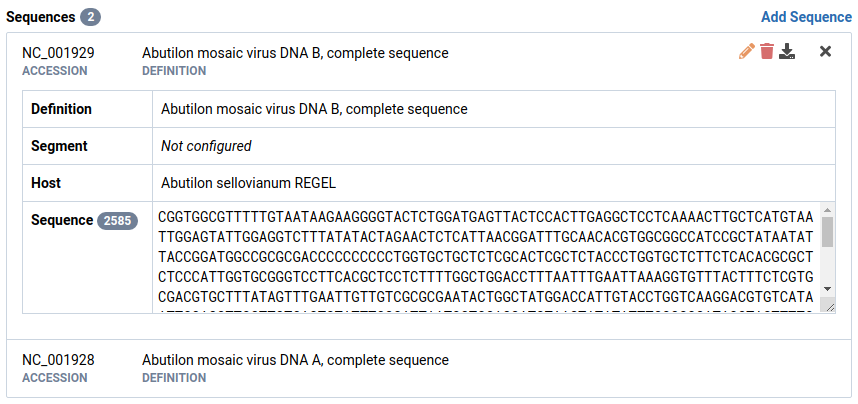

4. Click the  icon

    The **Edit Sequence** dialog will appear.

    

5. Click the **Segment** dropdown

    The segments defined in the schema will be available for selection.

    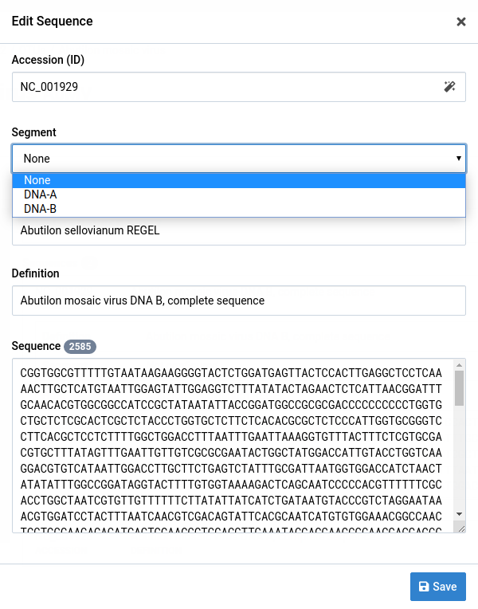

6. Select the segment for your sequence

    Here, we will select _DNA-B_ to match the information from the Genbank-sourced definition for the sequence.

    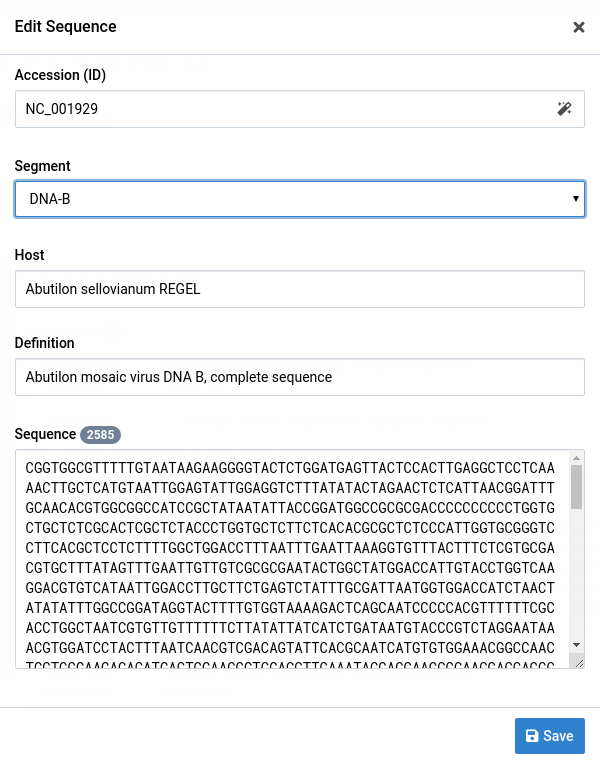

7. Click the  button

    The change to the **Segment** field will be reflected in the sequence record and the sequence header will contain the segment name instead of the sequence definition.

    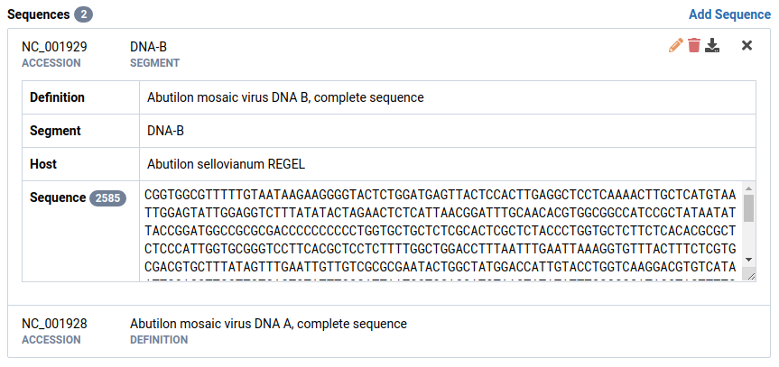

8. Set the segment for the other sequence

    When this has been done, the **Sequences** list will be ordered according to the schema.

    

# Reorder a Schema

1. Select an OTU and isolate and note the current sequence ordering

    These sequences have a segment set and are ordered based on the OTU schema.

    

2. Navigate to the OTU **Schema** tab

    The segments are currently ordered alphabetically.

    

3. Drag and drop the segments to reorder them

    

4. Return to the isolate from **Step 1**

    Note that the sequence ordering has changed to match the schema.

    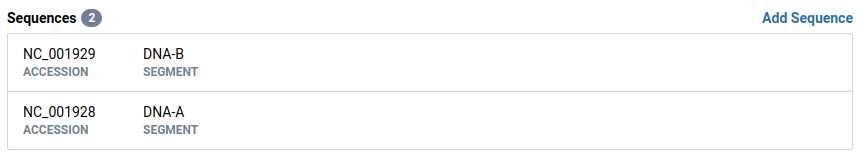

# Remove a Segment

1. Navigate to the schema page for an OTU

    

2. Click the  icon on a segment

    The **Remove Segment** dialog will appear.

    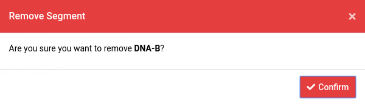

3. Click the  button to remove the segment

    The segment will be removed from the schema segment list.

    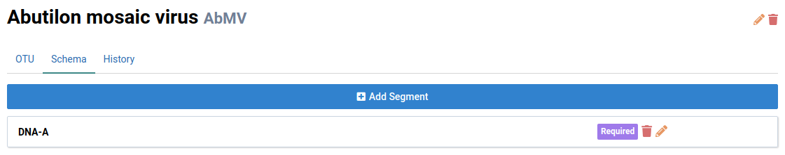
