# Overview

Selecting **Samples** on the top menu brings up the main sample management view. Here, samples can be created, viewed, edited, analyzed, and removed.

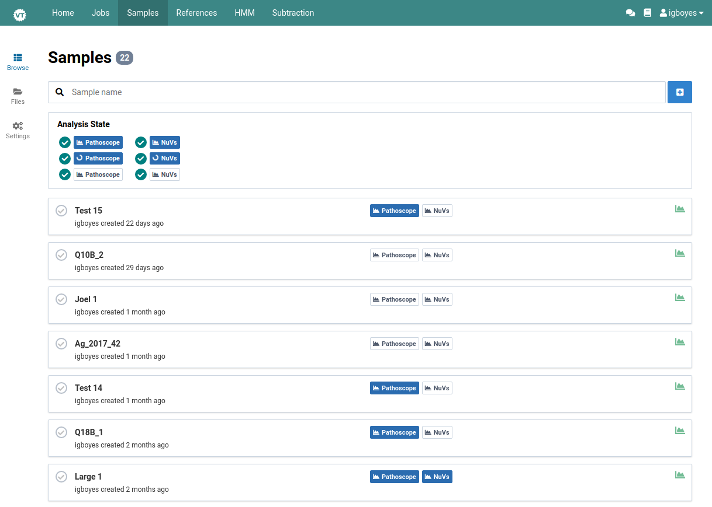

## What happens during sample creation?

Sample FASTQ files are copied into a new sample directory. The files will be compressed if necessary. Files associated with the sample can be viewed and downloaded under the sample detail tab.

Quality information is calculated from the library using [FastQC](https://www.bioinformatics.babraham.ac.uk/projects/fastqc/) and committed to Virtool's database.

The FASTQ files and quality data are used for further analyses triggered by the user.

# Browse Samples

Once you have imported one or more samples, they can be browsed in the main sample management view.

1. Navigate to the **Samples** view

    

2. Enter a search term in the search input

    

3. Use the status filters to further narrow the list of samples

    For each workflow (Pathoscope, NuVs), the sample can have:

    - no analysis available
    - analysis in progress
    - at least one completed analysis

    Here we are looking for samples with names containing _q10_ that have **a completed NuVs analysis**:

    

4. Click on a sample to navigate to its detail view

    Here is the detail view for samples from the previous step: _Q10A_2_.

    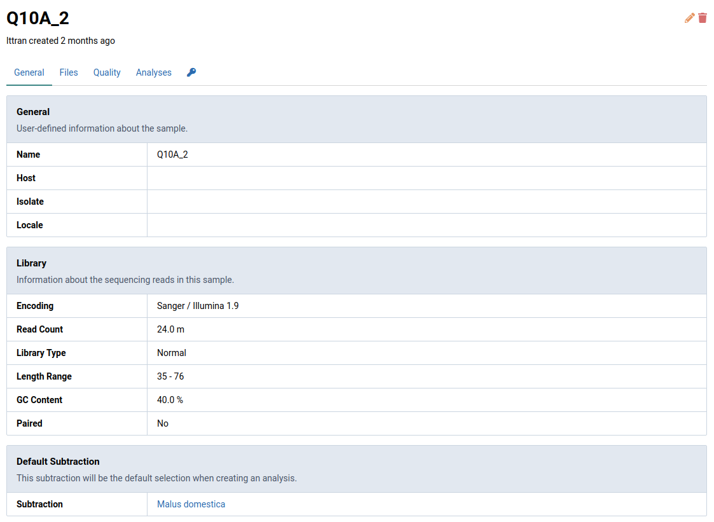

# Start Quick Analysis

Quick analyses allows you to start analysis jobs for multiple samples at once. Select the samples of interest and click on the  button. An **Analyze** dialog box will appear.

In this dialog you can choose the analysis algorithm (PathoscopeBowtie or NuVs), the subtraction, and the reference(s) you want to use to analyze your sample(s). Selecting multiple references will start a separate job for each sample-reference combination. Once these fields are specified, click the  button to start the analysis.

Once the analysis is running, you can view its progress under the **Jobs** tab.
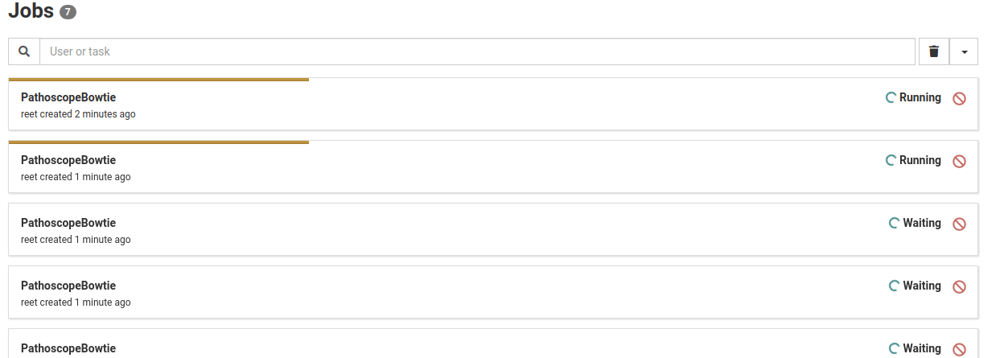

# Upload a FASTQ File

To upload a FASTQ file, click on **Samples** in the top navigation bar.
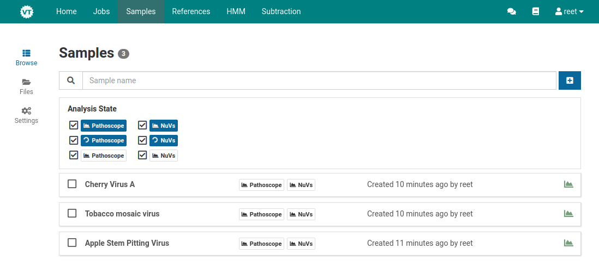

On the left sidebar click **Files**.

Click on the  button to choose a file from your computer. Here we will choose the **large.fq** file.

The uploaded file will then be visible under the **Read Files** overview page.

# Create a Sample

Upload your sample FASTQ files under **Samples | Files** if you haven't yet.

Click on the  button in the samples view to open the sample creation dialog.

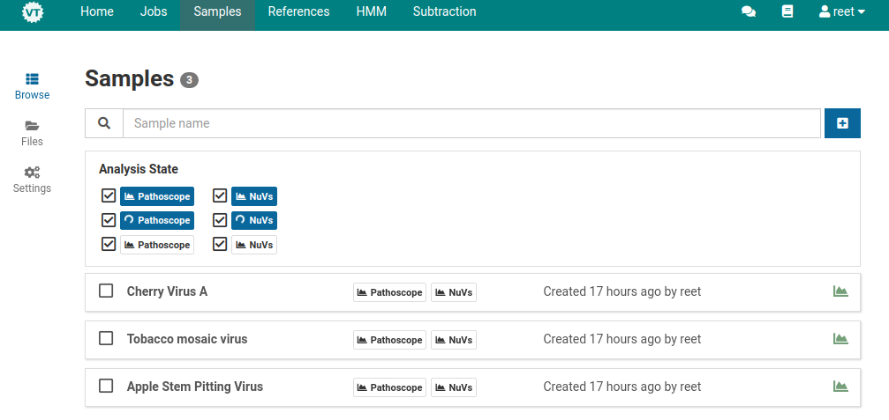

The sample dialog will look something like this:

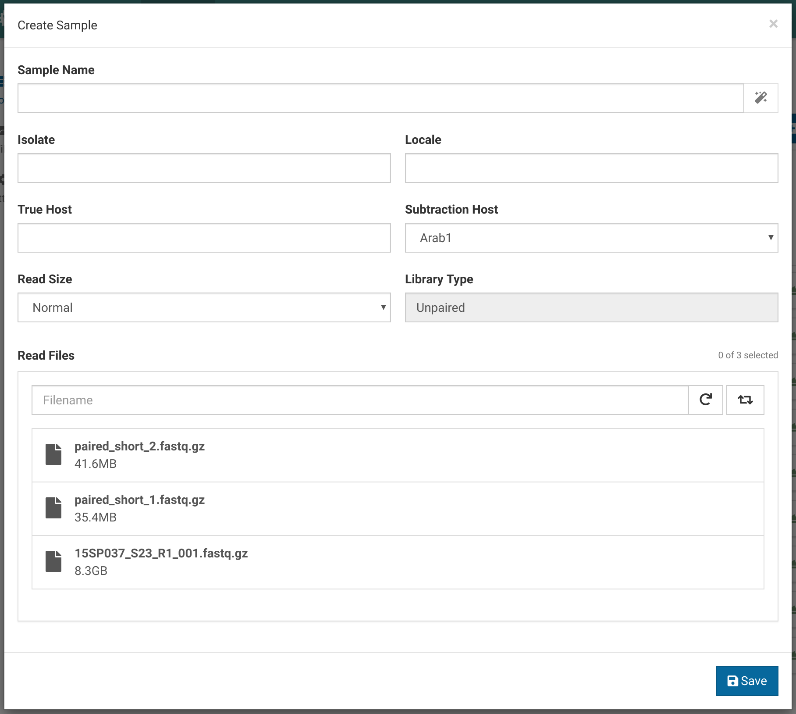

The sample creation dialog allows you to set optional metadata including _isolate_, _locale_, and _true host_.

You **must** set a unique sample _name_ and _read size_. _Read size_ can be set to either _normal_ or _sRNA_. Subsequent analysis workflows will run using significantly different parameters based on the _read size_ setting.

An appropriate _subtraction host_ must be selected. This should be the [subtraction genome](/docs/manual/guide/subtraction) most closely related to the _true host_ for your sample.

Here is an example using normal sequencing and _Banana_ as a **Default Subtraction** host:

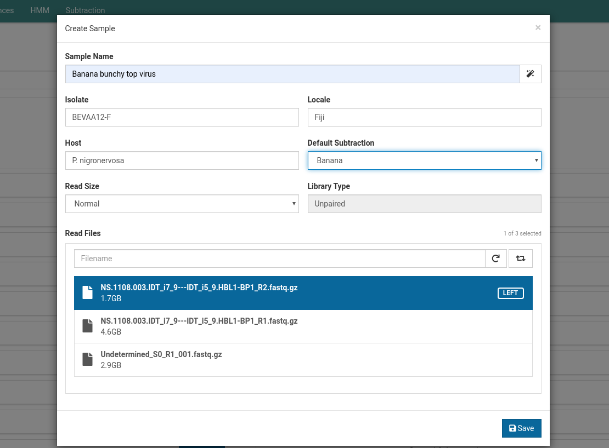

Once required fields are populated and you have selected the files, click the  **Save** button to create the sample. Your sample will immediately be listed in the samples list. However, it will take some time for the sample data to be imported and processed.

A job will appear in the **Jobs** view to track the process of creating your sample.

Your sample will look something like this when it is ready to use:

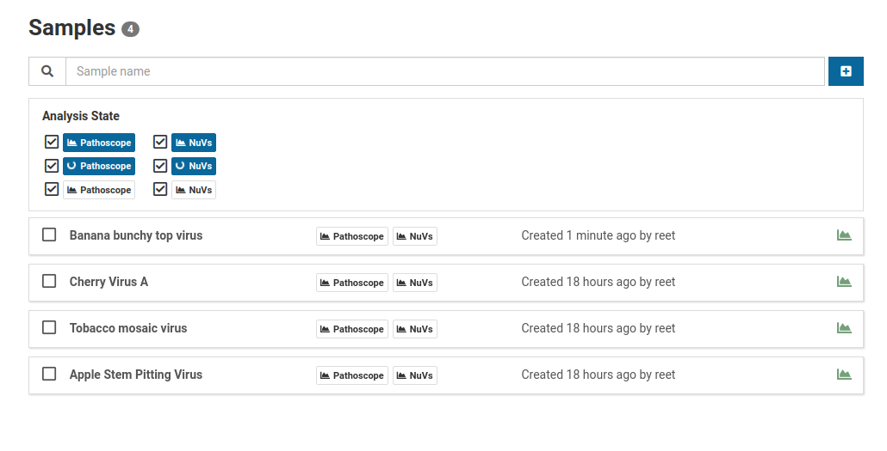

## Paired and Unpaired FASTQ Data

Paired or unpaired FASTQ data can be used to create a sample.

Samples created from only one file are assumed to be unpaired. Paired samples must comprise two paired FASTQ files. **Interleaved FASTQ files are not currently supported**.

For paired data, make sure the file orientation labels (left and right) are correct before you create a sample. You can use the  button to swap orientations.



## Default Subtraction

The default subtraction for a sample will be pre-selected as whenever you create an analysis for that sample. You can find the default subtraction for a given sample at the bottom of its detail view.

For Banana bunchy top virus below, the default subtraction is **Banana**. This was the same subtraction that was selected when first creating this sample. Once a default subtraction has been made for a sample, you cannot change it.

When you open an analysis creation dialog for the sample, the default subtraction (**Banana**) will already be pre-selected.
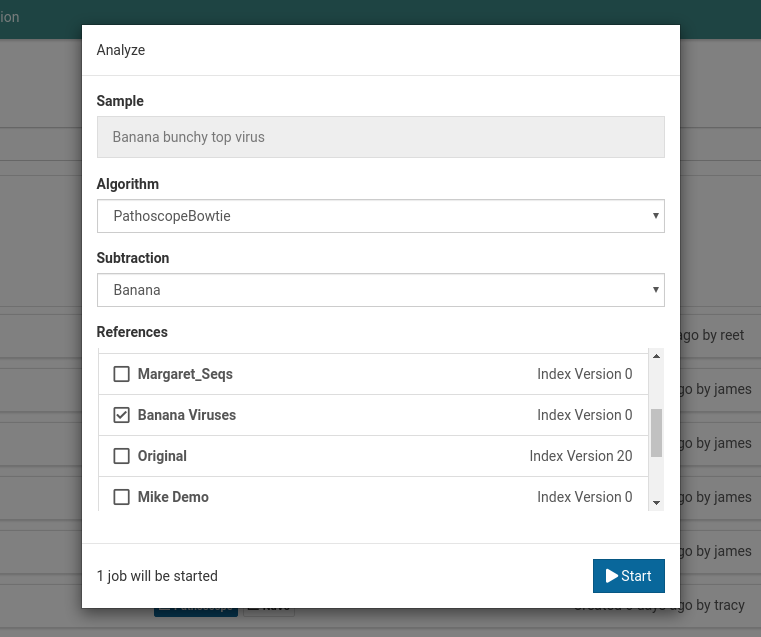

# Sample Quality

Quality metrics are calculated using [FastQC](https://www.bioinformatics.babraham.ac.uk/projects/fastqc) during the sample creation process. These metrics are based on the raw data provided by the user.

The quality information can be viewed under the **Quality** tab:

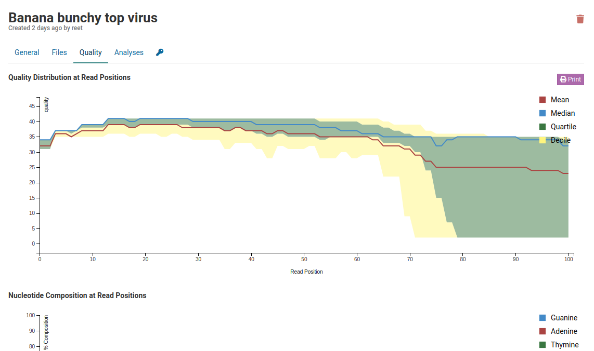

You will see three different graphs on this page as shown below.

## Quality Distribution at Read Positions

This graph shows the quality of your sample library. The Y-axis shows the quality score, the higher the better. The quality tends to decrease as the run progresses.

Median values of less than 25 or a lower quartile of less than 10 is concerning. In the case of the sample above, the quality of our sample library is fine and further analysis can take place.

## Nucleotide Composition at Read Positions

This plot shows the proportion of each base's position in a file. In general, one should expect A/T to be roughly equal and G/C to be roughly equal. Viruses genomes are often unevenly distributed in composition and are usually A/T rich.

With all of the things being equal in a diverse library, you should see an even distribution of the four bases which doesn't change with base position. Although the relative amount of G/C content will be determined by your library, but what you should see on the graph are parallel lines going across the plot.

## Read-wise Quality Occurrence

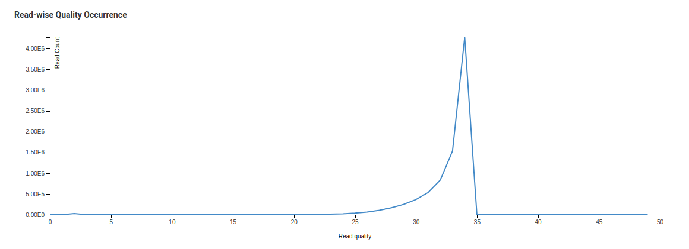

In this case we are taking every sequence and looking at the mean score across all the bases in that particular sequence. The distribution of those means are then plotted as shown above. All sequences should form one tight distribution (sharp curve) with universally high quality and no sequences of low quality. This sharp curve is the average quality per read. A mean quality below 27 is a cause for concern.

# Edit a Sample

Click on **Samples** in the top navigation bar to see a list of available samples.
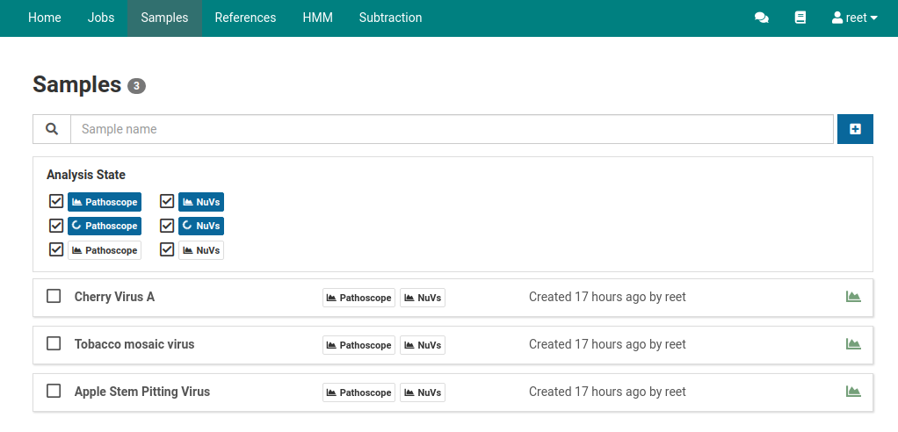

Click on the sample you would like to edit. Here we will choose **Apple Stem Pitting Virus**.

On the top right beside the name of the sample, click  to edit the sample. A dialog box like the one below will show up.
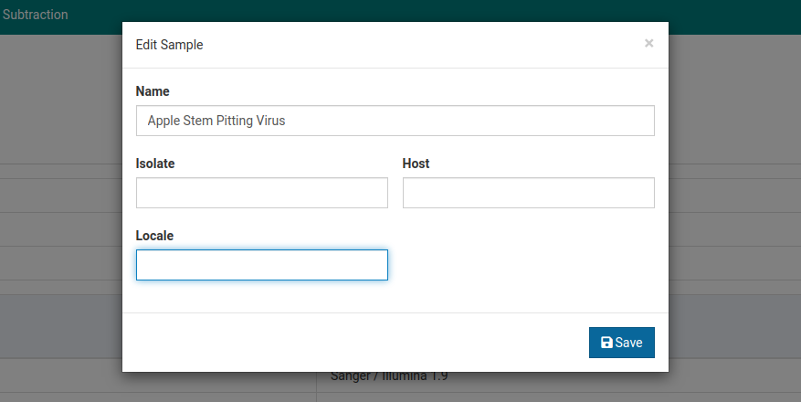

The name, isolate, host, and locale can all be edited here. After making the changes click 
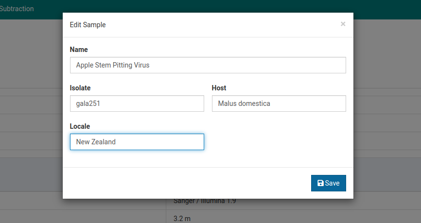

These edits will then be displayed on the sample detail view page as shown below.

# Delete a Sample

Click on **Samples** in the top navigation bar to see a list of available samples.
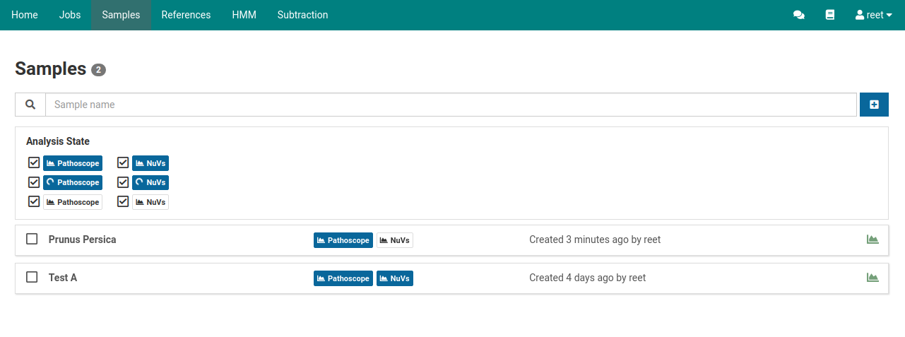

Click on the sample you wish to delete. Here we will delete **Test A**.
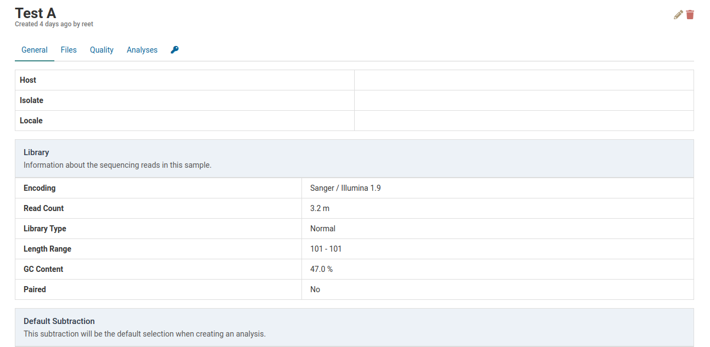

Click on the  to delete the sample. A dialog box such as the one below will show up to confirm the deletion of the sample.
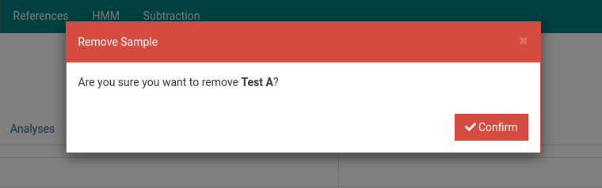

Click  **Confirm**. The sample will now be removed from the samples list.
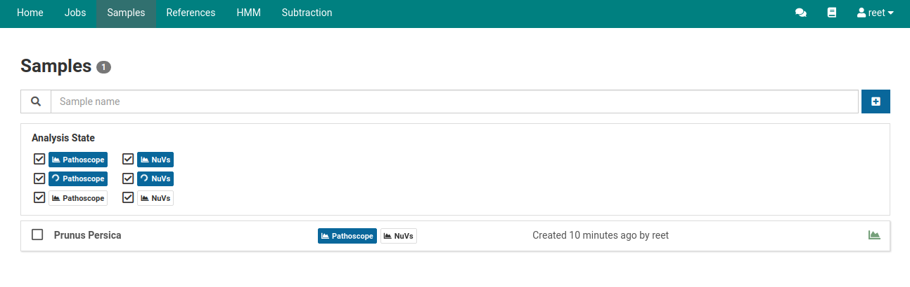

# Download a FASTQ File

You can download the original FASTQ files used to create a sample. To do so, click on the sample of interest and then click **Files**.
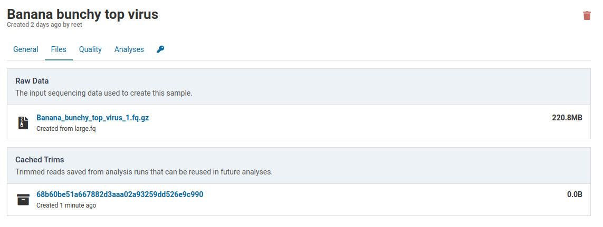

Click the link under **Raw Data** to download the FASTQ file that was originally used to create the sample.

# Trim Caches

Sample data is automatically trimmed during analysis to remove sequencing artefacts and low quality regions. After the first analysis, the trimmed data are cached for reuse in future analyses that use the same trimming parameters. This saves running the trimming workflow steps for every analysis for a given sample.

A sample that has not yet been analyzed will not have any caches associated with it.
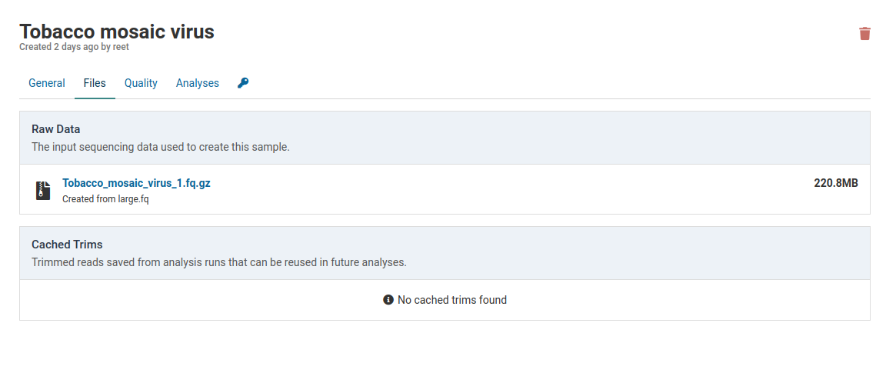

Running an analysis for this sample will create an analysis job. During the job the raw sample reads will be trimmed and cached for future analyses. As soon as trimming is complete the cache will be created.
Caches are always smaller than the raw data. This library was reduced from 220.8 MB to 153.9 MB. This is due to removal of low quality reads and localized shortening of reads with low quality ends.
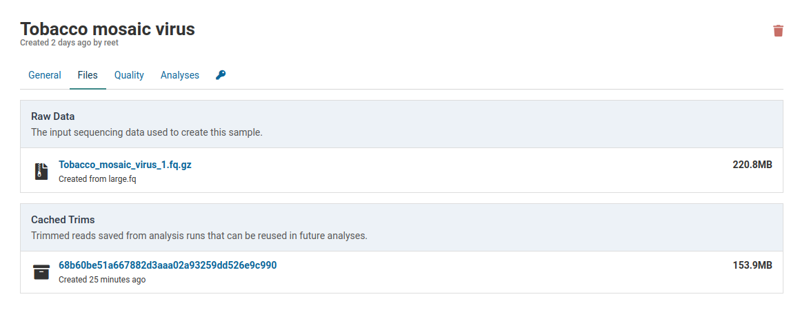

When you click on the link under **Cached Trims** you will see all the parameters used by the trimming program as well as the name of the trimming command (`skewer-0.2.2`). The _hash_ is a unique identifier for the program-parameters combination used to trim this cache.

Additionally, below the parameters you will see the quality of the data that has been trimmed and cached.
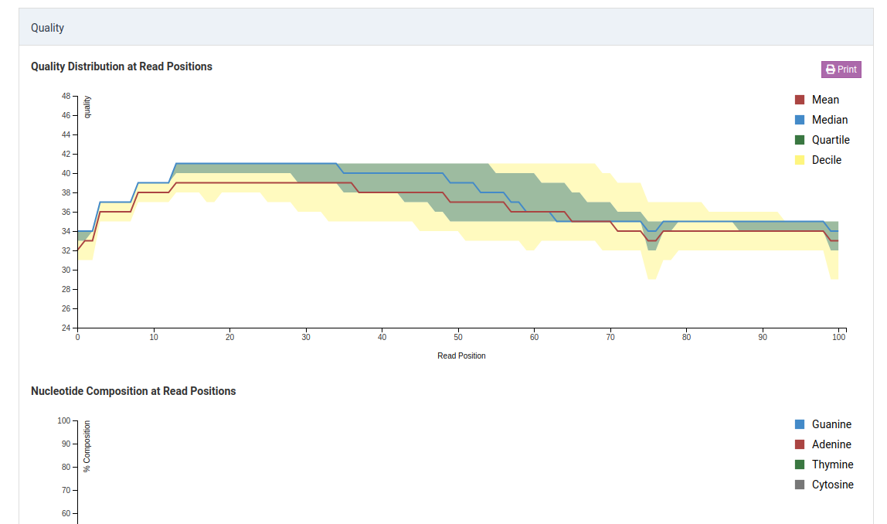

## Trim Cache Quality

Quality metrics are recalculated for reads trimmed during an analysis. The quality information is associated with the generated trim cache. Since low quality reads are discarded and low quality ends are removed, we expected the trim cache quality metrics to improve over those for the raw data.

### Quality Distribution at Read Positions - Raw

### Quality Distribution at Read Positions - Trimmed

In the **Quality Distribution at Read Positions - Raw** chart we see that the mean base quality degrades as we get closer to the end of the read. This is a common issue in Illumina libraries. In the **Trimmed** charts we can see that low quality ends were removed resulting in a higher mean and minimum base quality.

### Read-wise Quality Occurrence - Raw

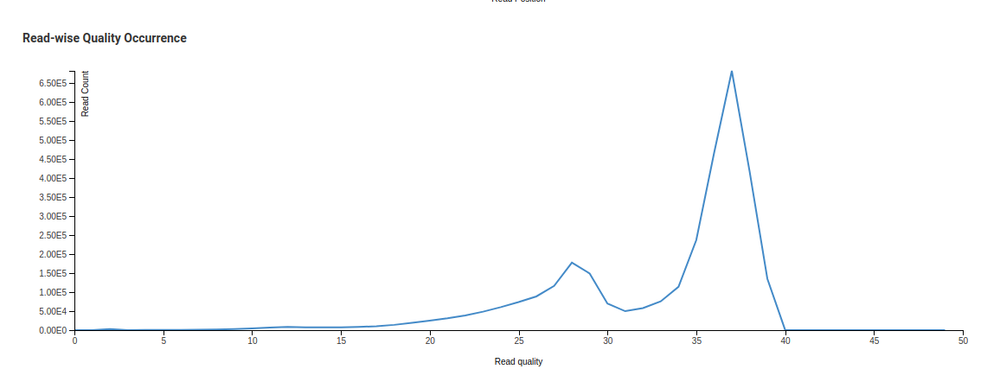

### Read-wise Quality Occurrence - Trimmed

In the **Read-wise Quality Occurrence - Raw** image we see one small curve before a sharp peak. This is due to a significant number of reads with low mean quality being present in the library. The trimming process discards reads with low mean qualities. This is reflected in the **Trimmed** chart where the smaller peak is no longer present.

# Rights

## Concepts

Virtool allows for fine control of the rights users have to view or modify samples.

### Management Levels

Rights can apply at four different levels.

|                  |                                                                                                                                                                   |
| ---------------- | ----------------------------------------------------------------------------------------------------------------------------------------------------------------- |
| _administrators_ | Members of the special administrator group. These users have full read and write access to all samples as well as the ability to manage the rights on any sample. |
| _owner_          | The original sample creator. This user always has full read and write access to the sample as well as the ability to manage the rights on the sample.             |
| _group_          | The group that owns the sample. Read and write privileges can be independently set at this level.                                                                 |
| _all users_      | All users registered on the Virtool instance. Read and write privileges can be independently set at this level.                                                   |

### Group Ownership

Each sample can be owned by a specific user group. This allows multiple groups of diagnosticians or researchers to keep their data private or safe from one another while sharing a single Virtool instance.

Samples are not required to have an owner group. The group can be set to `None`. In this case, group rights settings will have no effect.

### Privileges

<table class="defs">
<tbody>

  The management level (_eg_. group, all users) cannot read or write the sample. included users will never see the sample in the sample management interface.

This privilege is useful for completely isolating samples between separate groups of users.



The management level (_eg_. group, all users) can only read the sample. The included users will see the sample in the sample management interface and be able to view its general information, quality, and analyses.

They will not be able to edit or remove the sample and they will not be able to create new analyses. The elements in the user interface associated with the described actions will be hidden.



The management level (_eg_. group, all users) can only read the sample. The included users will see the sample in the sample management interface and be able to view its general information, quality, and analyses.

They will also be able to edit and remove the sample and create new analyses.


</tbody>
</table>

## Management

The access rights for an existing sample can be easily changed by the sample owner or an administrator.

Access the rights management controls by clicking the  tab in the sample detail view.

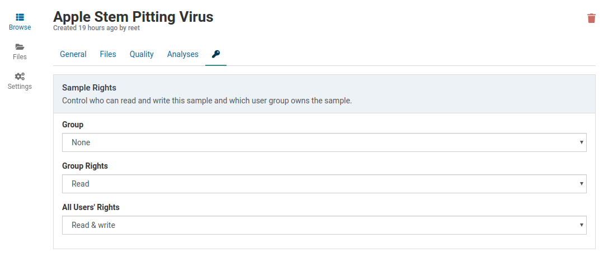

## Default Rights

Samples have their initial access rights configured when they are first created. How these rights are assigned can be configured in the adminstrative settings.

1. Go to the **Settings | General** view as an administrator.
   

# Settings {#settings}

## Unique Sample Names

By default, sample names must be unique to the sample manager. This prevents confusion with duplicately named samples. It is possible to disable this feature. To do so, click **Settings** on the left sidebar under the samples overview page.

Check the **Unique Sample Names** box to ensure that every created sample has a unique name.

## Default Sample Rights

These settings determine how rights are assigned to newly created samples. Sample rights in Virtool are reminiscent of UNIX permissions.

### Sample Group

This determines how an owner group is applied to the sample when it is created.

|                 |                                                                                 |
| --------------- | ------------------------------------------------------------------------------- |
| _None_          | No group owner is assigned. Group rights do not apply                           |
| _Force Choice_  | The sample creator is forced to choose the owner group from their member groups |
| _Primary Group_ | The sample is automatically assigned the creators primary group                 |

### Group Rights

This setting determines how members of the owner group can interact with the sample. If the owner group is _None_, this setting has no effect.

### Group Rights

This setting determines how members of the owner group can interact with the sample. If the owner group is _None_, this setting has no effect. Rights can be changed by sample owners and administrators at any time.

|                |                                                                                                                     |
| -------------- | ------------------------------------------------------------------------------------------------------------------- |
| _None_         | Sample is not returned in searches and is not accessible by URL.                                                    |
| _Read_         | Sample is returned in searches and is viewable. All editing interfaces are disabled and analyses cannot be started. |
| _Read & Write_ | In addition to _Read_ rights, editing interfaces are enabled and analyses can be run.                               |

### All Users' Rights

This settings determines how any Virtool user can interact with the sample. Rights for all users behave exactly as they do in **Group Rights**. Rights can be changed by sample owners and administrators at any time.
