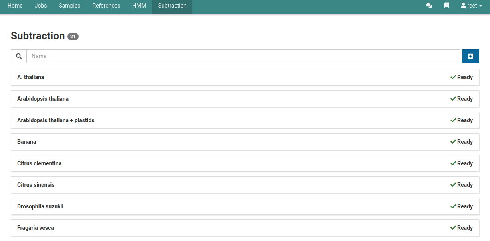
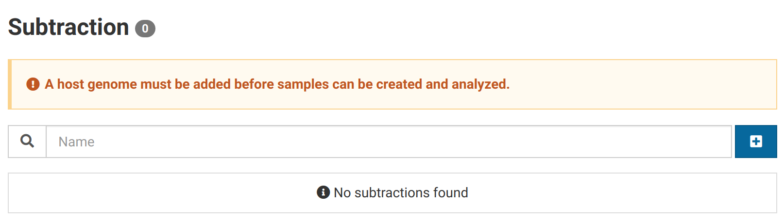
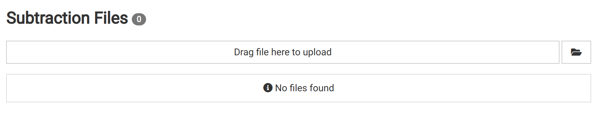
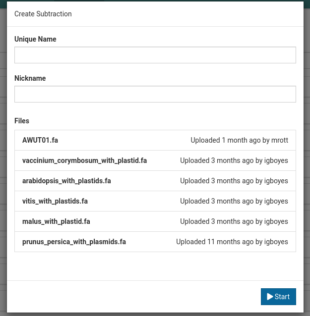
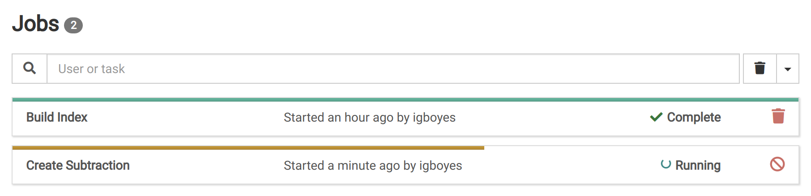
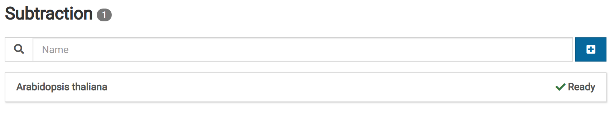
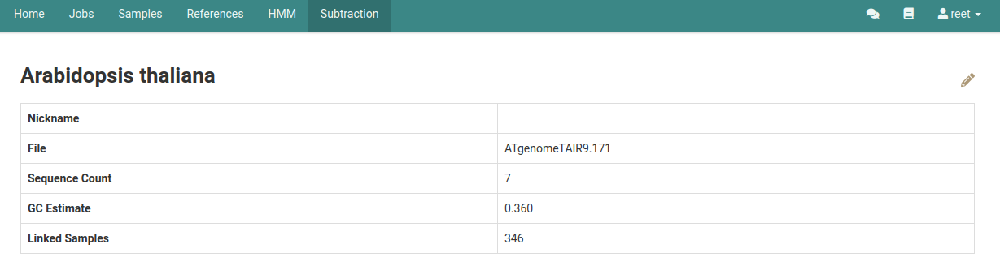

# Overview

Subtractions are whole genome references used for eliminating reads from the analysis that are likely to have originated from the host genome or non-pathogenic organisms associated with the host such as insects or fungi. A list of subtractions made can be found on the Subtraction Overview page.

# Upload FASTA {#uploading}

Go to the **Subtraction** view via the main navigation bar. You should see the following:

Click on the **Files** link in the left sidebar to go to the subtraction file manager.

Upload the previously obtained FASTA file.



# Create a Subtraction

Click on the **Subtraction** tab in the main navigation bar.

To create a new subtraction click the  button next to the search bar. This will open up the subtraction creation dialog.

Enter a unique name and an optional nickname, select the FASTA file, and click **Start** to start the job.

While the subtraction is being created it will have an **Importing** label.

Wait for the job to complete before trying to use the new subtraction. You can view its progress by going to the **Jobs** view.

The subtraction will have the **Ready** label when it is ready to use.

# View a Subtraction

View detailed information about the subtraction by clicking on it. As you use the subtraction in samples, they will be added to the **Linked Samples** list.

# Edit a Subtraction

Click on **Subtraction** in the main navigation bar and click on the subtraction you would like to edit.

Click on the  icon on the subtraction details page to bring up the **Edit Subtraction** dialog box.

Once a subtraction is made, the Unique Name and File cannot be changed. You are however, allowed to change the nickname of the subtraction.

The edits made on the subtraction will show up on the subtraction details page.

# Delete a Subtraction

Click on **Subtraction** in the main navigation bar and click on the subtraction that you wish to delete.

To delete the subtraction click on the  icon on the subtraction details page.

A dialog box will then pop up to confirm the deletion; select **Confirm**.

After confirming the deletion of a subtraction, it will no longer be shown on the subtraction overview page.

Once you start using subtractions in samples and they become **Linked Samples**, you will not be able to delete the subtraction.

