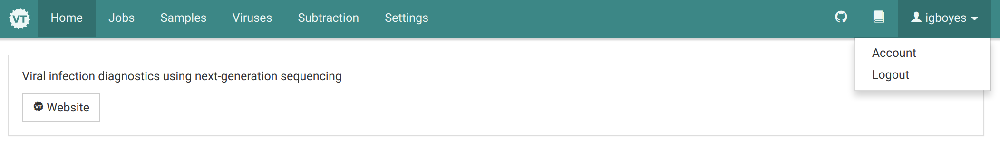
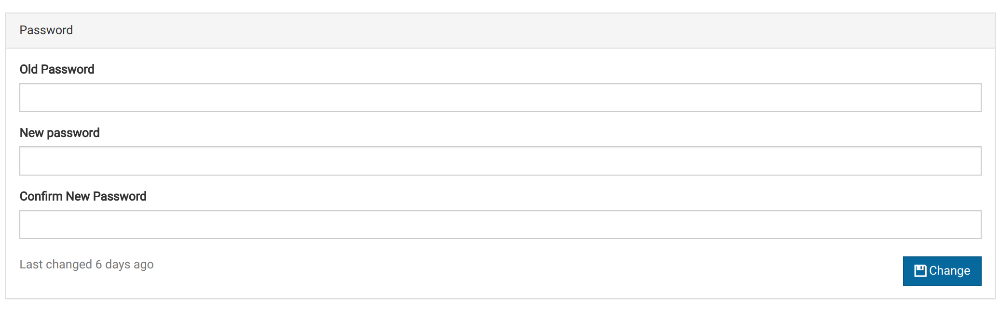
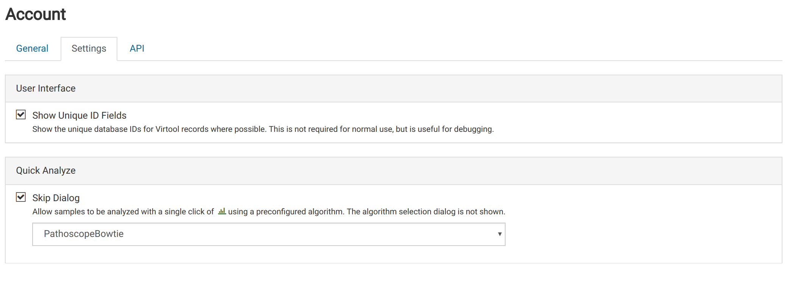
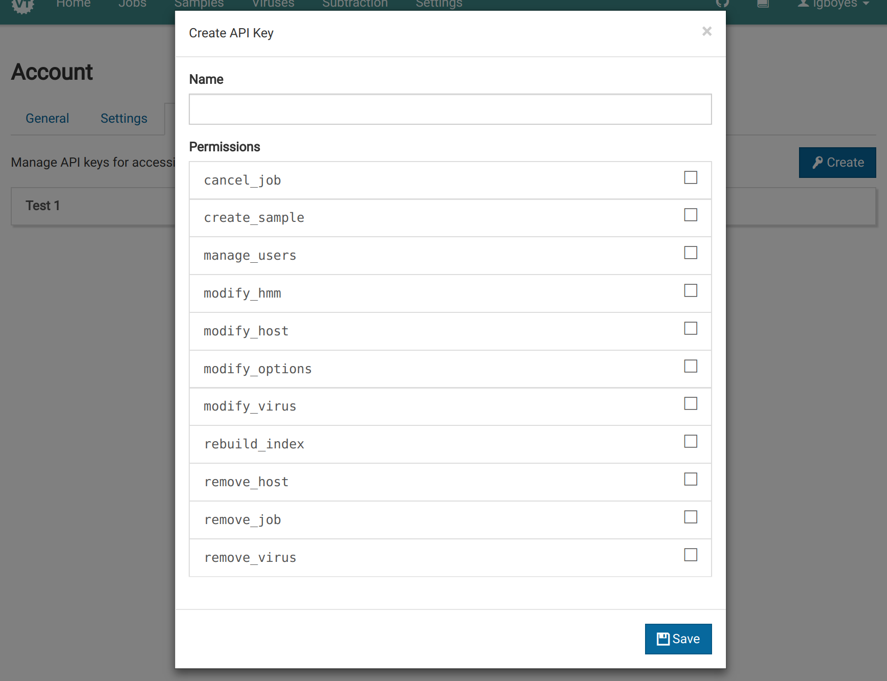

You can view your account details by navigating to _Username_ > Account in the main navigation bar.

You will land on this page, where you can make changes to your account. Here, you can see your username and user groups to which you belong.

# Change Password {#password}

You can change your password under the _General_ tab. By default, new passwords must be a minimum of 8 characters. This setting could be changed by your administrator.

# Settings {#settings}

Some settings are account-specific. These can be modified under the _Settings_ tab.

## Show Unique ID Fields

In certain situations, you can make visible the internal unique IDs for various Virtool data records. By default, these unique IDs are not shown.

They are useful for debugging.

## Quick Analyze

Virtool can be configured to allow you to quickly start analyses from the sample listing page.

By default, triggering quick analysis results in an algorithm selection dialog being shown before the job is started.

Setting _Skip Dialog_ prevents the dialog from appearing and starts every quick analysis job with the selected algorithm.

# API Keys {#api_keys}

Virtool exposes a complete [web API](/web-api.html). Access to the API is managed using [API keys](/web-api/authorization.html).

API keys are account-specific and are generated under the _API_ tab in the _Account_ view.

## Creating an API Key

1. Click **<i class="fa fa-key"></i> Create** to show the API key creation form.
   

2. Name the API key. Names do not have to be unique.

3. Select permissions you want the key to have. Permissions that are not granted to your account will be disabled and greyed out.

4. Click <i class="vtfont i-floppy"></i> to create the key.

5. The key will be shown only once. Make sure you keep it somewhere safe.
   

6. Use the key to access the API with the help of the [API documentation](/web-api/authorization.html).

{}
If permissions are removed from your account after the key is created, they will also be removed from the key.
{}
