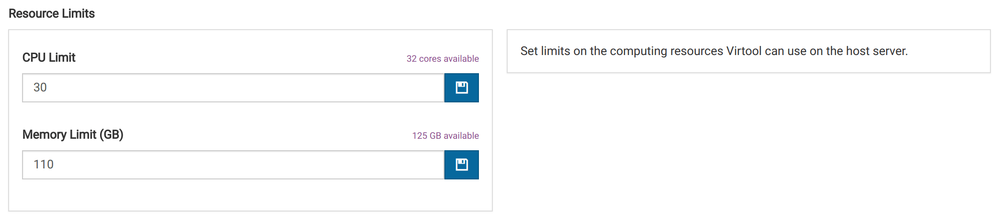

# General Settings

## Source Types

Isolate names comprise a _source type_ and _source name_. When creating isolates, users can be forced to use certain source type values for naming isolates.

Source type restrictions do not affect viruses that are imported into the database.

### Adding Source Types

Source types can be added by entering a new source type in the text box and clicking <i class="fa fa-plus-square"></i>. Once source types are added to the list, the can be accessed in isolate editing forms.

### Removing Source Types

Source types can be removed by clicking <i class="fa fa-trash"></i>. Source types that were assigned to isolates before removal will still be assigned to those isolates.

### Disabling Restriction

The source types feature can be disabled to allow users to enter whatever text they want as a source type. This can be done by clicking off the checkbox in the header of the _Source Types_ setting section.

## Internal Control

If you are using an internal control during your lab procedures, the control virus can be provided to Virtool. This setting is not currently in use, but may be used for scaling results or flagging irregular samples in the future.

### Selecting Internal Control

The internal control can be selected from the virus database by selecting the virus name in the dropdown text box.

### Disabling Internal Control

This can be done by clicking off the checkbox in the header of the _Internal Control_ setting section. This has no effect for now.

## Unique Sample Names

By default sample names must be unique to the sample manager. This prevents confusion with duplicately named samples. It is possible to disable this feature by clicking <i class="far fa-check-square"></i> **Enable**.

## Default Sample Rights

These settings determine how rights are assigned to newly created samples. Sample rights in Virtool are reminiscent of UNIX permissions.

### Sample Group

This determines how an owner group is applied to the sample when it is created.

|                 |                                                                                 |
| --------------- | ------------------------------------------------------------------------------- |
| _None_          | No group owner is assigned. Group rights do not apply                           |
| _Force Choice_  | The sample creator is forced to choose the owner group from their member groups |
| _Primary Group_ | The sample is automatically assigned the creators primary group                 |

### Group Rights

This settings determines how members of the owner group can interact with the sample. If the owner group is _None_, this setting has no effect.

### Group Rights

This setting determines how members of the owner group can interact with the sample. If the owner group is _None_, this setting has no effect. Rights can be changes by sample owners and administrators at any time.

|                |                                                                                                                     |
| -------------- | ------------------------------------------------------------------------------------------------------------------- |
| _None_         | Sample is not returned in searches and is not accessible by URL.                                                    |
| _Read_         | Sample is returned in searches and is viewable. All editing interfaces are disabled and analyses cannot be started. |
| _Read & Write_ | In addition to _Read_ rights, editing interfaces are enabled and analyses can be run.                               |

### All Users' Rights

This settings determines how any Virtool user can interact with the sample. Rights for all users behave exactly as they do in **Group Rights**. Rights can be changes by sample owners and administrators at any time.

# Server Settings

Manage technical settings for the Virtool server.

## HTTP Server

### Changing the HTTP Address

The address for the HTTP server can be changed by modifying the host and port number the server listens on.

Virtool must be restarted for these settings to take effect. Make sure the user running the Virtool server has the permissions required to bind the selected port. If you want to listen on port 80, we suggest setting up a [reverse proxy server](/docs/manual/gs_reverse_proxy) rather than running Virtool as a superuser.

### Enabling the API

To allow other applications to make use of Virtool's HTTP API, it must first be enabled. This can be done by checking <i class="far fa-square"></i> **Enable API**.

## Sentry

Sentry is a service Virtool developers use for tracking errors in instances of Virtool server and client software. This information is invaluable for fixing bugs and improving the user experience. Sample data is not sent as part of error reporting.

It is possible to opt out of sending error reports by unchecking the <i class="far fa-check-square"></i> **Enable** button. This change requires a reload to take effect.

# Data Settings

These settings determines how Virtool stores data in database and on disk.

{}
Changing these settings after initial setup can make Virtool non-functional.
{}

## Database

Allows administrators to change how Virtool connects to a MongoDB database. There are two situations when it would be safe and necessary to change these settings:

- the database had to be renamed and the name setting needs to be updated
- the database has moved to a different host and the host and port settings must be updated

These changes can be made here and require a server reload to take effect.

## Paths

Allows administrators to change where Virtool stores application data and where it automatically retrieves sequence data from.

### Virtool Data

The is the location Virtool where saves data for samples, analyses, virus indexes, subtractions, and uploaded files. Changing this location after inital setup is only safe and necessary in one situtation:

- the data path has moved to a different location and its contents are unchanged

These changes can be made here and require as server reload to take effect.

### Watch

This is the location Virtool automatically retrieves FASTQ files from.

The files are copied into the Virtool file manager and made available for sample creation. Files are deleted from the watch path once they are pulled into the file manager.

It is safe to change this path at any time.

# Jobs

Configure the resource usage of jobs on a Virtool instance.

## Resource Limits

These setting define what resources the Virtool server instance is allowed to access on the host computer.

The values for these settings cannot exceed the available resources. They cannot be set lower than any corresponding task-specific limits. Task-specific limits have to be reduced first before their corresponing resource limits.

## Task-Specific Limits

These settings define the resource limits for each task.

Jobs that exceed _CPU_ and _Memory_ task-specific limits will in most cases fail with an error.

The number of instances of each job type can be arbitrarily. Queued jobs in excess of the instance limit will be forced to wait until another instance completes. The setting prevents slowdowns due to heavy disk usage.

Certain fields are locked due to inherent resource requirements by those job types or limited benefit to increased resource allocation.
