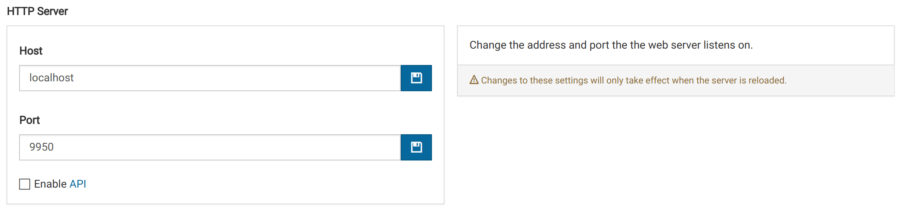

# Server Settings {#server}

Manage technical settings for the Virtool server.

## HTTP Server

### Changing the HTTP Address

The address for the HTTP server can be changed by modifying the host and port number the server listens on.

Virtool must be restarted for these settings to take effect. Make sure the user running the Virtool server has the permissions required to bind the selected port. If you want to listen on port 80, we suggest setting up a [reverse proxy server](/docs/manual/gs_reverse_proxy) rather than running Virtool as a superuser.

### Enabling the API

To allow other applications to make use of Virtool's HTTP API, it must first be enabled. This can be done by checking <i class="far fa-square"></i> **Enable API**.

## Sentry

Sentry is a service Virtool developers use for tracking errors in instances of Virtool server and client software. This information is invaluable for fixing bugs and improving the user experience. Sample data is not sent as part of error reporting.

It is possible to opt out of sending error reports by unchecking the <i class="far fa-check-square"></i> **Enable** button. This change requires a reload to take effect.

# Data Settings {#data}

{}
Changing these settings after initial setup can make Virtool non-functional.
{}

These settings determines how Virtool stores data in database and on disk.

## Database

Allows administrators to change how Virtool connects to a MongoDB database. There are two situations when it would be safe and necessary to change these settings:

- the database had to be renamed and the name setting needs to be updated
- the database has moved to a different host and the host and port settings must be updated

These changes can be made here and require a server reload to take effect.

## Paths

Allows administrators to change where Virtool stores application data and where it automatically retrieves sequence data from.

### Data

The is the location Virtool where saves data for samples, analyses, virus indexes, subtractions, and uploaded files. Changing this location after inital setup is only safe and necessary in one situtation:

- the data path has moved to a different location and its contents are unchanged

These changes can be made here and require as server reload to take effect.

### Watch

This is the location Virtool automatically retrieves FASTQ files from.

The files are copied into the Virtool file manager and made available for sample creation. Files are deleted from the watch path once they are pulled into the file manager.

It is safe to change this path at any time.

# Updates {#updates}
