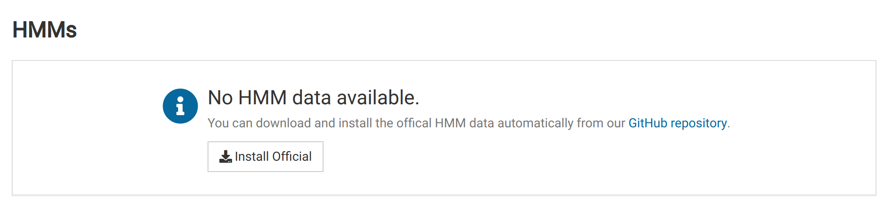
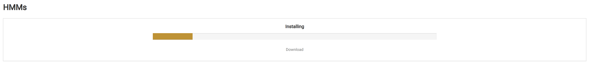
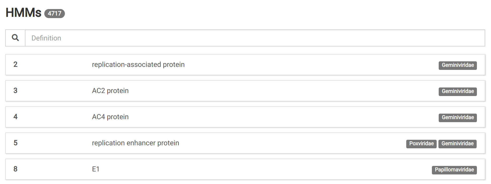
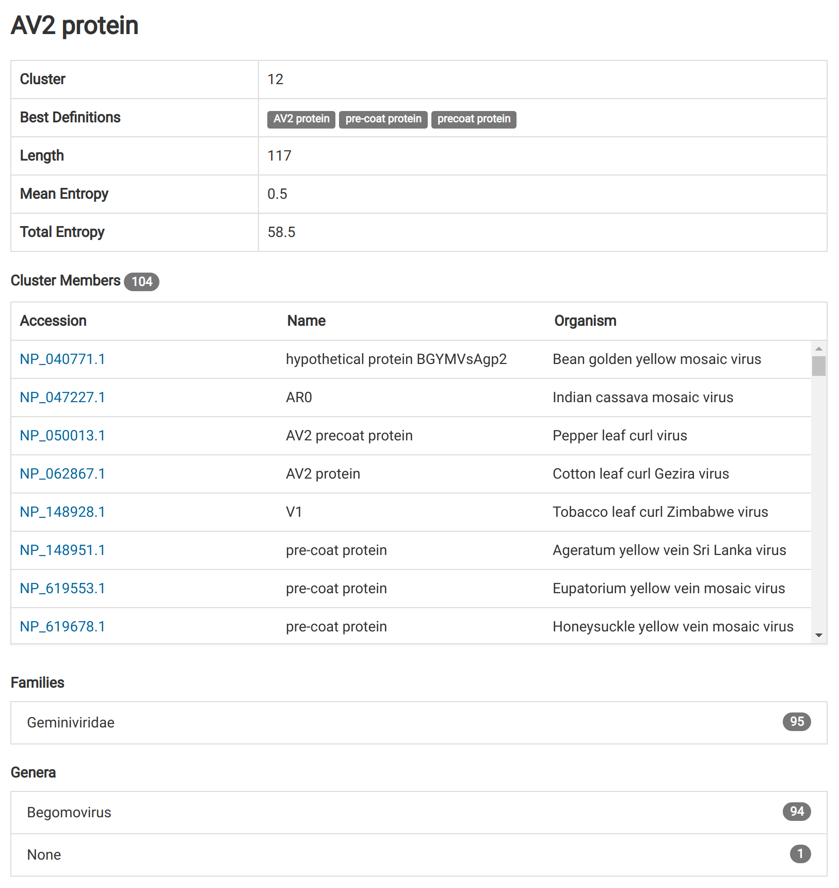

In order to use the NuVs algorithm, you must first install HMM profiles and annotations. Together these data allow NuVs to identify and annotate sequences assembled from your sample that might comprise part of a novel viral genome.

# Install Official Data {#official}

Navigate to the _HMMs_ view in the main navigation bar. You should see something like this if no HMM data have already been installed:

Click the **Install Official** button to begin downloading the data. This could take some time. The page should look something like this:

When the installation is complete, the HMM data will load and you will see a list of annotations.

Clicking on an HMM item will show detailed information for that HMM profile and its biological annotation.

