This tutorial assumes you have already [created a sample](/docs/manual/tut_sample/), [created and built a reference](/docs/manual/tut_reference/), [created a subtraction](/docs/manual/tut_subtraction/), and [installed HMM profiles and annotations](/docs/manual/tut_hmms/). You will use these data sources to run a bioinformatic pipeline for discovering potential novel virus sequences in a sample.

# Start an Analysis Job

Navigate to the _Samples_ view.

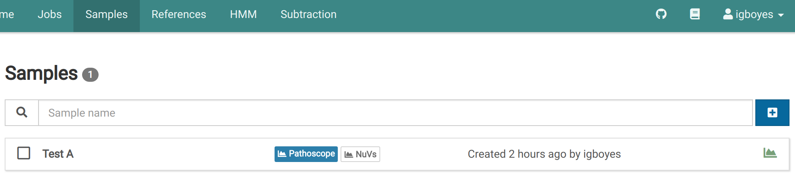

Click on a sample. You will see the general information for the sample.

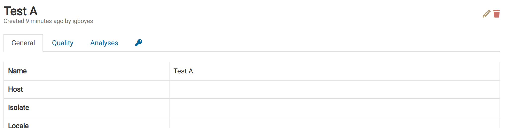

Navigate to the _Analyses_ tab to see a list of analyses for the sample.

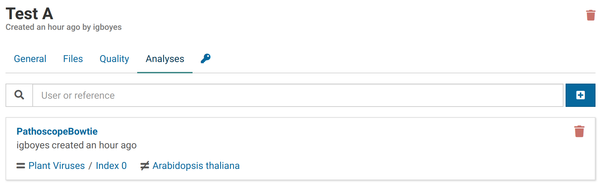

Click <i class="fa fa-plus-square"></i> to open the analysis creation dialog, select **NuVs** and a reference against which to eliminate known sequences, and click <i class="fa fa-play"></i> **Start**.

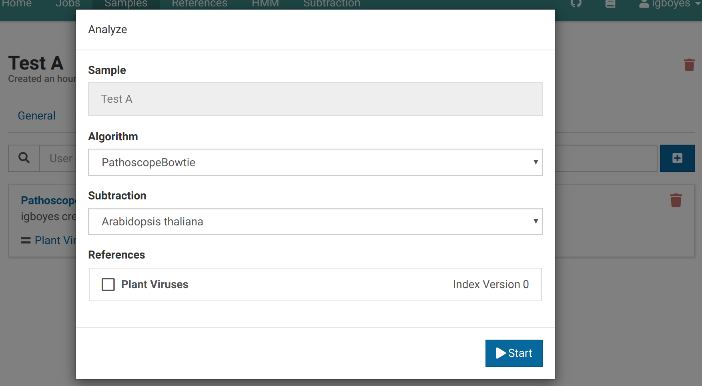

The dialog will close and you will immediately see your new analysis appear in the list. The NuVs pipeline can take significantly longer than Pathoscope to complete.

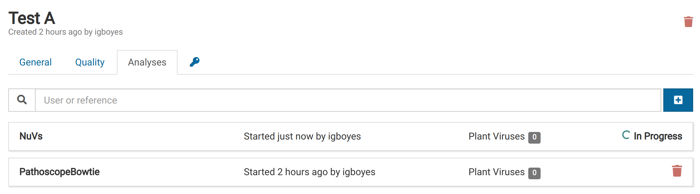

When the analysis is complete, the list item will look like this:

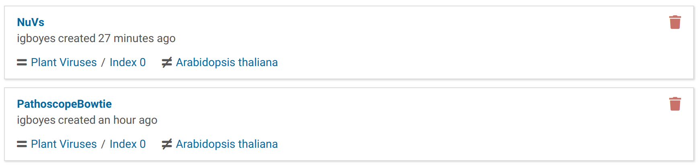

In the _Samples_ view, you will notice the sample entry is tagged to show that a NuVs analysis has been completed.

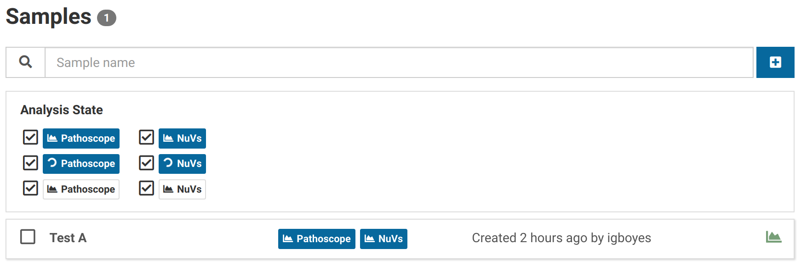

# View NuVs Results

Carrying on from the previous section, click on your recently created analysis. The list shows sequence fragments (contigs) that may be part of a novel virus.
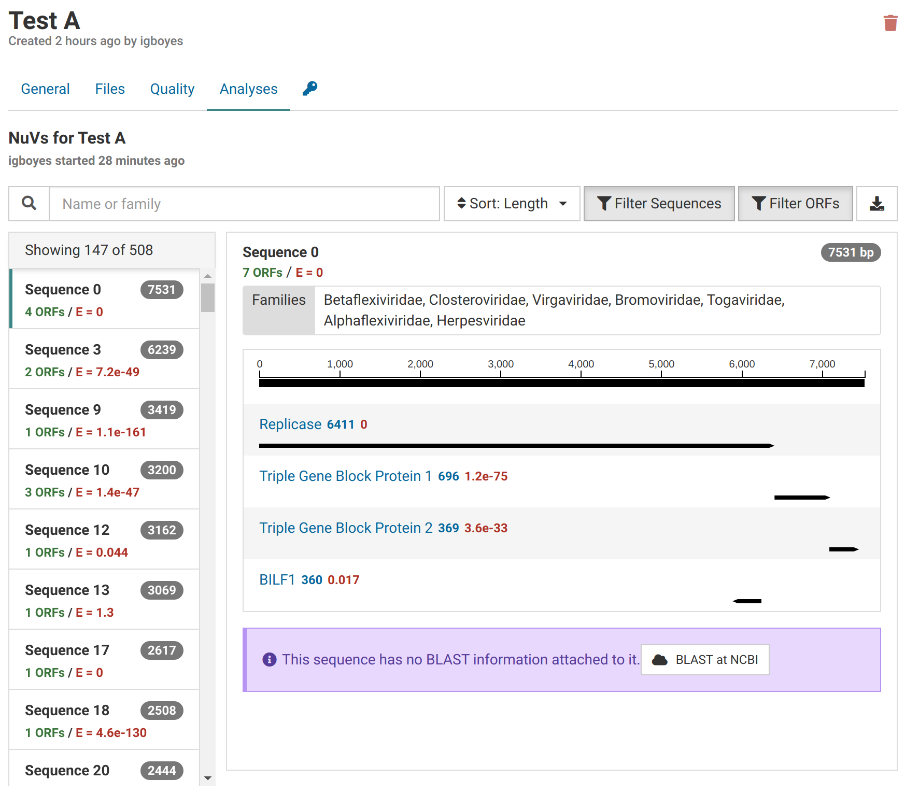

During NuVs, sample libraries are assembled into contigs. Open reading frames (ORFs) are calculated from these and potential protein annotations are assigned using profile HMMs.
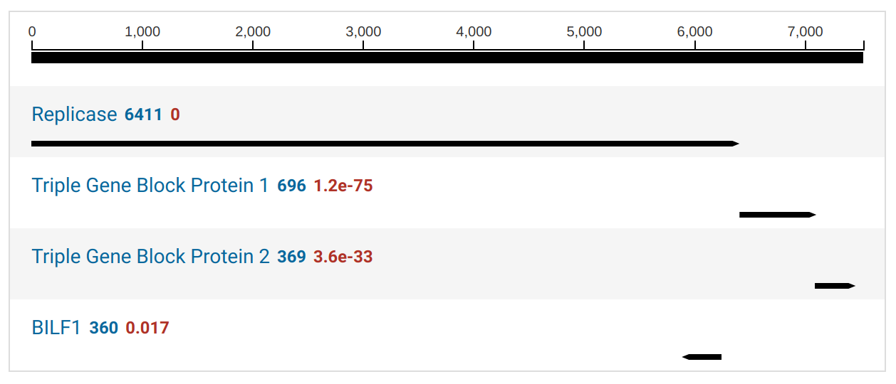

By default, ORFs with no HMM annotation are hidden. You can toggle the visibility of these by clicking the <i class="fa fa-filter"></i> <strong>Filter ORFs</strong> button.
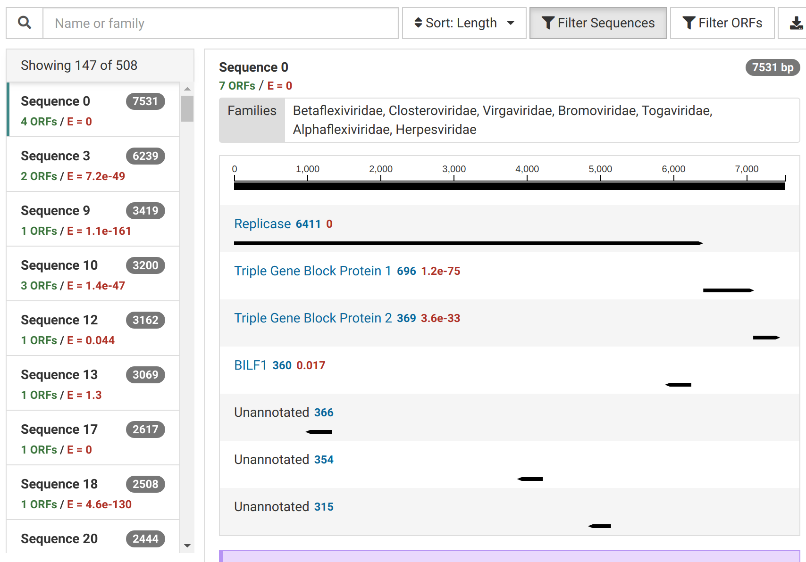

Contigs without significant HMM hits are filtered out by default. Click <i class="fa fa-filter"></i> <strong>Filter Sequences</strong> to show all contig sequences.

Part of interpreting NuVs results is BLASTing contigs to make sure they are truly unknown. You can BLAST contigs by clicking **BLAST at NCBI**.
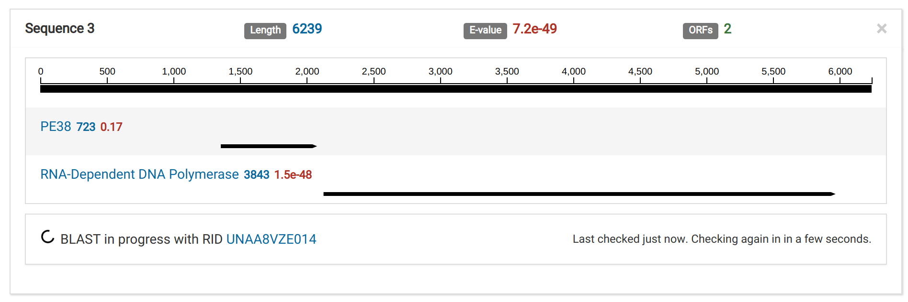

The BLAST results for this sequence show it is likely contamination from a technician.
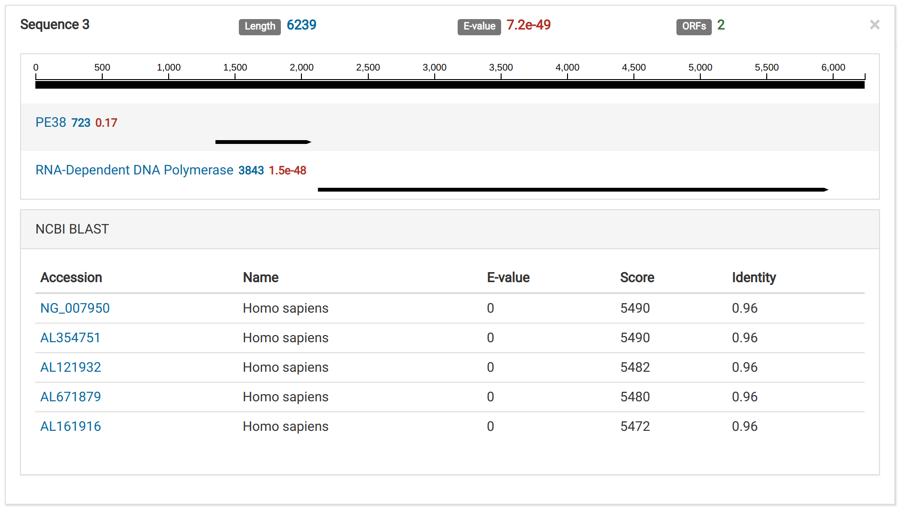
