This tutorial assumes you have already [created a sample](/docs/manual/tut_sample/), [created and built a reference](/docs/manual/tut_reference/), and [created a subtraction](/docs/manual/tut_subtraction/). You will use these data sources to run a bioinformatic pipeline for detecting, in a sample, known viruses from your virus database.

# Start an Analysis Job

Navigate to the _Samples_ view.

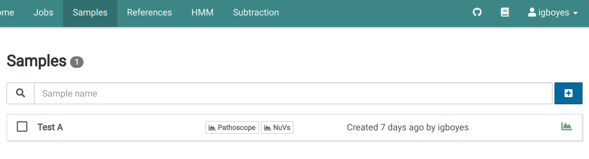

Click on a sample. You will see the general information for the sample.

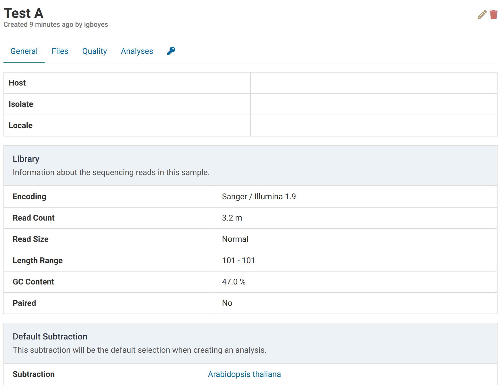

Navigate to the _Analyses_ tab. You should see an empty list if you haven't already created an analysis for this sample.

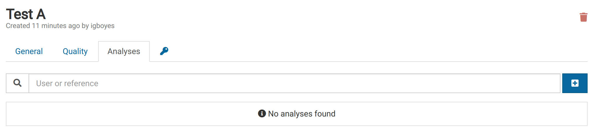

Click <i class="fa fa-plus-square"></i> to open the analysis creation dialog, select PathoscopeBowtie and a refernece to search against, and click <i class="fa fa-play"></i> **Start**.

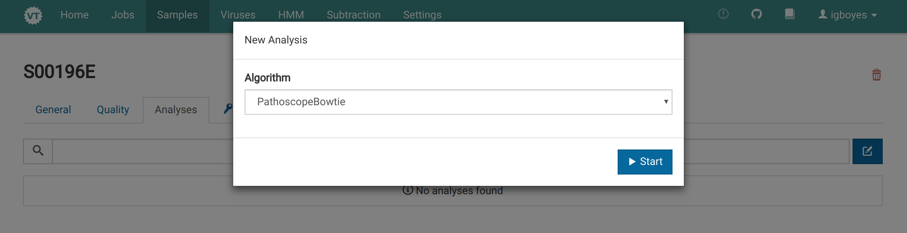

The dialog will close and you will immediately see your new analysis appear in the list.

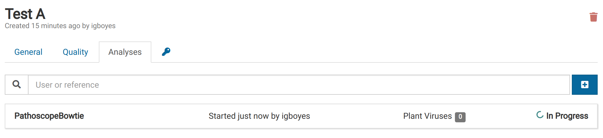

When the analysis is complete, the list item will look like this:

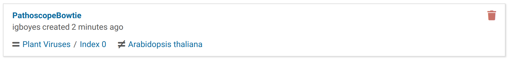

In the _Samples_ view, you will notice the sample entry is tagged to show that a Pathoscope analysis has been completed.

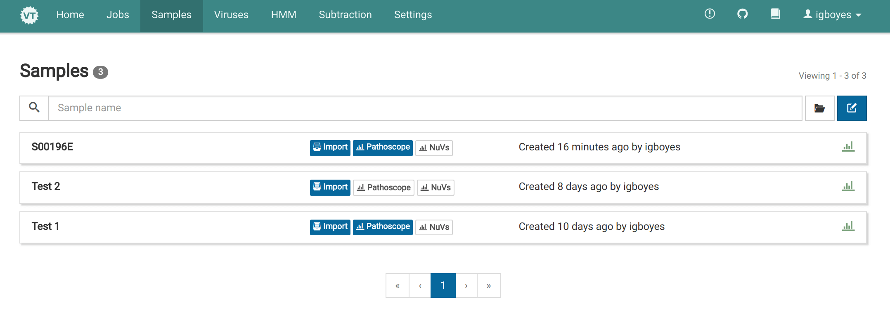

# View Pathoscope Results

Carrying on from the previous section, click on your recently created analysis. The list shows the viruses Virtool thinks are likely to be in the sample.

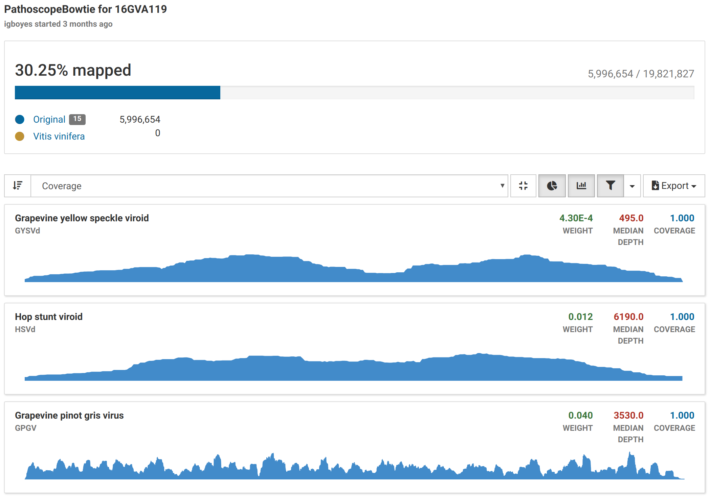

By default, viruses with low coverage or weight (relative abundance) are filtered out. They can be made visible by clicking <i class="fa fa-filter"></i>.

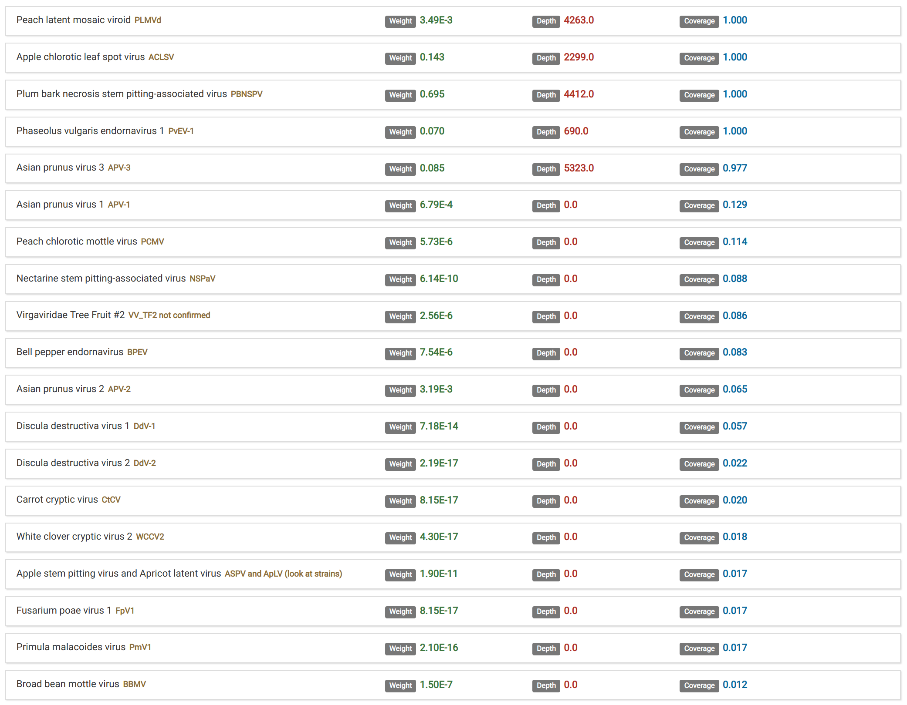

Clicking a virus shows sequencing coverage charts for the isolates that may be in your sample.

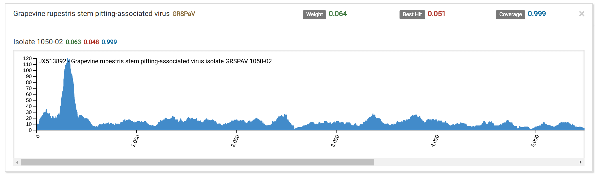

- Deep, wide coverage of an isolate is indicative of an infection.
- Shallow, wide, and broken coverage is suggestive of intra-plate contamination. Hits due to contamination also typically have low weights.
- Isolates with high weight, and deep localized coverage are typical of low-complexity or host-similar regions in the isolate genome and do not indicate true infections.

Filtering of low weight and coverage isolates is toggled by clicking <i class="fa fa-filter"></i>. Virtool excels at detecting virus infections at the isolate-level. In this case, it is clear that **Isolate Q65b** is the infective isolate rather than **Isolate Nanjing**.
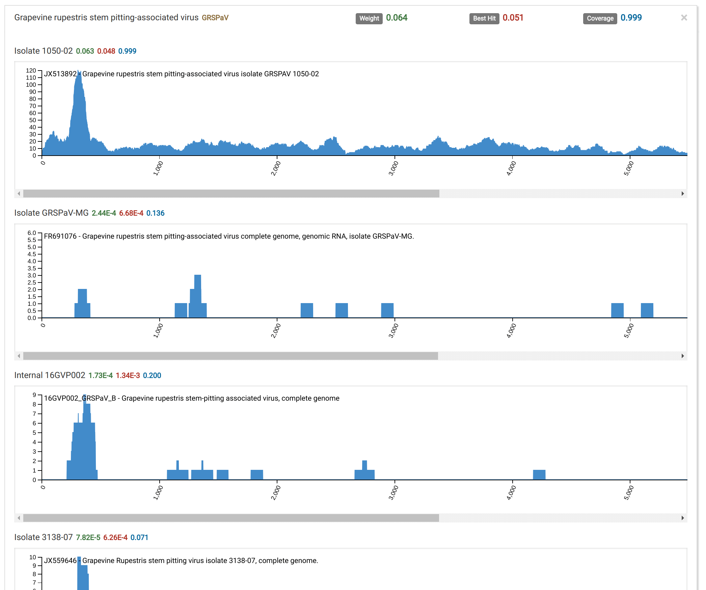
