Virtool is built for detecting viruses and is capable of detecting other pathogens. Managing collections of pathogen sequences used for this purpose is a key feature of Virtool.

At least one non-empty reference must be created in order to start analyzing samples. One quick way to accomplish this is to install the [official plant virus reference](https://github.com/virtool/ref-plant-viruses).

# Install the Official Reference {#installing}

Instead of starting a virus database from scratch, you can use our [official plant virus reference](https://www.virtool.ca/downloads). Doing this will setup up **_remote_** connection to the reference on GitHub.

Go to the _References_ view. If you have not yet installed the official reference, you should see this:

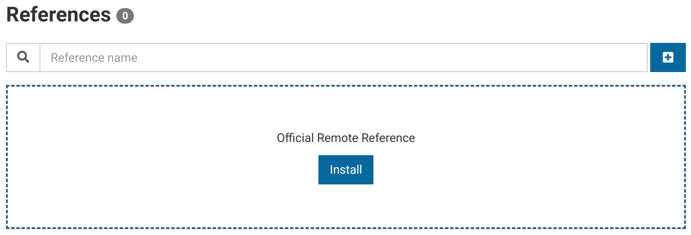

Click the **Install** button to begin the installation process. A new card should appear representing the official reference on your system.

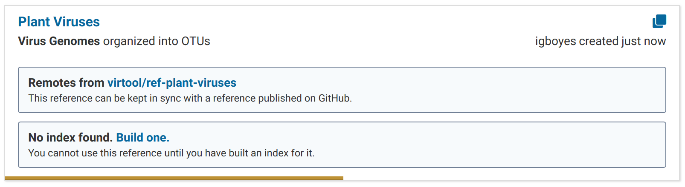

Once the installation process is complete, the reference card should look something like this:

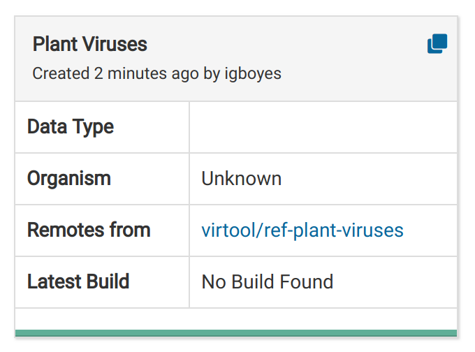

Clicking on the reference card will bring you to a detail page for the reference.

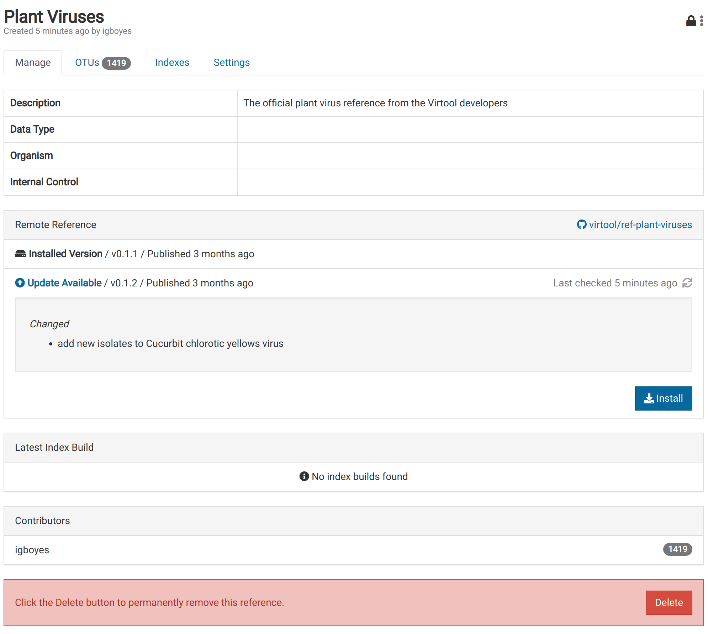

# Browse OTUs {#browsing}

Once the installation of the official reference is complete, you can browse the OTUs that are included in the reference.

Click on the **OTUs** tab and you should see something like the following:

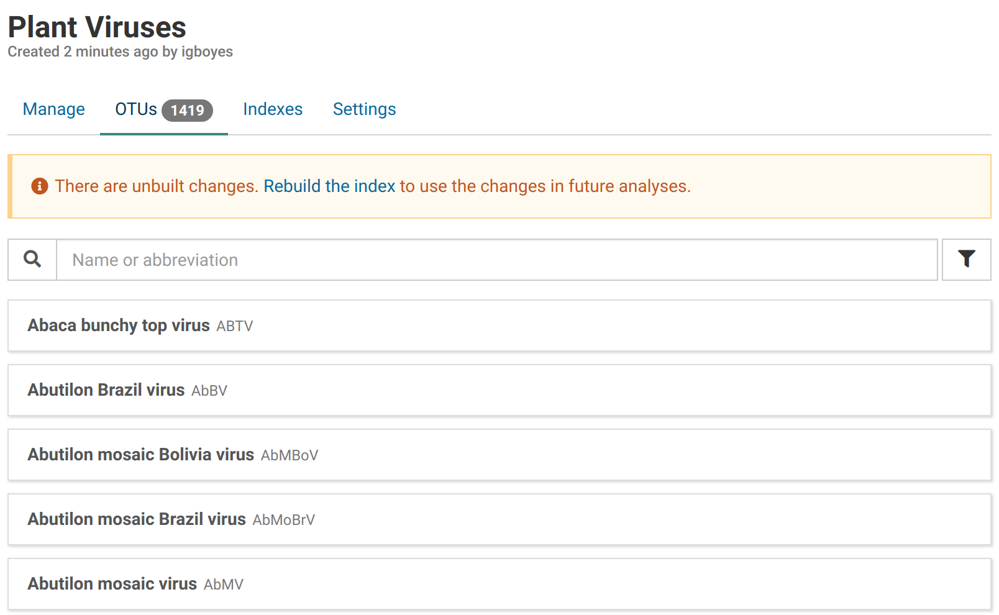

You can search OTUs by their names or abbreviations.

Note the _There are unbuilt changes_ message. This means you have to **_build_** a new index for the reference before you can use it in analyses.

# Build an Index {#building_an_index}

Before the imported data can be used in analyses, an optimized index must be built. Think of this as a publication or commit step.

Look for the **Indexes** tab in the reference detail view.

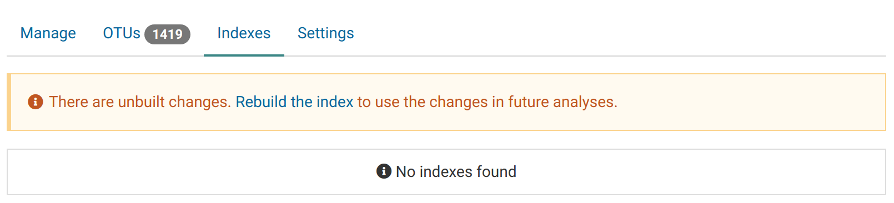

Click the **Rebuild the index** link to start preparing an index build.

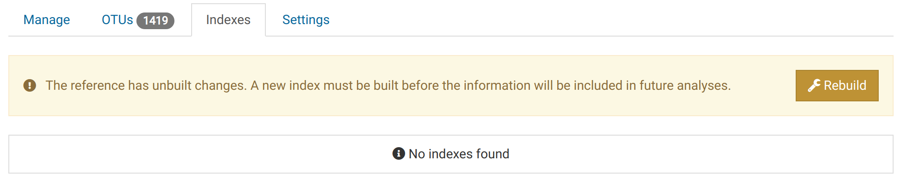

An index creation dialog describing the changes to be built will appear.

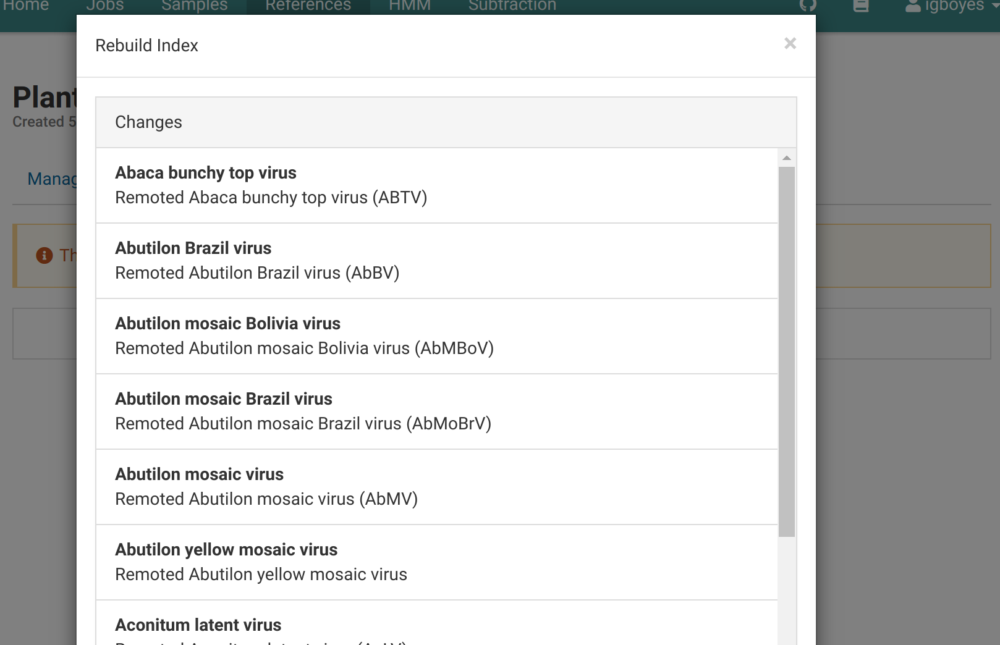
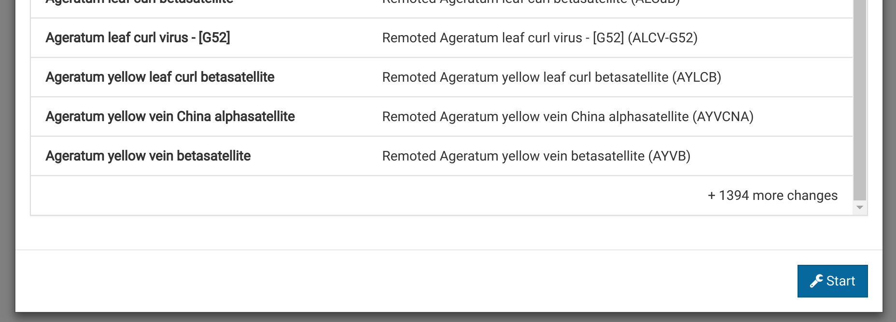

Click the **Start** button at the bottom of the dialog to start an index build job. A new index entry will appear with the **Building** label:

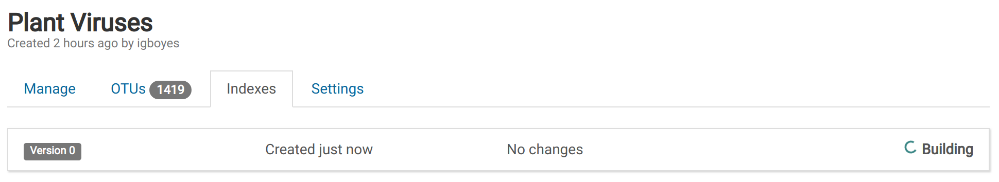

The index will look something like this is when it is ready to use. It will have the **Active** label.

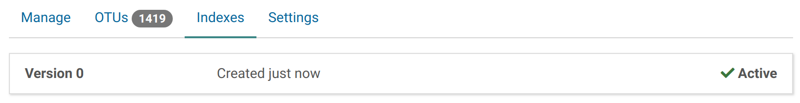
