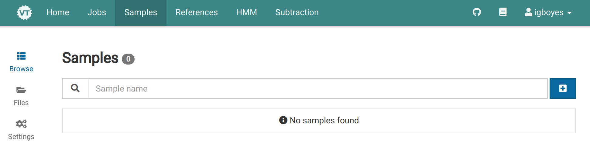
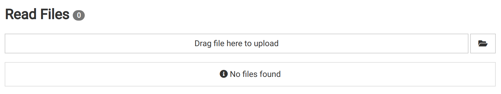
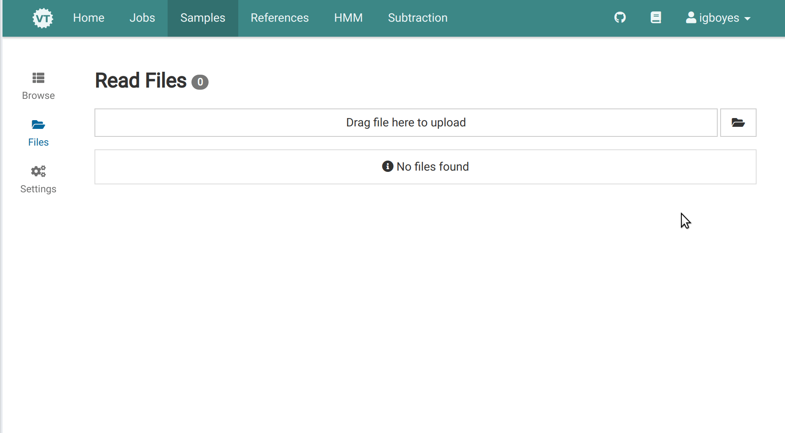
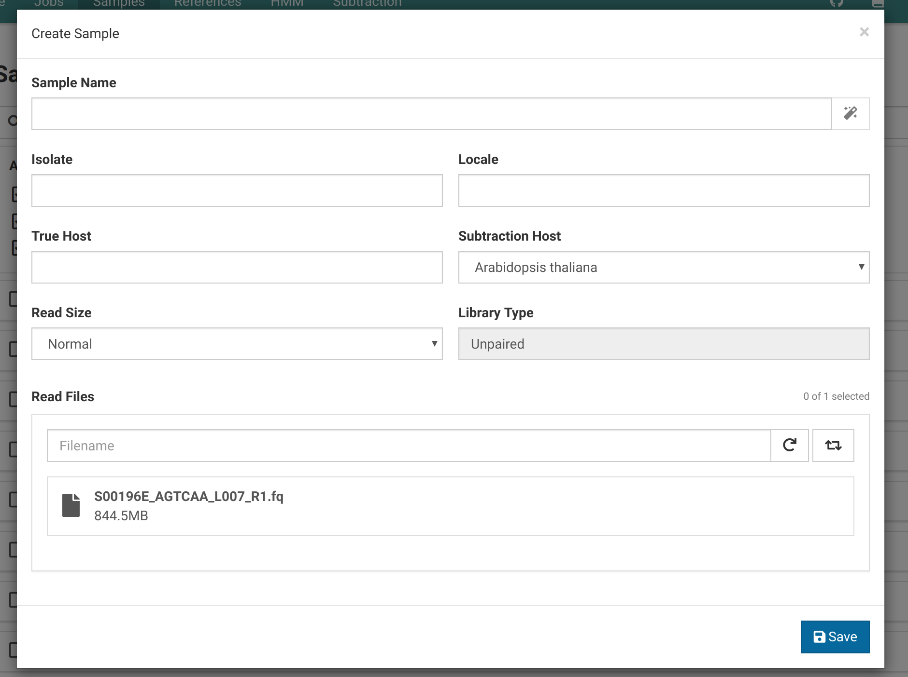
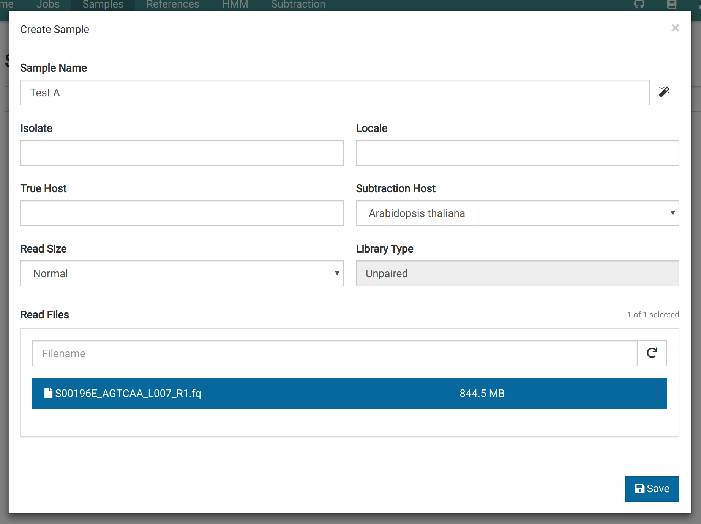
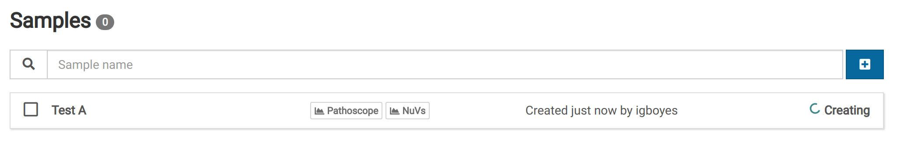
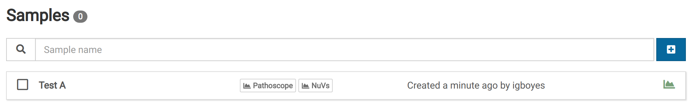
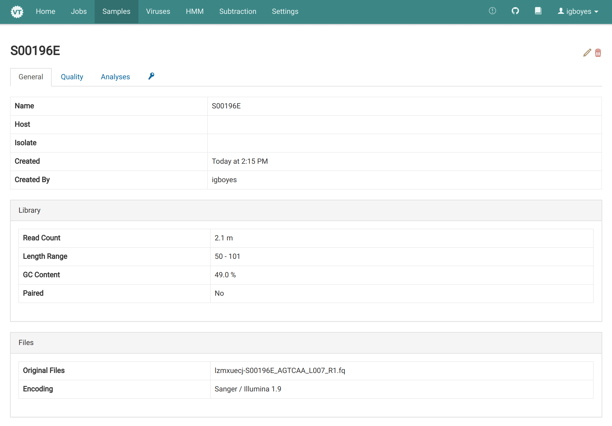

# Uploading a FASTQ File

1. Go the _Samples_ view via the main navigation bar.
   

2. Click **Files** in the left sidebar to go to the sample read file manager.
   

3. Upload a FASTQ read file.
   

4. In the _Samples_ view, click <i class="fa fa-plus-square"></i> to open the sample creator. The file you uploaded should now be available in file list.
   

# Creating a Sample

1. Fill out the fields in the sample creator. Only the sample name, subtraction host, and one or two read files are required.
   

2. Click <i class="fas fa-save"></i> **Save** and you should immediately see a placeholder for your sample in the _Samples_ view. The spinner indicates that the sample is still being created.
   

3. When the sample creation process is finished your sample will look something like this:
   

4. When the sample is ready, you can see some information about your sample by clicking the sample entry in the _Samples_ view.
   

5. You can view a quality assessment generated using [FastQC](https://www.bioinformatics.babraham.ac.uk/projects/fastqc/), by clicking the _Quality_ tab.
   
