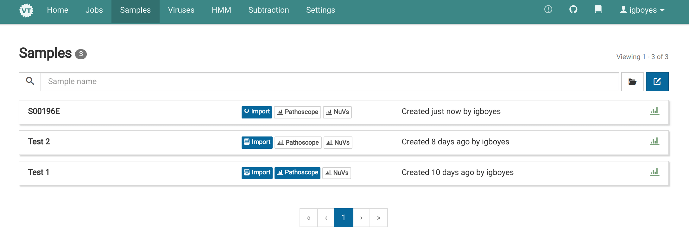

# Uploading a FASTQ File

1. Go the _Samples_ view via the main navigation bar.
   

2. If you haven't already uploaded a FASTA file, you must do so. Click <i class="fa fa-folder-open"></i> to go to the read file uploader and upload as FASTQ file.
   

3. In the _Samples_ view, click <i class="fa fa-edit"></i> to open the sample creator. The file you uploaded should now be available in file list.
   

# Creating a Sample

1. Fill out the fields in the sample creator. Only the sample name, subtraction host, and one or two read files are required.
   

2. Click <i class="fas fa-save"></i> **Save** and you should immediately see a placeholder for your sample in the _Samples_ view. The spinner indicates that the sample is still being imported.
   

3. When the import is complete you can see some information about your sample by clicking the sample entry in the _Samples_ view.
   

4. You can view a quality assessment generated using [FastQC](https://www.bioinformatics.babraham.ac.uk/projects/fastqc/), by clicking the _Quality_ tab.
   
