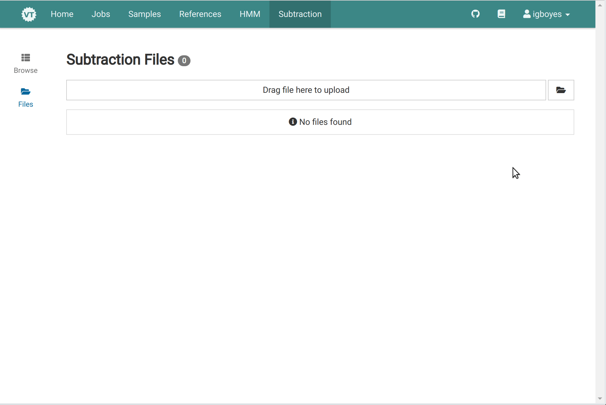
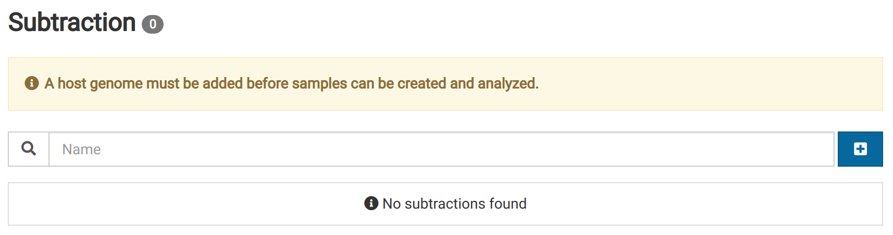

Subtractions are whole genome references used for eliminating reads from the analysis that are likely to have originated from the host genome or non-pathogenic organisms associated with the host such as insects or fungi.

## 1. Find source FASTA {#finding}

We will use the _Arabidopsis thaliana_ genome for this example.

1. Go the Ensembl Genomes FTP site for Arabidopsis [here](ftp://ftp.ensemblgenomes.org/pub/plants/release-37/fasta/arabidopsis_thaliana/dna/). Download the unmasked version of the genome.
   

2. Decompress the downloaded file. Virtool does not currently accept GZIP-compressed subtraction FASTA data.

## 2. Upload FASTA {#uploading}

1. Go to the _Subtraction_ view via the main navigation bar. You should
   

2. Click on the **Files** link in the left sidebar to go to the subtraction file manager.
   

3. Upload the FASTA file obtained during step **1.2**.
   

## 3. Create Subtraction {#creating}

1. Go to the _Subtraction_ view via the main navigation bar.
   

2. Click the <i class="vtfont i-new-entry"></i> button to open the subtraction creation dialog.
   

3. Enter a unique name and an optional nickname, select the FASTA file, **Start** to start the job.
   

4. While the subtraction is being created it will have an **Importing** label.
   

5. Wait for the job to complete before trying to use the new subtraction. You can view its progress by going to the _Jobs_ view.
   

6. The subtraction will have the <i class="vtfont i-checkmark"></i> **Ready** label when it is ready to use.
   

7. View detailed information for the subtraction by clicking on it. As you use the subtraction in samples, they will be added to the **Linked Samples** list.
   
