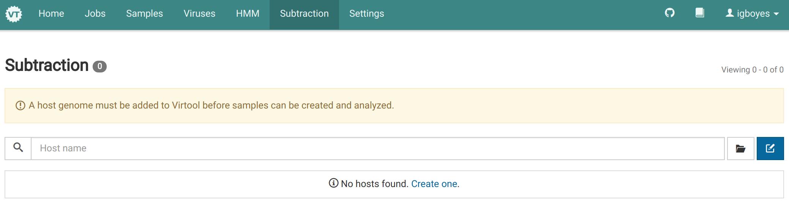
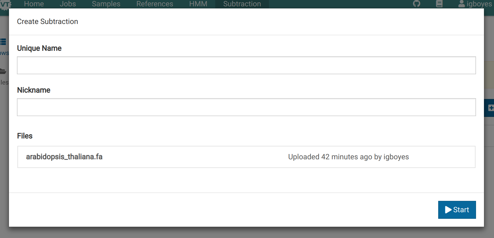
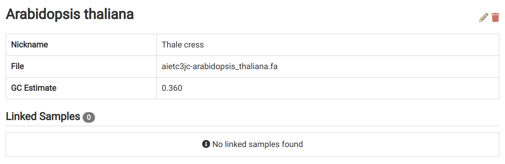

Subtractions are whole genome references used for eliminating reads from the analysis that are likely to have originated from the host genome or non-pathogenic organisms associated with the host such as insects or fungi.

# Find source FASTA {#finding}

We will use the _Arabidopsis thaliana_ genome for this example.

Go to the Ensembl Genomes FTP site for Arabidopsis [here](ftp://ftp.ensemblgenomes.org/pub/plants/release-37/fasta/arabidopsis_thaliana/dna/). Download the unmasked version of the genome.

Decompress the downloaded file. Virtool does not currently accept GZIP-compressed subtraction FASTA data.

# Upload FASTA {#uploading}

Go to the _Subtraction_ view via the main navigation bar. You should see the following:

Click on the **Files** link in the left sidebar to go to the subtraction file manager.

Upload the previously obtained FASTA file.



# Create Subtraction {#creating}

Go to the _Subtraction_ view via the main navigation bar.

Click the  button to open the subtraction creation dialog.

Enter a unique name and an optional nickname, select the FASTA file, and click **Start** to start the job.

While the subtraction is being created it will have an **Importing** label.

Wait for the job to complete before trying to use the new subtraction. You can view its progress by going to the _Jobs_ view.

The subtraction will have the  **Ready** label when it is ready to use.

View detailed information for the subtraction by clicking on it. As you use the subtraction in samples, they will be added to the **Linked Samples** list.

