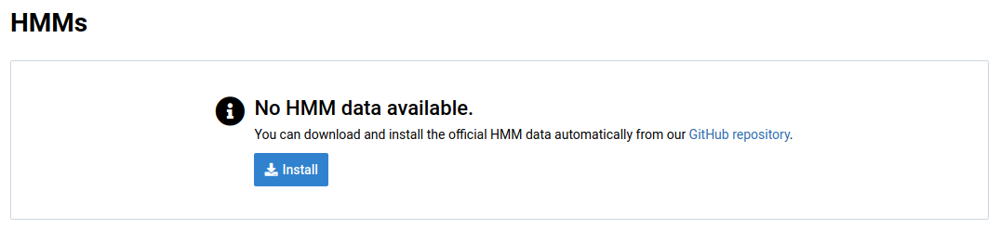
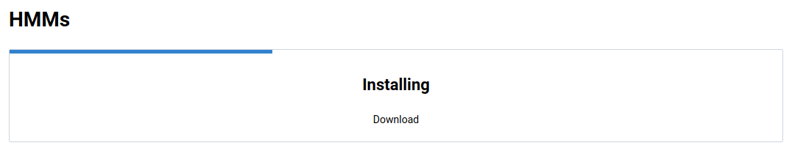
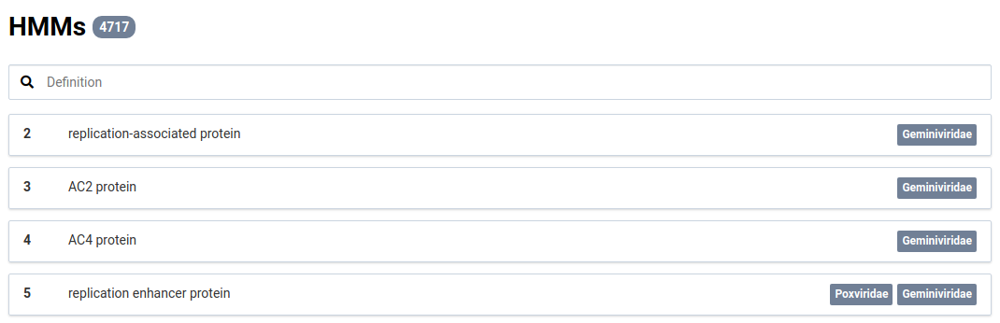
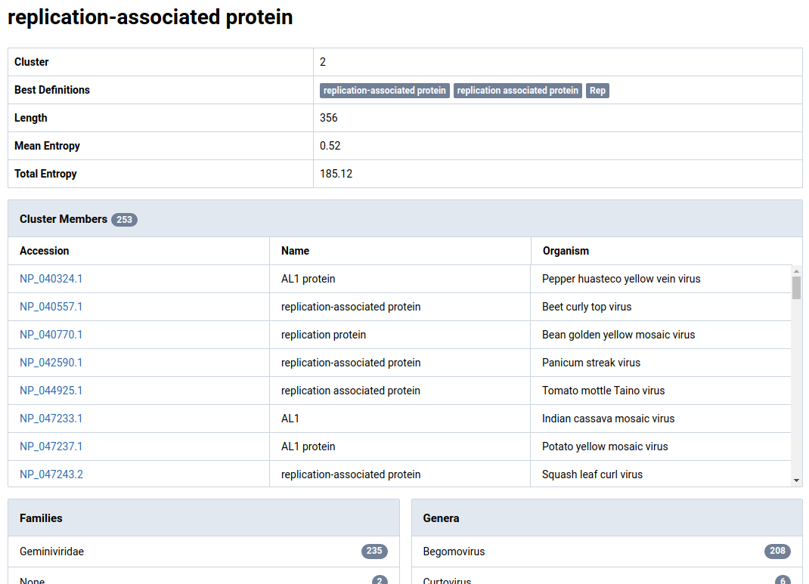

In order to use the NuVs algorithm, you must first install HMM profiles and annotations. Together these data allow NuVs to identify and annotate sequences assembled from your sample that might comprise part of a novel viral genome.

# Install Official Data {#official}

1. Navigate to the _HMMs_ view in the main navigation bar

    You should see something like this if no HMM data have already been installed:

    

2. Click the  button.

    The data will begin downloading and installing. This could take some time. You should see a progress bar like this:

    

3. Wait for the installation to complete

    The HMM data will load and you will see a list of annotations.

    

4. Click an HMM to see its detail

    The detail view shows statistics about the HMM, the protein sequences it was calculated from, and an overview of the taxonomic annotations for the protein sequences.

    
