This tutorial assumes you have already done the following:

-   [created a sample](/docs/manual/tutorials/sample/)
-   [created and built a reference](/docs/manual/tutorials/reference/)
-   [created a subtraction](/docs/manual/tutorials/subtraction/)
-   [installed HMM profiles and annotations](/docs/manual/tutorials/hmms/)

You will use these data sources to run a workflow for discovering potential novel virus sequences in a sample.

# Start an Analysis Job

1. Navigate to the **Samples** view

    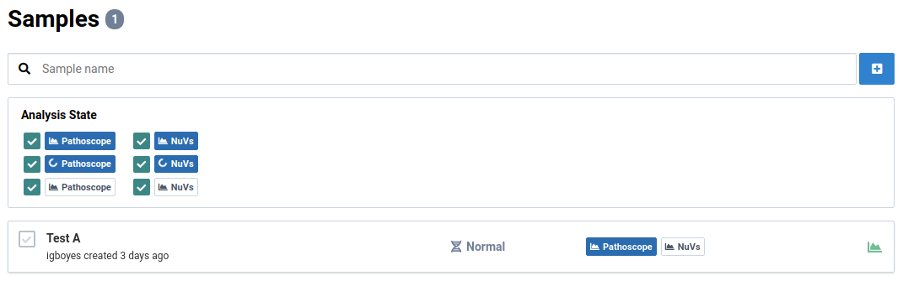

2. Click on a sample

    You will see the general information for the sample.

    

3. Navigate to the **Analyses** tab

    You will see a list of analyses for the sample. The sample _Test A_ has one PathoscopeBowtie analysis already complete.

    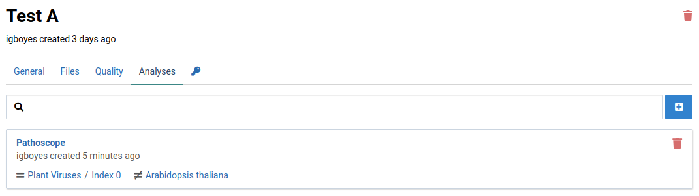

4. Click the  button to open the analyze dialog

    

5. Complete the analyze form

    Select the **NuVs** algorithm, a reference against which to eliminate known sequences. If you select multiple reference, a separate job will be created for each one.

    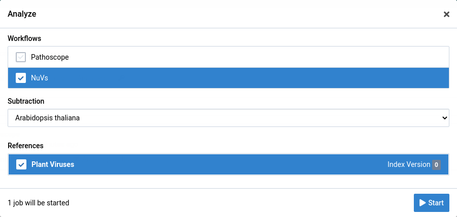

6. Click the  button

    The dialog will close and you will immediately see your new analysis appear in the list. NuVs can take significantly longer than Pathoscope to complete.

    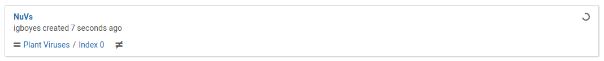

    When the analysis is complete, the list item will look like this:

    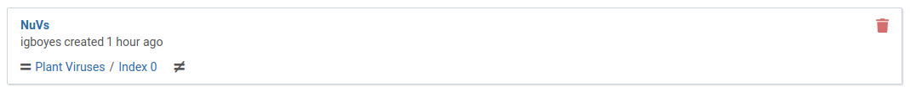

7. Navigate back to the **Samples** view

    The sample entry will be tagged to show that a NuVs analysis has been completed.

    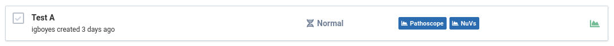

# View NuVs Results

1. Navigate to the **Analyses** tab for a sample

    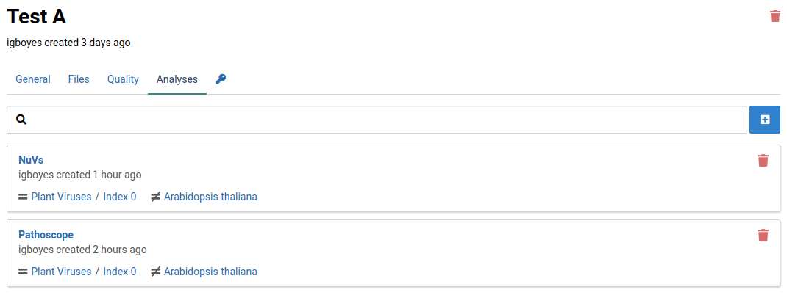

2. Click on the NuVs analysis item

    The list shows assembled sequence fragments (contigs) that may be part of a novel virus.

    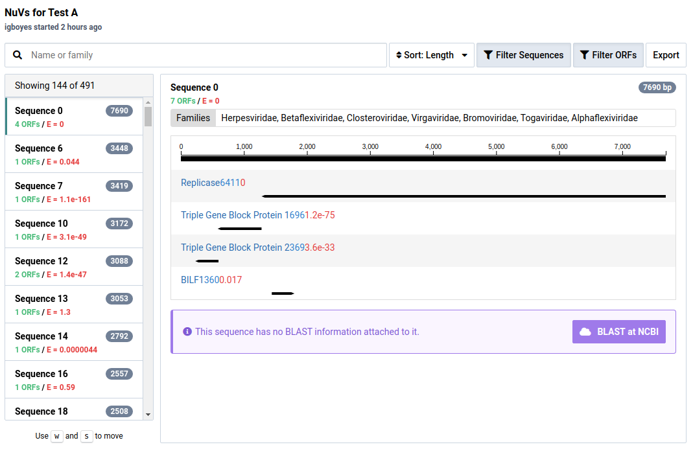

    In the NuVs workflow, sample libraries are assembled into contigs. Open reading frames (ORFs) are calculated from these and potential protein annotations are assigned using profile HMMs.

    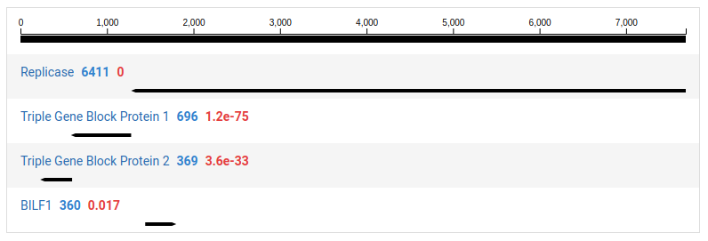

3. Click the  button.

    This will toggle the visibility of ORFs with no HMM annotations, which are hidden by default.

    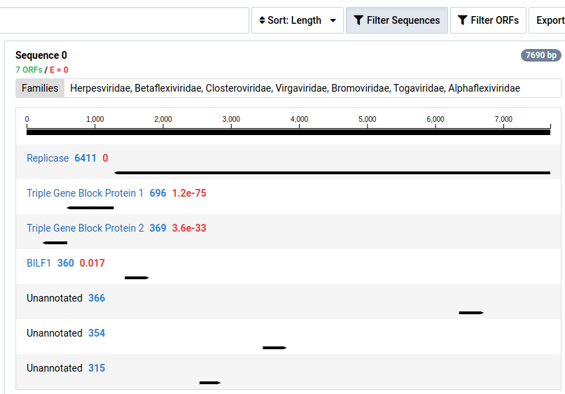

4. Click the  button

    This will toggle the visibility of contigs without significant HMM hits, which are filtered out by default.

    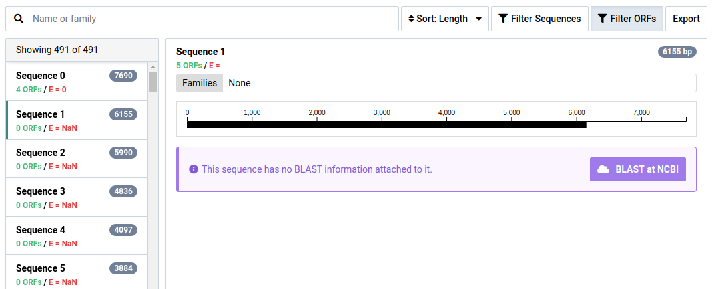

5. Click the  button to BLAST the contig at NCBI

    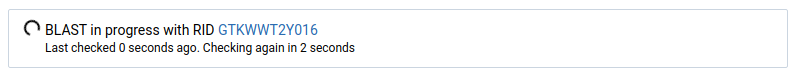

6. Wait for the BLAST search to complete

    Part of interpreting NuVs results is BLASTing contigs to make sure they are truly unknown. The BLAST results for this sequence show it is likely a contamination from a technician.

    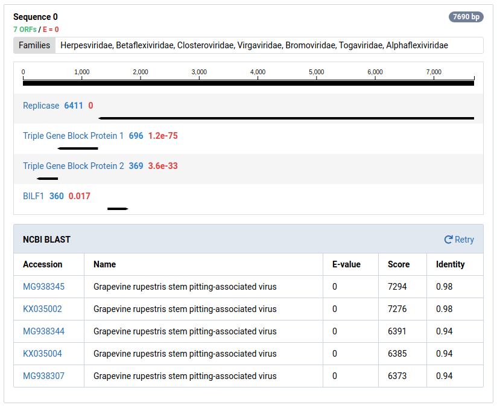
