This tutorial assumes you have already

-   [created a sample](/docs/manual/tutorials/sample/)
-   [created and built a reference](/docs/manual/tutorials/reference/)
-   [created a subtraction](/docs/manual/tutorials/subtraction/)

You will use these data sources to run a workflow for detecting, in a sample, known viruses from your virus database.

# Start a Pathoscope Job

1. Navigate to the **Samples** view

    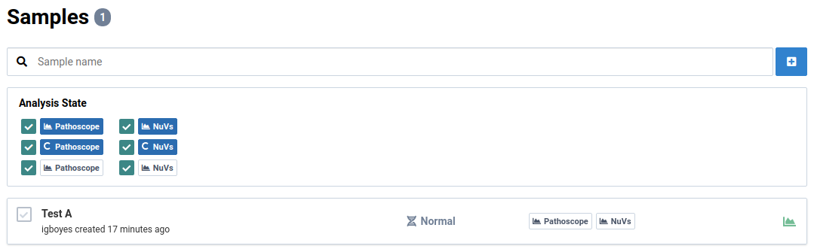

2. Click on a sample

    You will see the general information view for the sample.

    

3. Navigate to the **Analyses** tab

    You should see an empty list if you haven't already created an analysis for this sample.

    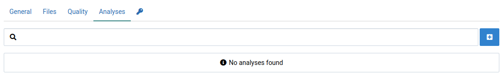

4. Click the  button to open the analyze dialog

    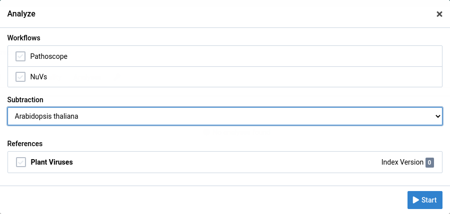

5. Select the analysis parameters

    Select the Pathoscope workflow, a subtraction, and one or more references to search against. Selecting more than one reference will start a separate analysis job for each reference.

    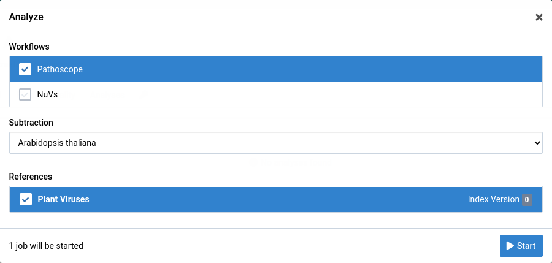

6. Click the  button to start the job

    The dialog will close and you will immediately see your new analysis appear in the list.

    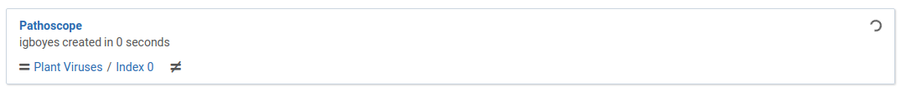

    When the analysis is complete it will look like this:

    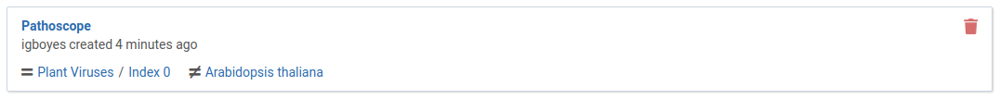

7. Go back to the **Samples** view

    The sample item is tagged to show that a Pathoscope analysis has been completed.

    

# View Pathoscope Results

1. Navigate to the analysis tab for a sample.

    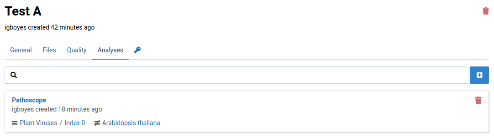

2. Click on an analysis

    The detail for the analysis will be displayed.

    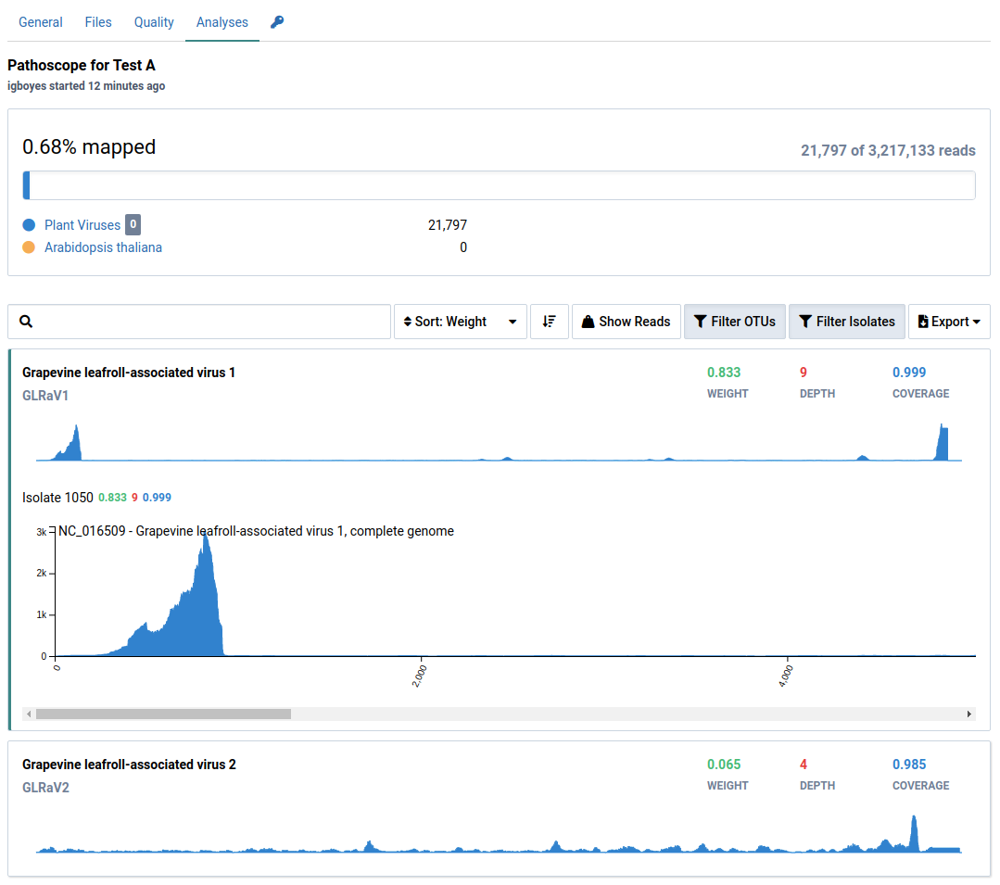

3. View the mapping overview

    This shows how many sample reads were mapped to the reference (eg. Plant Viruses) and the subtraction (eg. Arabidopsis thaliana).

    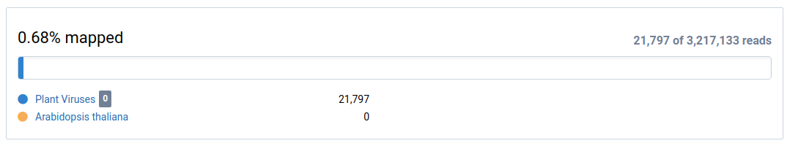

4. View the result list

    The list shows the viruses Virtool thinks are likely to be in the sample. Each identified OTU is listed and be expaned to show the coverage chart and detailed numbers for each isolate and sequence.

    

5. Use the mouse or the  and  keys to select OTUs

    

6. Click the  button to show all OTUs

    By default, OTUs with low coverage or weight (relative abundance) are filtered out. The OTUs shown here would normally be filtered out:

    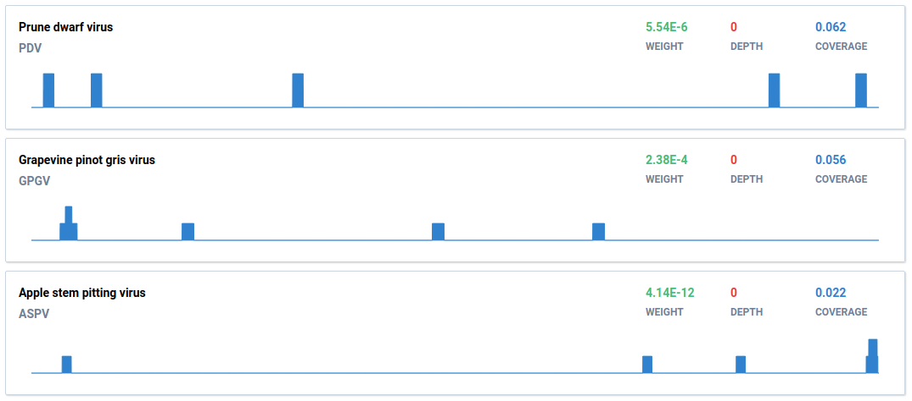

7. Clicking an OTU shows coverage charts for the isolates

    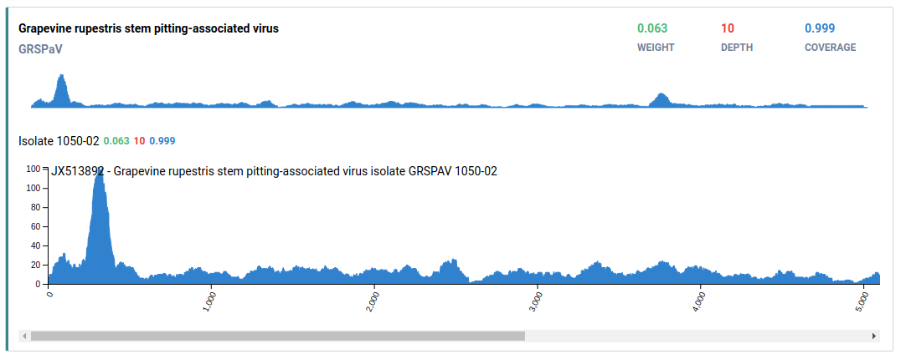

    - Deep, wide coverage of an isolate is indicative of an infection.
    - Shallow, wide, and broken coverage is suggestive of intra-plate contamination. Hits due to contamination also typically have low weights.
    - Isolates with high weight, and deep localized coverage are typical of low-complexity or host-similar regions in the isolate genome and do not indicate true infections.

8. Click the  to show all isolates

    By default, isolates with low coverage or wheight are filtered out.

    Virtool excels at detecting virus infections at the isolate-level. In this case, it is clear that **Isolate 1050-02** is the infecting isolate rather than **Isolate GRSPaV-MG**, which would normally be filtered out.

    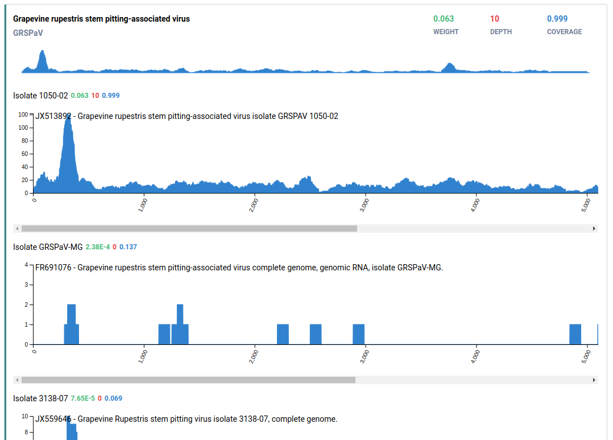
