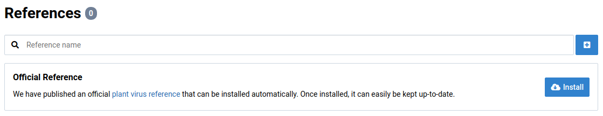
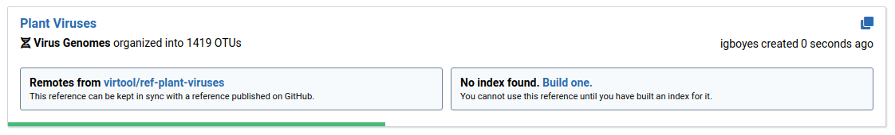
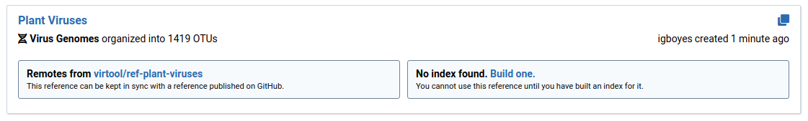
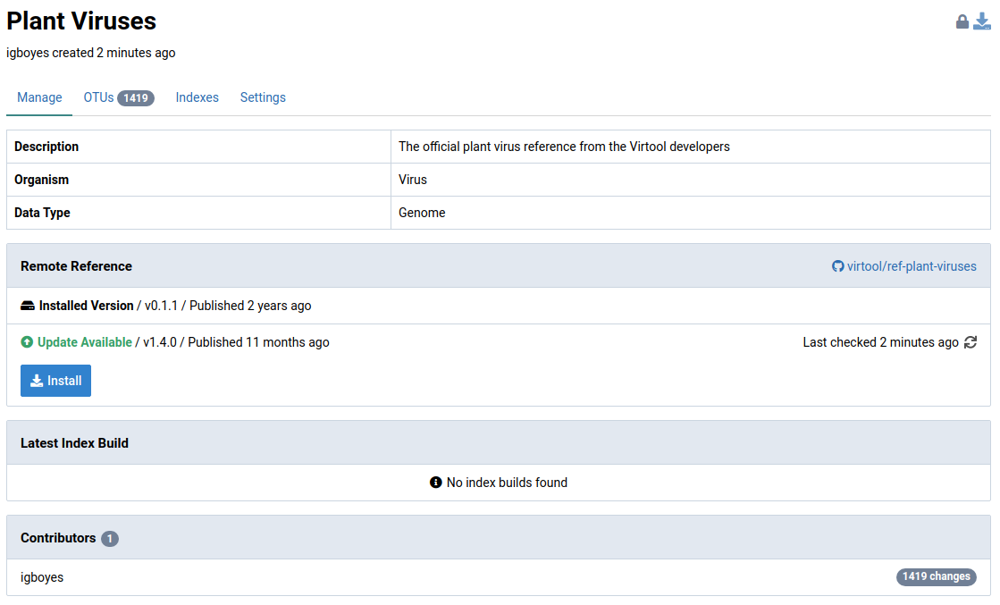
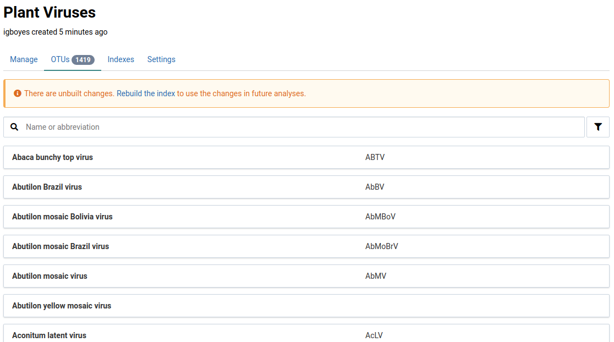
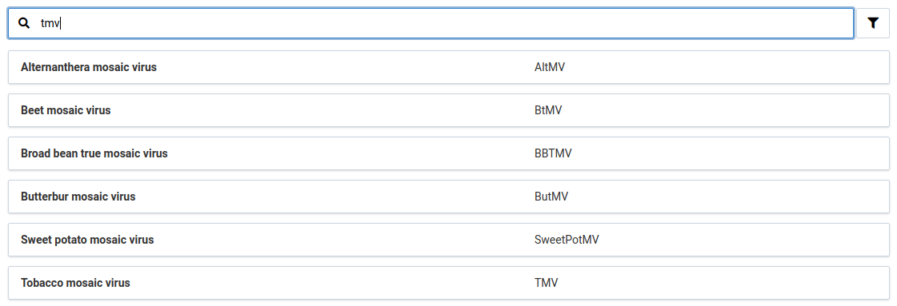
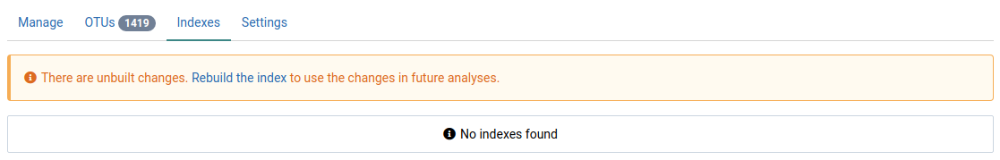
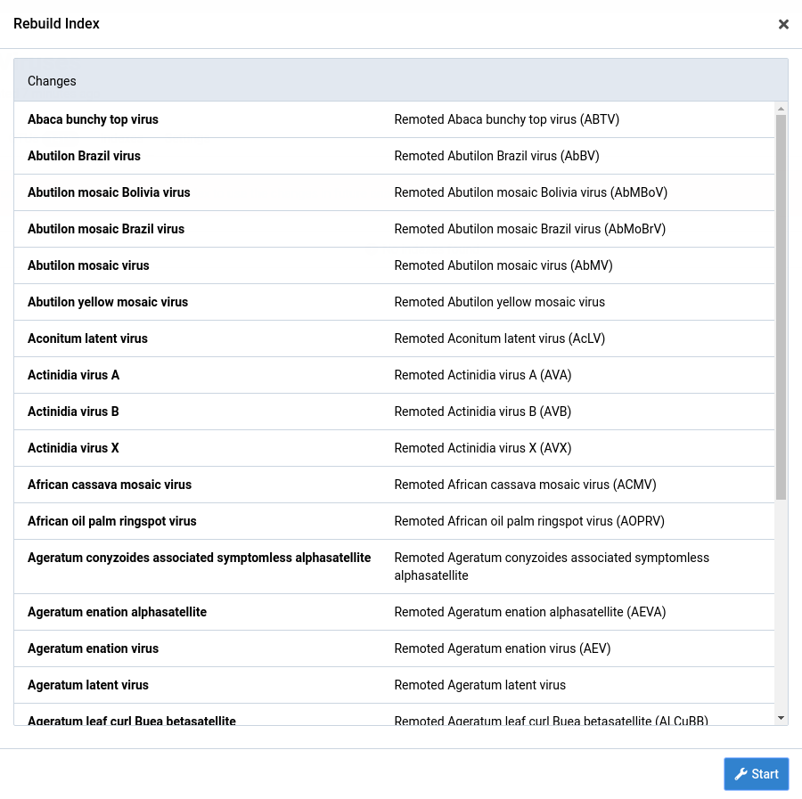
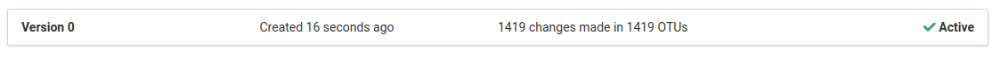

Virtool is built for detecting viruses and is capable of detecting other pathogens. Managing collections of pathogen sequences used for this purpose is a key feature of Virtool.

At least one non-empty reference must be created in order to start analyzing samples. One quick way to accomplish this is to install the [official plant virus reference](https://github.com/virtool/ref-plant-viruses).

# Install the Official Reference

Instead of starting a virus database from scratch, you can use our [official plant virus reference](https://www.virtool.ca/downloads). Doing this will setup up **_remote_** connection to the reference on GitHub.

1. Go to the **References** view

    A message with a button for installing the official reference will be visible if you have not already installed it.

    

2. Click the  button to begin the installation process

    A new card should appear representing the official reference on your system. It will display a progress bar while the reference is being created locally.

    

    Once the installation process is complete, the reference card should look something like this:

    

3. Click the reference card to view a detail page for the reference

    

# Browse OTUs

Once the installation of the official reference is complete, you can browse the OTUs that are included in the reference.

1. Click on the **OTUs** tab

    You should see something like the following. This is searchable list of all OTUs in the reference.

    The _There are unbuilt changes_ message means you have to **build** a new index for the reference before you can use it in analyses.

    

2. Search OTUs by their names or abbreviations

    

# Build an Index

Before the imported data can be used in analyses, an optimized index must be built. Think of this as a publication or commit step.

1. Go to the **Indexes** tab in the reference detail view

    

2. Click the  link to prepare an index build

    The **Rebuild Index** dialog will appear, summarizing the OTU changes that will be included in the index.

    

3. Click the **Start** button at the bottom of the dialog.

    This will start an index build job. A new index entry will appear with the  **Building** label.

    

4. Wait for the build to complete

    The index will look something like this is when it is ready to use. It will have the  **Active** label.

    
