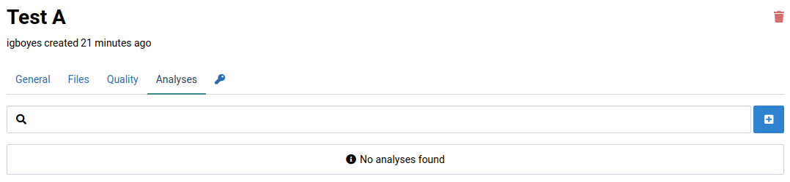
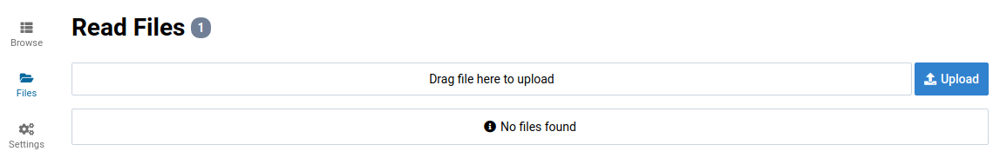
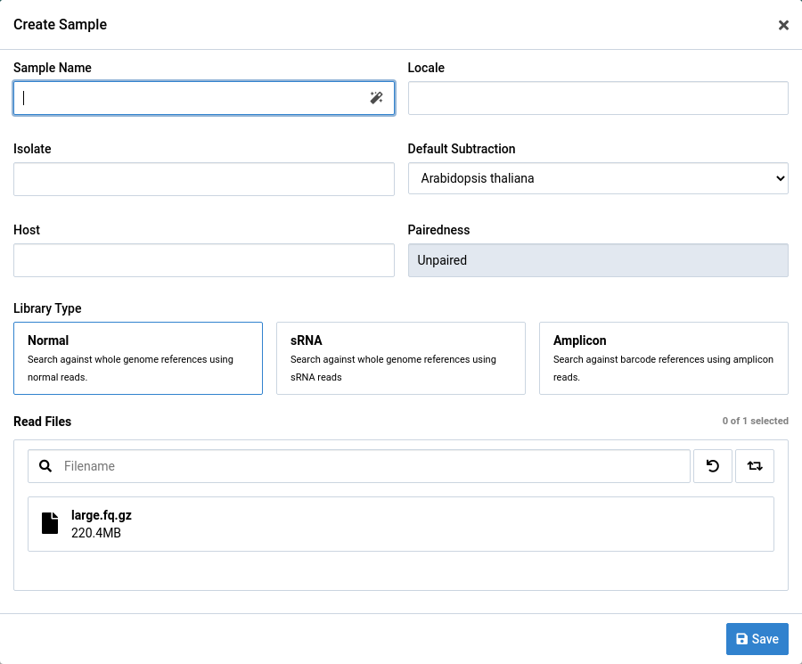
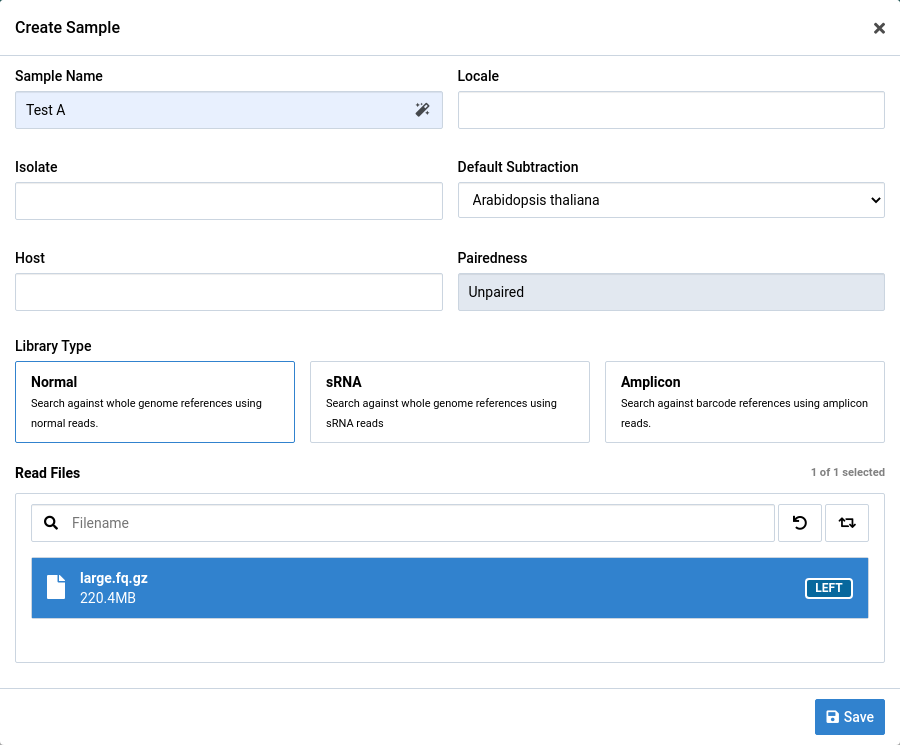
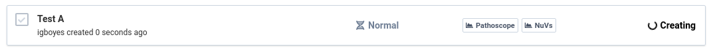
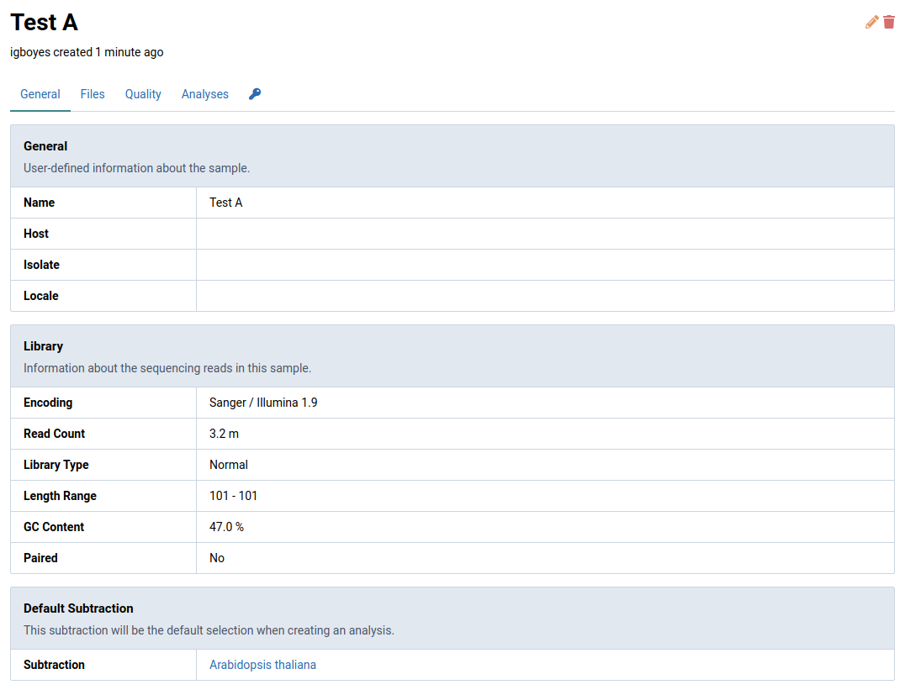
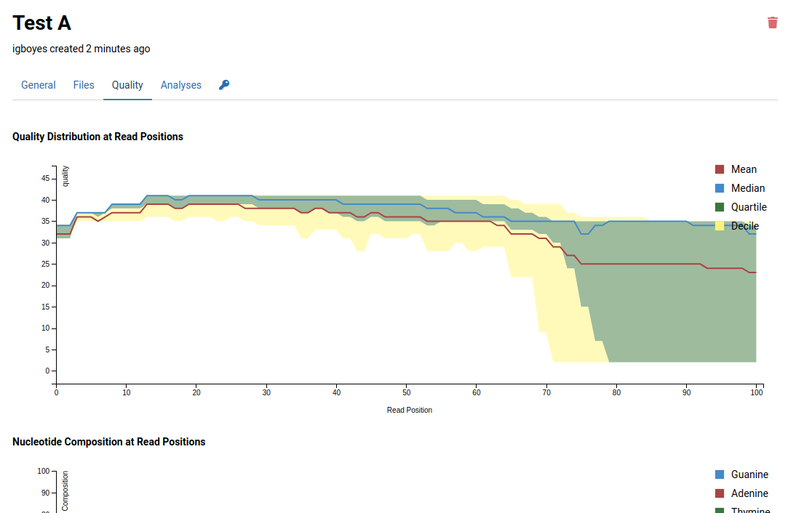

# Upload a FASTQ File

1. Go to **Samples** view via the main navigation bar

    

2. Click **Files** in the left sidebar to go to the sample read file manager

    

3. Upload a FASTQ read file

    

4. Return to the **Samples** view

    

5. Click the  button to open the sample creation dialog

    The file you uploaded should now be available in file list.

    

# Create a Sample

1. Click the  button to open the sample creation dialog

    

2. Fill out the fields in the sample creator

    Only the _sample name_, _default subtraction_, and one or two read files are required.

    

3. Click the  button

    You should immediately see a placeholder for your sample in the **Samples** view. The spinner indicates that the sample is still being created.

    

    When the sample creation process is finished your sample will look something like this:

    

4. Click on the sample when it is ready

    You will be able to see some information about your sample that was calculated during the creation process.

    

5. Click the Quality tab

    This will display a quality assessment for the sample generated using [FastQC](https://www.bioinformatics.babraham.ac.uk/projects/fastqc/).

    
