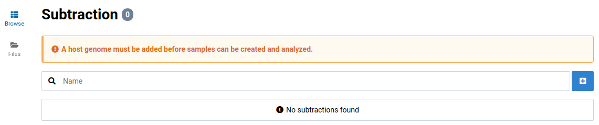
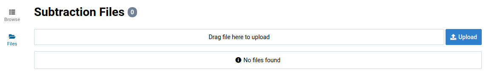
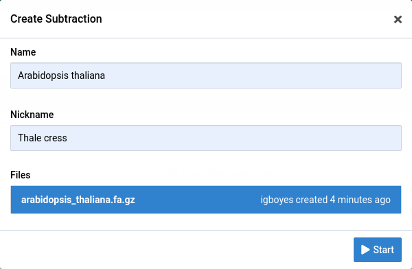
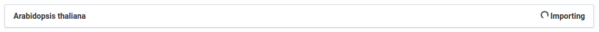
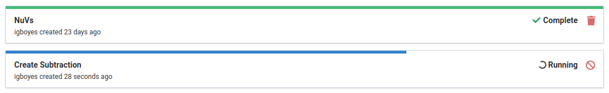
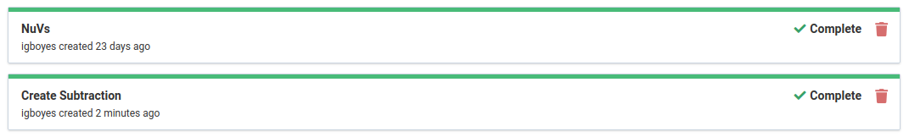
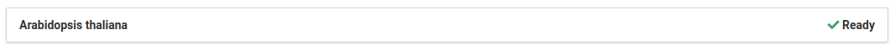
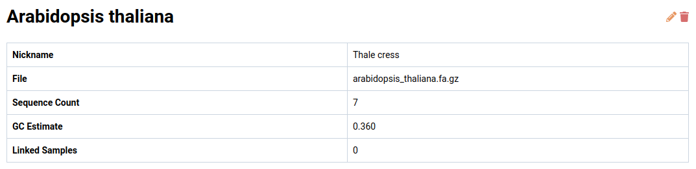

Subtractions are whole genome references used for eliminating reads from the analysis that are likely to have originated from the host genome or non-pathogenic organisms associated with the host such as insects or fungi.

# Find source FASTA {#finding}

We will use the _Arabidopsis thaliana_ genome as a subtraction in this tutorial.

1. Go to the [Ensembl Genomes FTP site for Arabidopsis](ftp://ftp.ensemblgenomes.org/pub/plants/release-37/fasta/arabidopsis_thaliana/dna/)

    Download the unmasked version of the genome.

    

# Upload FASTA {#uploading}

1. Go to the **Subtraction** view via the main navigation bar

    There will be a warning indicating that no subtraction has been created.

    

2. Click on the **Files** link in the left sidebar to go to the subtraction file manager

    

3. Upload the previously obtained FASTA file.

    

# Create Subtraction {#creating}

1. Go to the **Subtraction** view via the main navigation bar

    There will be a warning indicating that no subtraction has been created.

    

2. Click the  button

    This will open the subtraction creation dialog.

    

3. Enter information for the new subtraction

    Give it a unique name and an optional nickname and select the uploaded FASTA file. Click the  button to start the job.

    

    While the subtraction is being created it will have an  **Importing** label.

    

4. Wait for the job to complete before trying to use the new subtraction

    You can view the creation progress by going to the **Jobs** view.

    

    The job will look like this when it is complete:

    

    The subtraction will have the  **Ready** label when it is ready to use.

    

5. Click on the subtraction to view its details

    
