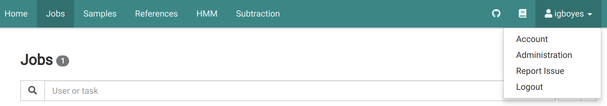
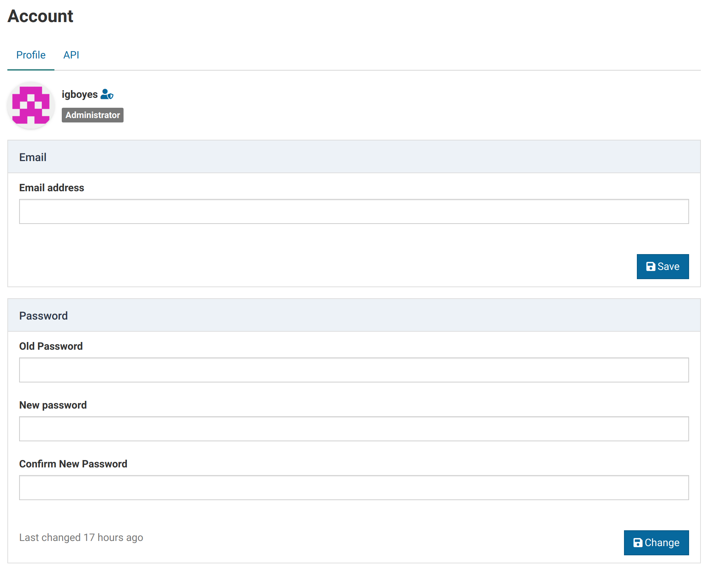
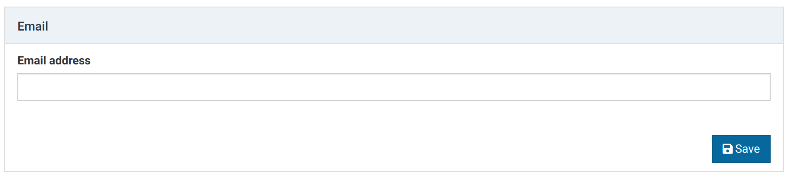
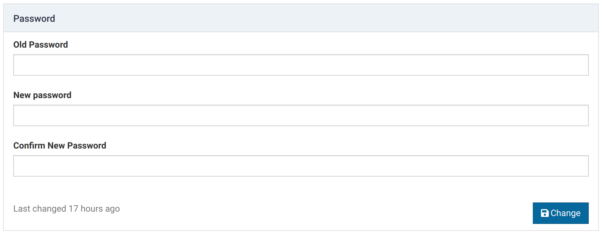
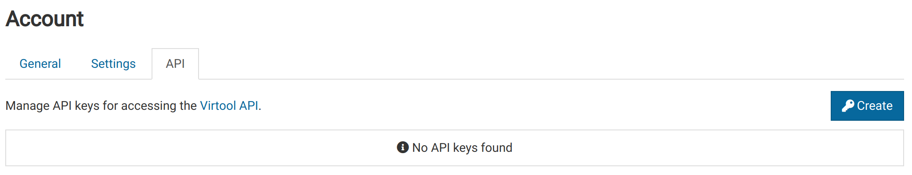
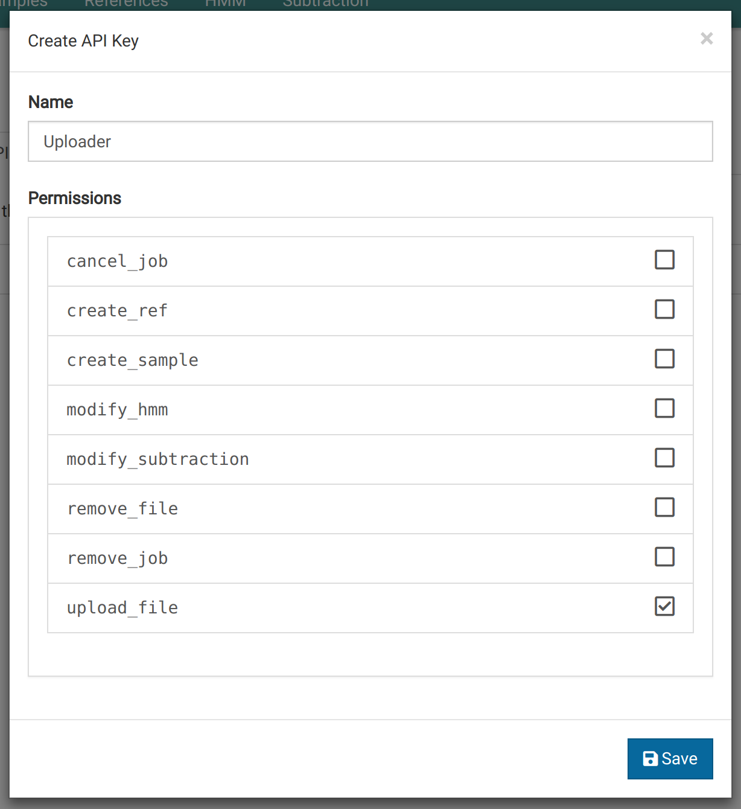
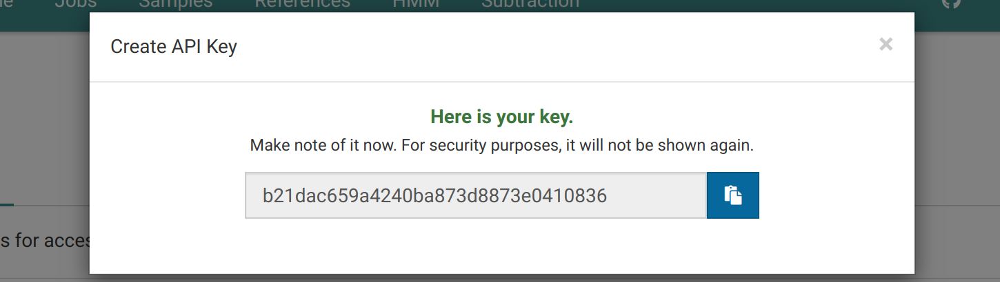
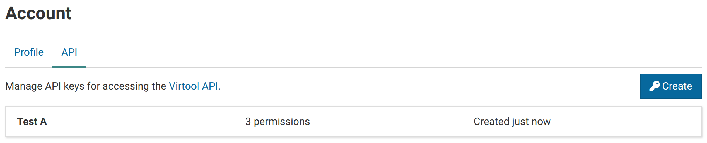

You can view your account details by navigating to _Username_ > Account in the main navigation bar.

You will land on this page, where you can make changes to your account. Here, you can see your username and user groups to which you belong.

This user is an administrator and a member of the **Laboratory** group.

# Change Email {#email}

You can set or change you email address. Email addresses are currently unused, but will be used in the future for NCBI API requests, downloading Gravatars, and sending out email notifications.

# Change Password {#password}

You can change your password under the _General_ tab. By default, new passwords must be a minimum of 8 characters. This setting could be changed by your administrator.

# Settings {#settings}

Some settings are account-specific. These can be modified under the _Settings_ tab.

Currently, the only account-specific settings is toggling the visibility of unique IDs in the user interface. They are useful for debugging purposes and are invisible by default.

# API Keys {#api_keys}

Virtool exposes a complete [web API](/web-api.html). Access to the API is managed using [API keys](/web-api/authorization.html).

API keys are account-specific and are generated under the _API_ tab in the _Account_ view.

## Creating an API Key

1. Click **Create** to show the API key creation form.
   

2. Give the API key a name and select permissions you want the key to have. Permissions that are not granted to your account will be disabled and greyed out.

3. Click **Save** to create the key. The key will be shown only once. Make sure you keep it somewhere safe.
   

4. The key will be added to your API key list and can be removed or edited later. You **cannot** view the key value after creation.
   

5. Use the key to access the API with the help of the [API documentation](/web-api/authorization.html).

{}
If permissions are removed from your account after the key is created, they will also be removed from the key.
{}
