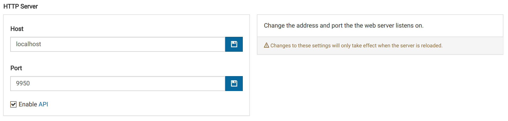
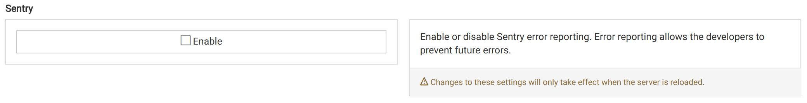
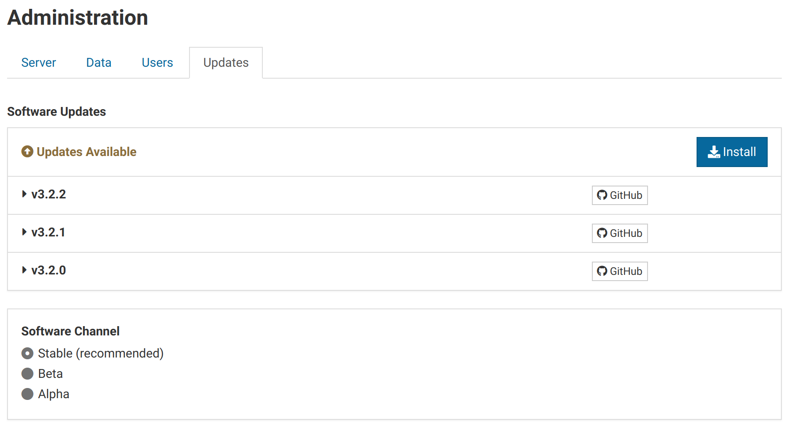
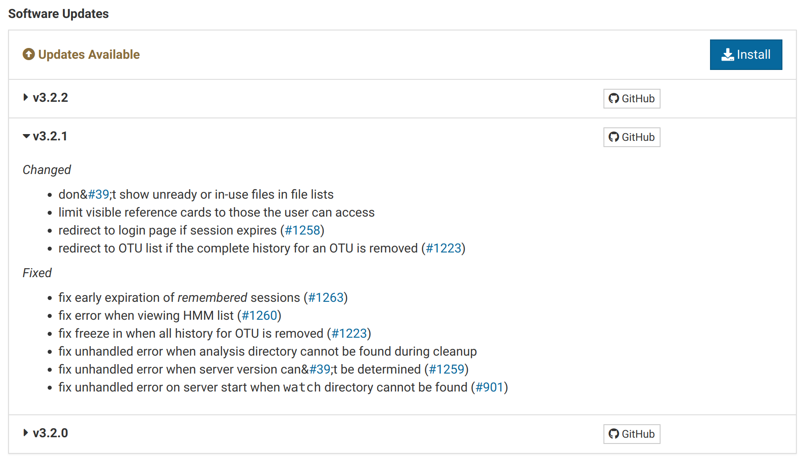
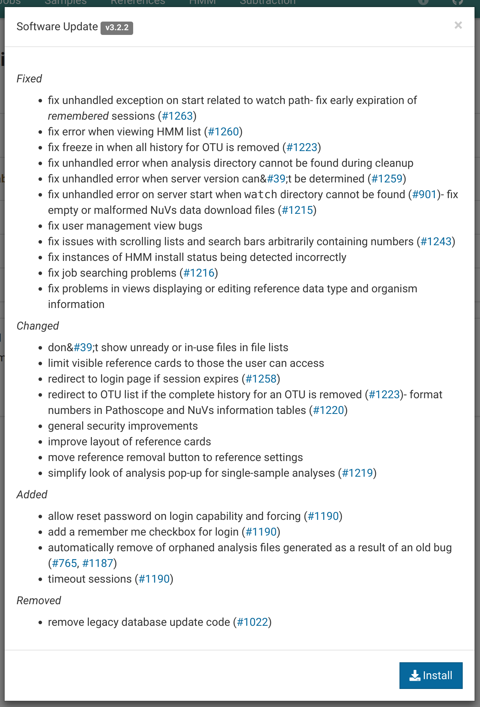
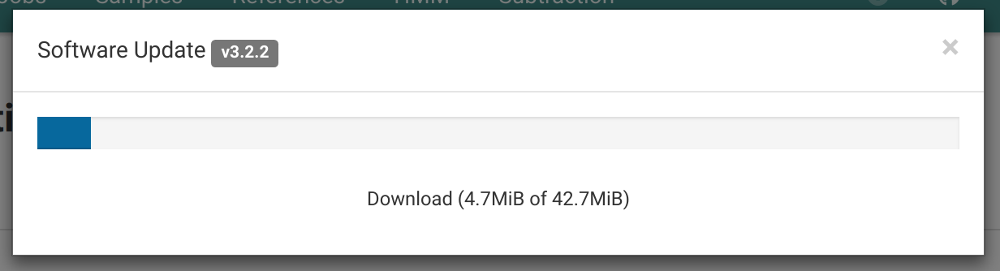
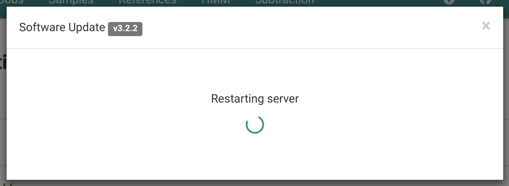
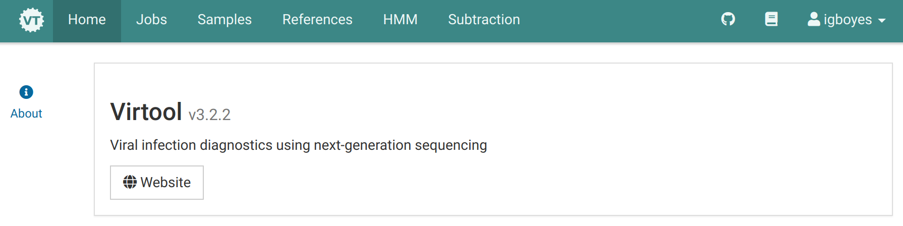

The administration views can be accessed by clicking on the user dropdown at the far right of the main navigation bar.

User management is not covered in this page. See the [Users documentation](/docs/manual/ug_users).

# Server Settings {#server}

Manage technical settings for the Virtool server.

## Enabling the API

Enabling this settings allows other applications to make use of Virtool's HTTP API. This can be done by checking <i class="far fa-square"></i> **Enable API**.

See the [Account guide](/docs/manual/ug_account) for information on API authentication using keys.

## Enabling Sentry

[Sentry](https://sentry.io) is a service Virtool developers use for tracking errors in instances of Virtool server and client software.

It is possible to opt out of sending error reports by unchecking the <i class="far fa-check-square"></i> **Enable** button. This change requires a reload to take effect.

Please consider leaving this setting enabled as it is invaluable for fixing bugs and improving the user experience.

# Users {#users}

See the [Users Guide](/docs/manual/ug_users) for information on managing users.

# Updates {#updates}

Once installed, Virtool can be check for and apply software updates automatically.

## Viewing Available Updates

An update is available is when the <i class="fa fa-arrow-alt-circle-up"></i> icon is pulsing in the main navigation bar:



You can see further information about the update by clicking the pulsing icon or navigating to _Administration_ | _Updates_.

Clicking on a single update will show the changes made.

## Installing Updates

Click the <i class="fa fa-download"></i> _Download_ button to open the update install dialog. This dialog shows the changes applied as a result of applying all available updates.

Click the <i class="fa fa-download"></i> _Install_ button to install the updates. A progress dialog will appear.

When the update download and install is complete, Virtool will restart. This can take some time depending on the size of the Virtool database and data folder.

The updates view will look something like this when the instance is up-to-date:

Check that the installation version is up-to-date after the server restart.

## Update Channels

Changing update channels allow your Virtool instance to apply updates that are not quite ready for production.

The _alpha_ and _beta_ channels should only be used by Virtool developers, testers, or advanced users.

| Channel | Description                                                                          |
| ------- | ------------------------------------------------------------------------------------ |
| stable  | appropriate for most Virtool users; production tested by Virtool developers          |
| beta    | feature-complete but still requires fixes and polish for stable release              |
| alpha   | contains bugs or missing functionality that can compromise your data or installation |

# Versioning

The Virtool project uses [semantic versioning](https://semver.org/). A Virtool version number looks like this: **v3.2.1**.

| Number | Description                                                     | Backwards Compatible |
| ------ | --------------------------------------------------------------- | :------------------: |
| 3      | the MAJOR version; not backwards compatbile with older versions |          No          |
| 2      | the MINOR version; introduces major feature changes or fixes    |         Yes          |
| 1      | the PATCH version; bug fixes with no features introduced        |         Yes          |

{}
Using the built-in update manager will ensure that only compatible updates are applied.

You only have to worry about update versions if you are running Virtool in a non-standard manner such as Docker or you are manually updating (not recommended).
{}

By _backwards compatible_, we mean that the version can use data generated by a previous version of Virtool with the same MAJOR version. For example:

> <i class="fa fa-check-circle is-green"></i> v3.2.1 → v3.1.2

> <i class="fa fa-check-circle is-green"></i> v3.2.1 → v3.0.1

> <i class="fa fa-times-circle is-red"></i> v3.2.1 → v2.3.4

> <i class="fa fa-times-circle is-red"></i> v3.2.1 → v1.2.1

The only exception to this rule is the first release of a new MAJOR version (_eg_. v4.0.0). The first release of a new major version is backwards compatible with the previous major version.

During this the first start of the update software the database and data files will be updated for compatiblility with future releases of the new MAJOR version (_eg._ 4.1.0).

## Examples

<i class="fa fa-check-circle is-green"></i> _Upgrading v3.12.2 to v4.0.0_

This works because the first release of a new MAJOR version is backwards compatible with the previous MAJOR version (v3=).

<i class="fa fa-times-circle is-red"></i> _Upgrading v3.12.2 to v4.1.0_

This does not work because **only** the first release of a new MAJOR version (v4.0.0) is backwards compatible with the previous MAJOR version (v3.\*.\*).

<i class="fa fa-times-circle is-red"></i> _Upgrading v2.12.5 to v4.0.0_

This does not work because the first release of a new MAJOR version (v4.0.0) is backwards only with the previous MAJOR version (v3.\*.\*).
