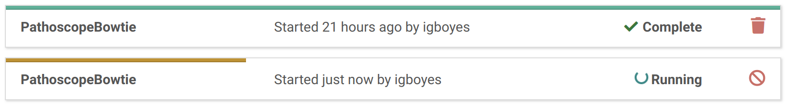
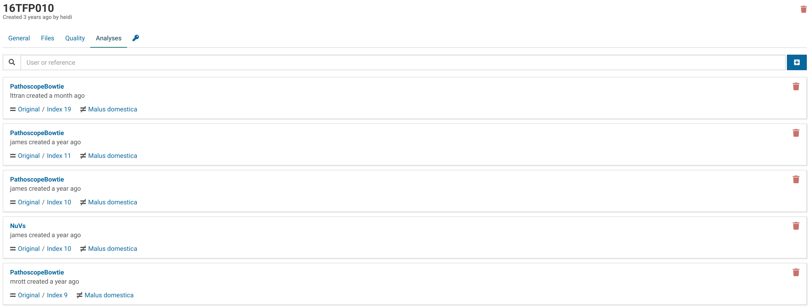
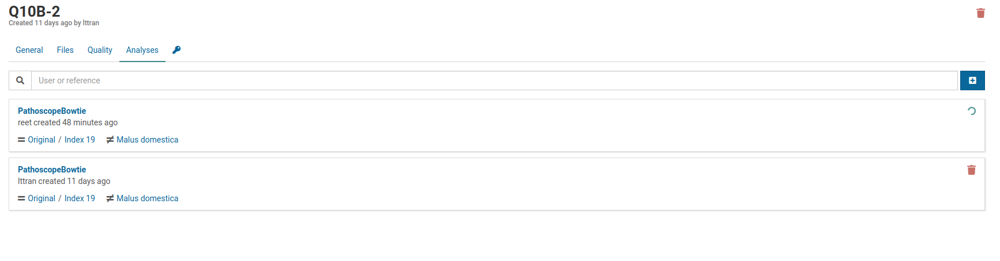
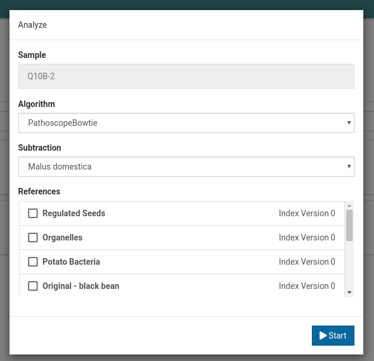
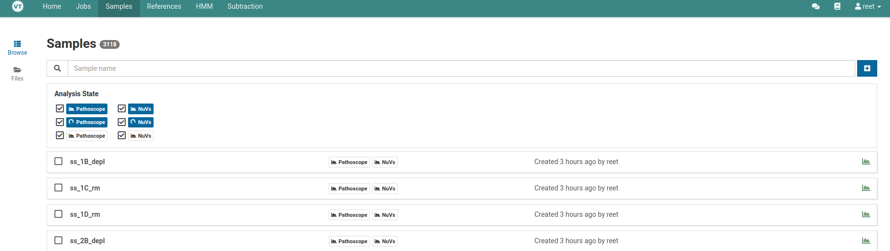
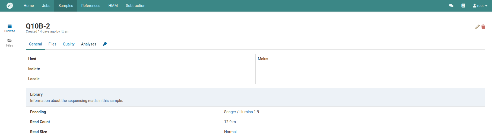
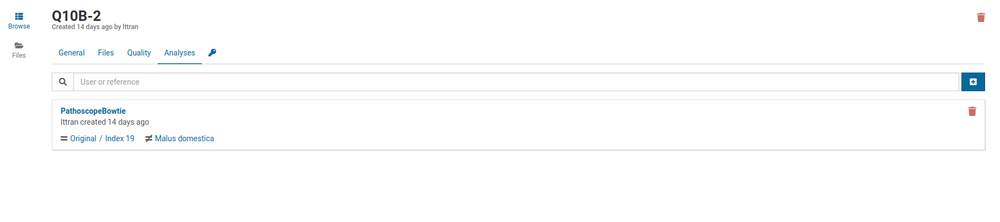

# Overview

# Analysis Jobs

Analyzing sample data is the most computationally intensive task Virtool performs. It can take minutes or hours to run analyses for large, complex sample libraries.

Long-running analyses are therefore tracked in the **Jobs** view.

From an analysis job, you can easily navigate to the analysis listing for the sample being analyzed.



# Caching


**New in v3.4.0**.


Sample data is automatically trimmed during analysis. Trimmed data are cached so that data doesn't have to be re-run

## What are analyses?

Analyses are the results of running a bioinformatic workflow on sample data.

When an analysis is started, the sample data is run through a series of bioinformatic tools to produce a meaningful result that is made available to the user.

## Reference Versions

Analyses make use of [references](/docs/manual/ug_references) composed of pathogen sequences. Since references are modifiable and versioned, analyses are linked to specific versions of a reference. If a sample needs to be analyzed against a newer version, a new analysis must be created.

Here is an example of a sample with multiple analyses using different pipelines and different reference versions:

## Subtractions

Subtractions are sets of host or non-pest sequence data used to eliminiate non-pathogen reads from analysis results.

You can read more about creating and managing subtractions:

- [Subtraction Creation Tutorial](/docs/manual/tut_subtraction)
- [Subtractions User Guide](/docs/manual/ug_subtraction)

Virtool currently supports two built-in workflows/pipelines called PathoscopeBowtie and NuVs.

## List of Analyses 

A list of analyses can be found under your sample of interest. Select your sample and click on the blue _Analysis_ tab.


This page will list all the analyses that have been run on or currently running on this sample. The following image shows one analysis that has been completed, and one that is currently running.

## Create an Analysis

Select the sample of interest and click on the blue _Analyses_ tab.

To create a new analysis for this sample, click on the blue plus icon on the right and a dialog box will appear.

Use this dialog to choose the analysis algorithm (PathoscopeBowtie or NuVs), the subtraction, and the reference(s) you want to use to analyze your sample(s). Selecting multiple references will start a separate job for each sample-reference combination. Once these fields are specified, click the **Start** button to start the analysis.

Once the analysis is running, you can view its progress under the _Jobs_ tab.

A guide on creating a _Quick Analysis_ can be found [here](/docs/manual/ug_samples).

## Delete an Analysis

Under the _Samples_ tab, select the sample whose analysis you want to delete.

 Then click on _Analyses_. 

Click on the red trash can icon next to the analysis you wish to delete. 

Note that once an analysis is deleted, it cannot be retreived back.