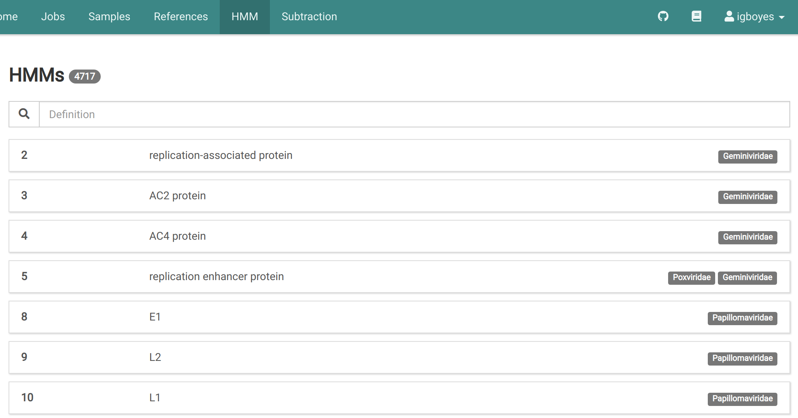
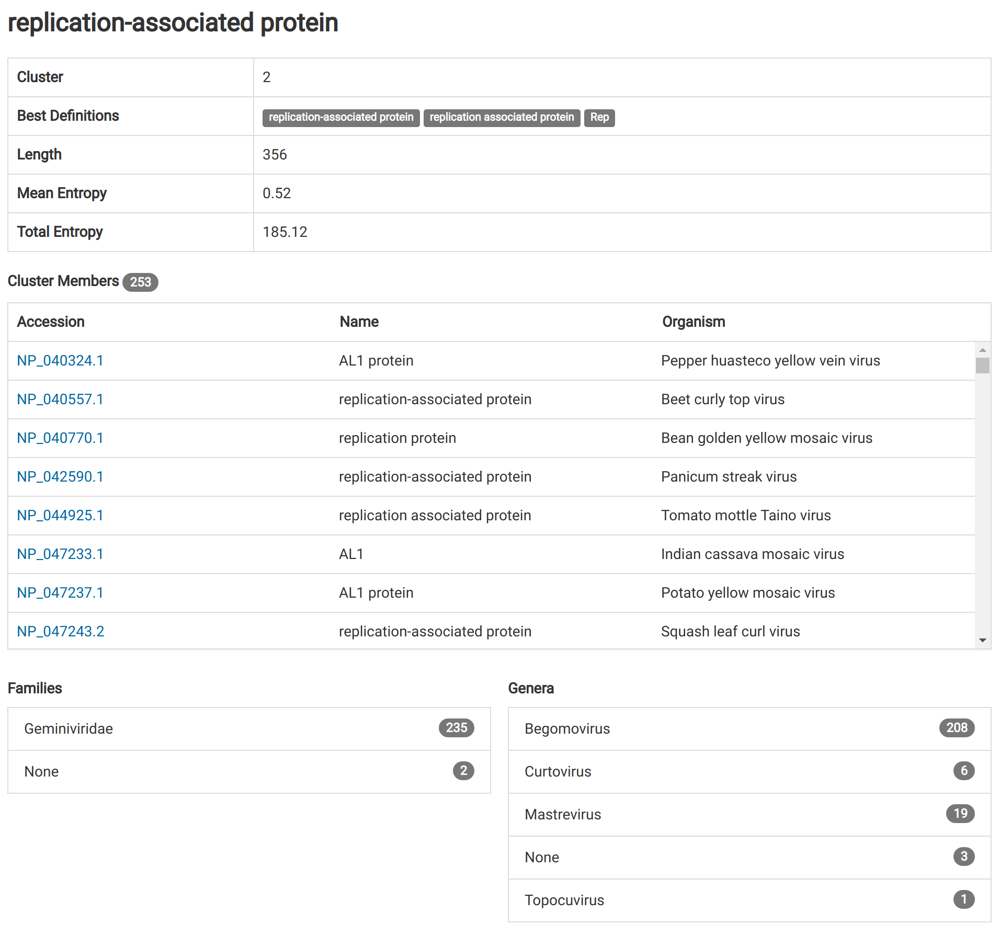
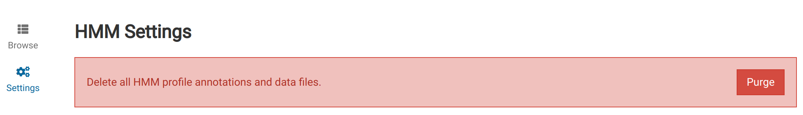

Profile hidden Markov models (HMM) are used in Virtool to discover potential novel viruses using the [NuVs workflow](/docs/manual/sci_nuvs).

# Installing Official Models {#official}

We highly recommend using the official models and annotations. It is very easy to obtain and use this data without leaving Virtool.

1. Go to _HMM_ in the main navigation bar.
   

2. If no HMM reference data has been installed, you will see the following:
   

3. Click the **Download Official** button to begin downloading the data. This could take some time.
   

4. When the download is complete, the data will be imported into Virtool and you can browse the annotations and use the NuVs analysis algorithm.
   

# Exploring Annotations {#annotations}

You can browse the annotations used in NuVs results.

1. After HMM data has been installed, go to _HMM_ in the main navigation bar.
   

2. Use the search bar to find HMMs by annotative name (_eg_. RNA replicase).
   <video autoplay muted loop><source src="replicase.mp4" type="video/mp4" /></video>

3. Click on an HMM item to view its details.
   

## Annotation Fields

The fields in the HMM detail view describe the profile and the protein sequences that were used for its creation.

#### Cluster

A unique integer identifier for the cluster.

#### Best Definitions

The three most common protein definitions found in the cluster member protein annotations. |

#### Length

The length of the motif identified in the profile.

#### Mean Entropy

Undocumented

#### Total Entropy

Undocumented

#### Cluster Members

A list of the proteins included in the cluster used to construct the profile HMM. Each member is described by its NCBI accession number, name, and organism.

#### Families

The taxonomic families represented in the cluster and their cluster member counts. Cluster members without family annotations are grouped in _None_.

# Finding Files on Disk

The profile HMMs used by Virtool are stored in the `hmm` subdirectory of your Virtool data location.

# Purge HMM Data

It is possible to delete all HMM data from the disk and database. This is used primary during testing and development.

You will be able to reinstall the HMM data once the deletion process is complete.

1. Go to _HMM_ in the main navigation bar.
   

2. Click on _Settings_ in the left sidebar. You should see the following:
   

3. Click the **Purge** button. Navigating to _Browse_ in the left sidebar should now should an HMM installation alert.
   
