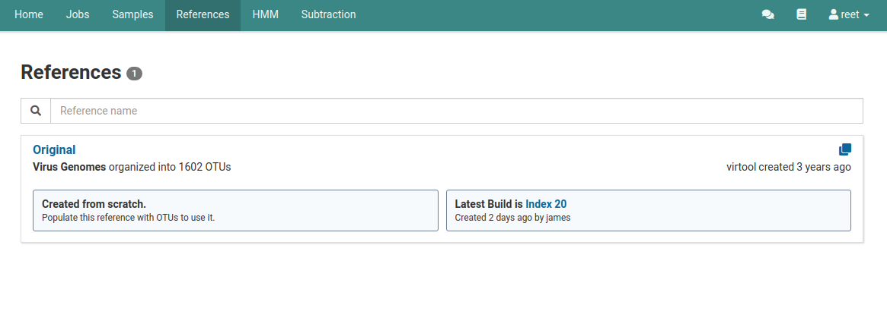

# Overview

Indexes are versioned snapshots of all of the OTUs in a reference at points in time. In the background, indexes are associated with optimized read mapping indicies managed by Virtool.

When changes are made to OTUs, the index is rebuilt to include those changes in future analysis jobs. Each analysis is tied to a specific index (version) of its target reference.

# Viewing Indexes

To view indexes, click the **References** tab in the top navigation bar.

Click on the reference of interest to view its index.

On this page you will see the **Latest Index Build**. In our example above, the Latest Index Build is **Index 20**. 

Click on the **Indexes** tab under the reference's name.

On this page you will see all the index versions for that reference. The current version will be on the very top and will have

# View a Specific Index

# Rebuild Index

After making an update on your remote reference there may be unbuilt changes on your index. To rebuild your index after the update click the **Indexes** tab on the detailed view page of your official reference.
 

Then click the blue **Rebuild the index** link. 

A **Rebuild Index** dialog box will appear that will list all the changes that are going to be made. 

To start making these changes and rebuilding the index, click  **Start** on the bottom of the dialog box.

Once the changes have been made, you will see a new index version that is now  **Active**.  
