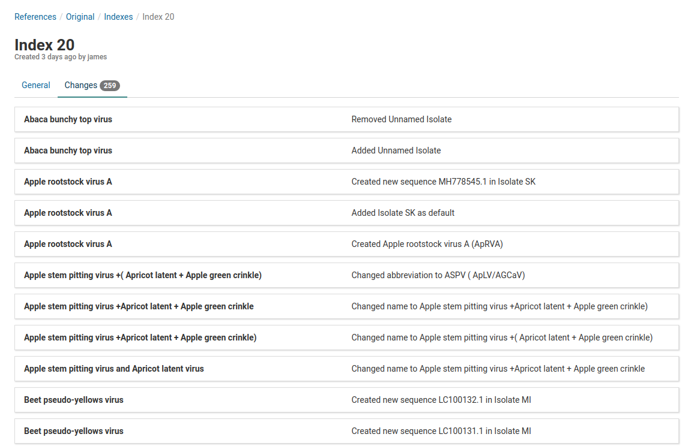

# Overview

Indexes are versioned snapshots of all of the OTUs in a reference at points in time. In the background, indexes are associated with optimized read mapping indicies managed by Virtool.

When changes are made to OTUs, the index is rebuilt to include those changes in future analysis jobs. Each analysis is tied to a specific index (version) of its target reference.

# Viewing Indexes

To view indexes, click the **References** tab in the top navigation bar.

On this page you will see the **Latest Build** box. This will advise the user what index is currently being used for that specific reference. In our example above, the Latest Index Build is **Index 20**.

Click on the reference of interest to view its index.
 

Once again, on this page you will be able to view the **Latest Index Build** for the reference you are using.

Click on the **Indexes** tab under the reference's name.

Here you will see all the index versions for that reference. The current version will be on the very top and will have  **Active**.

# View a Specific Index

To view a specific index, simply click on it. We will look at the **Version 20** index.

On this page we can view all the changes that have been made to the index. We can also view which user made the changes and how many changes they have made under **Contributors**.

Under **OTUs**, you can view all the OTUs that have been modified. In our example 27 OTUs have been changed. The number of changes made to each OTU is listed on its right.

To view all these changes individually click on the **Changes** tab.

Here all 259 changes are listed. The list shows all OTUs and what changes were made to them.

# Rebuild Index

After making an update on your remote reference there may be unbuilt changes on your index. When this occurs, a yellow  alert will pop up in multiple views of your Virtool site.  

To rebuild your index after the update click the **Indexes** tab on the detailed view page of your official reference.
 

Then click the blue **Rebuild the index** link. 

A **Rebuild Index** dialog box will appear that will list all the changes that are going to be made. 

To start making these changes and rebuilding the index, click  **Start** on the bottom of the dialog box.

Once the changes have been made, you will see a new index version that is now  **Active**.  
