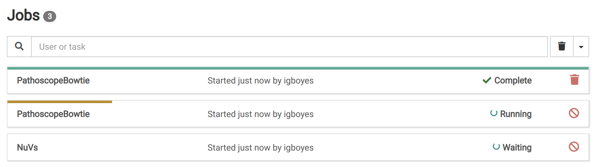
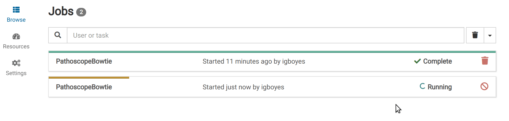
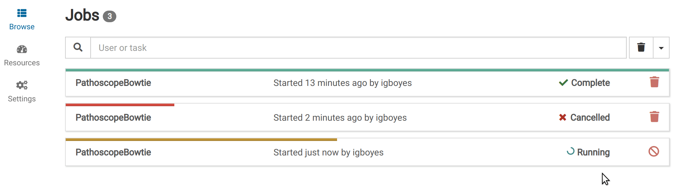
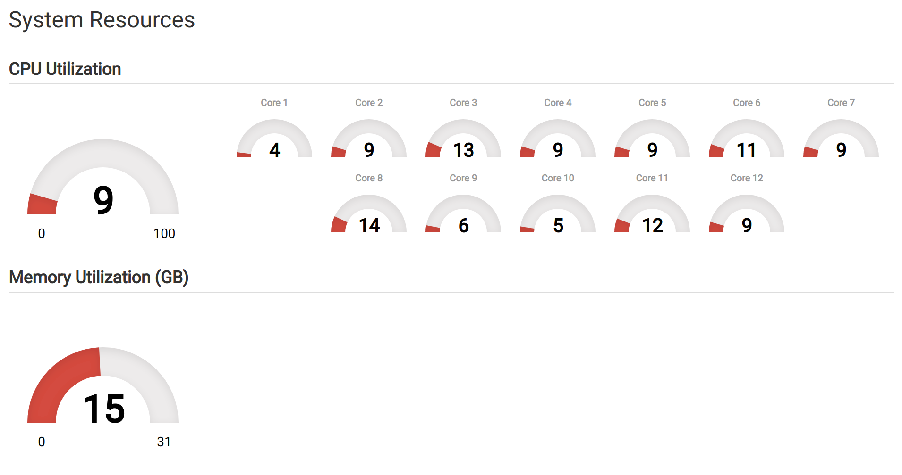

# Introduction

Jobs represent long running, resource-intensive processing tasks. All job types are related to analyzing and handling bioinformatic data.

| Type              | Description                                                      |
| ----------------- | ---------------------------------------------------------------- |
| BuildIndex        | Build a new index for a reference                                |
| CreateSample      | Create a sample from uploaded FASTQ data                         |
| CreateSubtraction | Create a new subtraction from an uploaded genome FASTA           |
| NuVs              | Run a NuVs analysis for a sample and reference combination       |
| PathoscopeBowtie  | Run a Pathoscope analysis for a sample and reference combination |

Jobs are started when a task is started in another view (_eg_. sample creation dialog). New jobs are appended to the job queue and start as resources become available.

# List Jobs

The jobs list can be accessed by navigating to _Jobs_ in the top navigation bar.

The jobs list shows all waiting, running, and finished jobs. Jobs can be [cancelled](/docs/manual/ref_jobs#cancel) and [deleted](/docs/manual/ref_jobs#delete) from the list view.

# View Detail

Detailed information for a job can be viewed by clicking on its entry in the job list.

# Cancel a Job {#cancel}

Running and waiting jobs can be cancelled. Cancellation entails forcibly stopping the job process and cleaning up any partial job data from the database and file system.

Jobs can be cancelled by clicking the <i class="fa fa-ban"></i> icon at the right end of the job list item.

# Delete a Job {#delete}

Once a job is finished, either by completing, erroring, or being cancelled, its record can be deleted. Click the <i class="fa fa-trash"></i> icon in the job list to delete the job.

Jobs can also be deleted via their detail page by clicking the <i class="fa fa-trash"></i> icon.

# Host Resources

Host resource utilization numbers can be viewed by clicking the _Resources_ link in the left sidebar.

# Settings

Job-specific settings can be accessed by clicking the _Settings_ link in the left sidebar. This link will only be visible to administrators.

These settings
