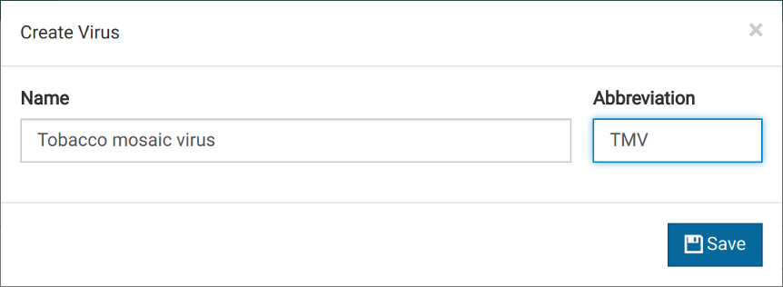

# Overview

The Virtool virus reference is a fully editable and tracked collection of viruses, viral isolates, and their genome sequences. The data in the virus reference is used to identify potential viral infections in Illumina libraries derived from your samples.

## Record Structure

Here is the structure of a single virus record containing one isolate and its sequences.

> - **Virus** - Apple Mosaic Virus

    - **Isolate** - Isolate 1
        - **Sequence 1** - [NC_003464.1](https://www.ncbi.nlm.nih.gov/nuccore/NC_003464.1)
        - **Sequence 2** - [NC_003465.1](https://www.ncbi.nlm.nih.gov/nuccore/NC_003465.1)
        - **Sequence 3** - [NC_003480.1](https://www.ncbi.nlm.nih.gov/nuccore/NC_003480.1)

Virtool is capable of storing large numbers of isolates for each virus. It can use this data to identify which known isolates a virus in your sample is most closely related to.

## Editing

The virus reference database is fully editable. You can change the name and abbreviation, modify the schema, and alter the isolates and sequences of each virus. **There are a few important details to keep in mind when editing the virus database**:

- each change causes the virus's version to increase by one
- each change is recorded with a timestamp and the user's name

## Browsing

The viral reference database can be searched and viewed easily from your web browser. Clicking on _Viruses_ in the main navigation bar will bring you to the following view.

In the virus database browser, you can:

- find viruses by their names or abbreviations using the search bar
- view only viruses modified since the last [index build](/viruses/indexes.md)

# Editing

## Add an Isolate

Open the dialog for adding an isolate by clicking the <i class="vtfont i-new-entry"></i> icon in the rights corner of the _Isolates_ header:

Fill the _Source Type_ and _Source Name_ fields. These fields are combined to create an isolate name. They are

- both fields are optional and the isolate named will be **Unamed** if they are both empty
- in a single virus, multiple isolates can have the same name
- administrators can add new source types to the

# 3. Creating a Virus {#creating}

Creating the first virus requires only a name. You can optionally provide an abbreviation.

1. Click <i class="vtfont i-new-entry"></i> to bring up a dialog for creating viruses.
   

2. Enter a name and abbreviation for the new virus.

3. Save the new virus.

4. The virus should now appear in the virus manager.
   

# 4. Adding an Isolate {#adding_an_isolate}

Isolates are how sequence data are organized within the virus record. To maintain continuity with virus sequence records in Genbank, isolates in Virtool are identified by a **source type** and **source name**. These two fields are concatenated to form the isolate's name.

Examples of source types are: _isolate_, _genotype_, and _culture_.

Examples of source names are: _A_, _Canada_, _8801-VLH_, or anything really.

1. Click on the virus entry.
   

2. Take note of the red notification at the top of the page. This indicates that the virus cannot be used in analyses until the listed issues are corrected.

3. Click <i class="vtfont i-new-entry"></i> near the **Isolates** heading to bring up a dialog for creating isolates.
   

4. Notice that the **Isolate Name** field changes with the other two fields. This will be the display name for the isolate.

5. Save the changes. The new isolate appear in the isolate editor.
   
6. You can edit or remove the isolate by clicking <i class="vtfont i-pencil"></i> and <i class="vtfont i-remove"></i>.

# 5. Adding a Sequence {#adding_a_sequence}

Sequences are members of isolates. Many isolates will only have one sequence. If the virus in question is multipartite, more than one sequence would be assigned to each isolate.

1. Click <i class="vtfont i-new-entry"></i> near the **Sequences** heading to bring up a dialog for creating sequences.
   

2. Fill out the form fields. The **Host** field is optional. You can pull sequence records from GenBank by entering a valid GenBank accession in the **Accession** field and clicking <i class="vtfont i-wand"></i>.
   

3. Save the new virus. It will appear in the isolate editor.
   
4. Click on the sequence entry to expand it and view all the data associated with the sequence record.
