# Overview

## OTUs

The Virtool OTU (Organization taxonomic unit) reference is a fully editable and tracked collection of viruses, viral isolates, and their genome sequences. The data in the virus reference is used to identify potential viral infections in Illumina libraries derived from your samples.

See the [OTUs documentation](/docs/manual/ug_otus) for more information.

## Indexes

An Index contains a list of all OTUs available to a specific reference. When changes are made to an OTU(s), the index is rebuilt to include those new changes for future jobs.

See the [Indexes documentation](/docs/manual/ug_indexes) for more information.

# Searching a Reference

Click on **References** in the main navigation bar to go to the Reference Overview page. 
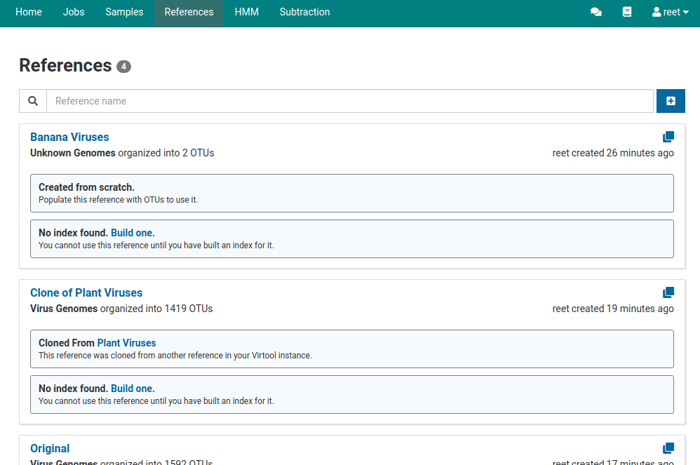

Then type in the name of the reference in the search bar.

Click on your reference to view detailed information about it.

# Creating References

## Installing an Official (Remote) Reference

Virtool is built for detecting viruses and is capable of detecting other pathogens. Managing collections of pathogen sequences used for this purpose is a key feature of Virtool.

At least one non-empty reference must be created in order to start analyzing samples. One quick way to accomplish this is to install the [official plant virus reference](https://github.com/virtool/ref-plant-viruses).

To see a a step-by-step tutorial on installing an official reference click [here](/docs/manual/tut_reference).

## Creating a Blank Reference
Click on **References** in the main navigation bar to go to the References Overview page. 

To create a new empty reference, click on the  button. A dialog box like the one below will show up.

Give your new reference a name, the organism to which it belongs, and an optional description. Once the fields in the dialog box are filled out, click  **Save**.

Your new reference will now appear in the References Overview page.
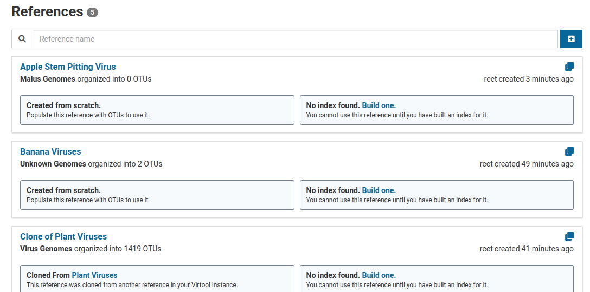

## Cloning a Reference

Click on **References** in the main navigation bar to go to the Reference Overview page.

To clone a reference click on the  button. A dialog box like the one below will show up.
 

Click on the blue **Clone** tab.

In the dialog box, click on the **Source Reference** you want to clone. Clicking on a source reference will automatically give your clone a default name which you can change. Filling out the **Description** field is optional.
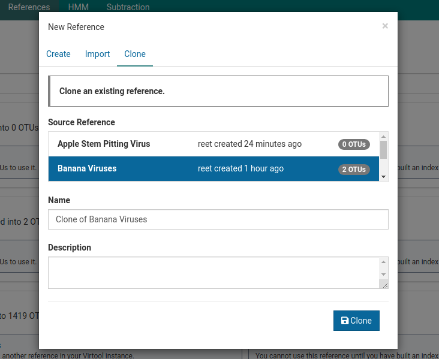

Once the fields in the dialog box are specified, click  **Clone**. Your Banana Viruses clone will be added to the references list.

## Cloning Shortcut

Another way to clone a particular reference is by using the cloning shortcut button . Click on  and a **Clone** dialog box will appear.
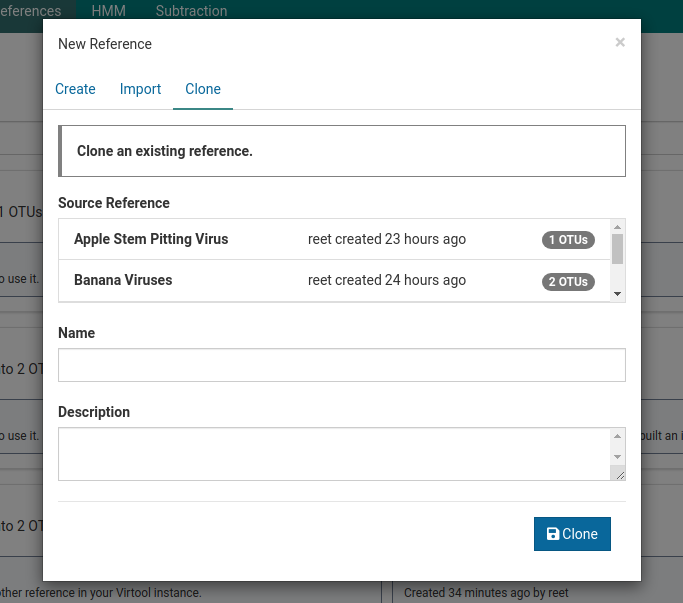

Follow the steps above to complete the cloning process.

## Exporting a Reference

To export a reference, click on **References** in the main navigation bar. 

Click on the reference you want to export. 
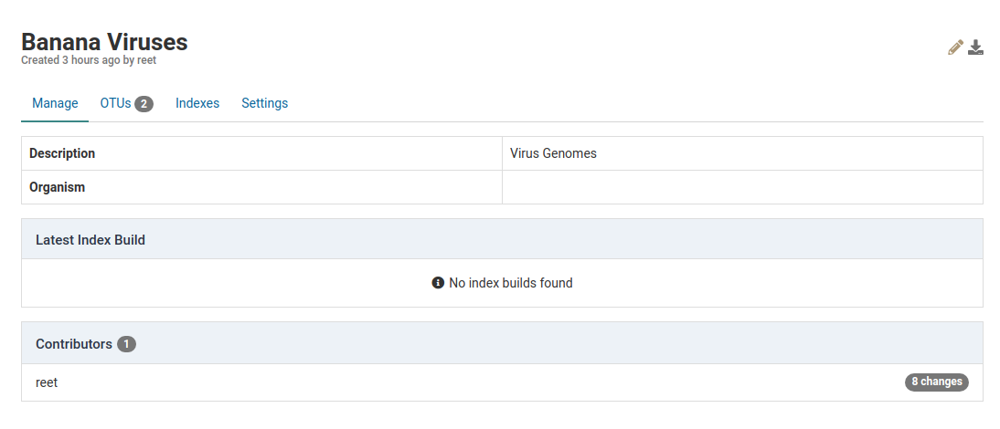

On the top right click the  button.
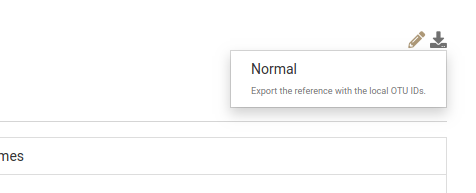

To export the reference with the local OTU IDs, click **Normal**. This will begin the downloading process of that reference.

## Importing a Reference

Click on **References** in the main navigation bar to go to the Reference Overview page.

To import a new reference, click on the  button. A dialog box like the one below will show up.

Click on the blue **Import** tab.
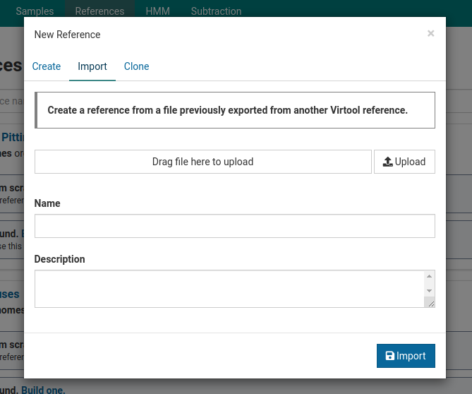

Click the  **Upload** button and open the reference file you want to import. You must also type in a name for the reference you want to import.

Click  **Import** to import the reference. The importing progress can be seen under the **References** tab.
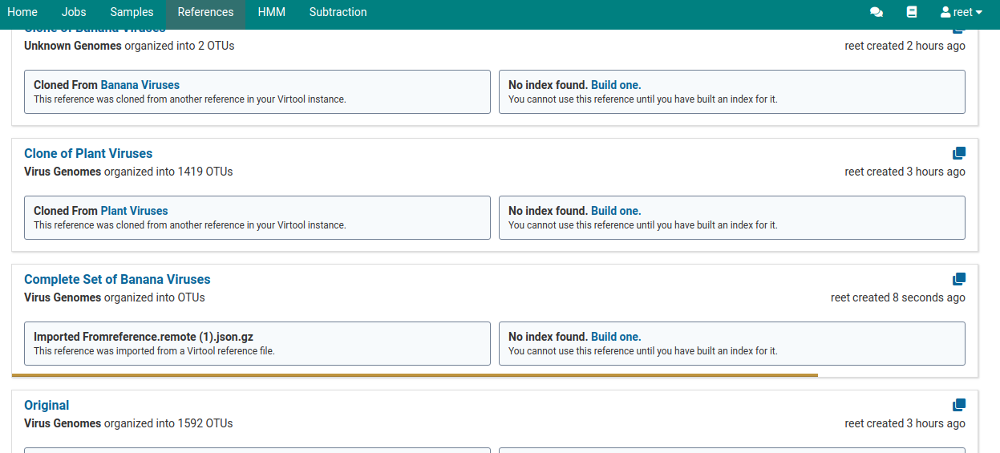

# Manage References

## Edit a Reference

The name of a reference cannot be changed once it has been made. You are however, allowed to make changes to the OTUs and its isolates. 

## Update Official (Remote) Reference

Your remote reference is the first reference you downloaded that is in sync with a reference published on GitHub. When changes are made to the reference on GitHub, your official reference on Virtool also needs to be updated.

To view if any updates are required, click on your official reference under the **References** tab. In this case our official reference is named as **Plant Viruses**.

Under the **Remote Reference** heading, we see that there is one update available.
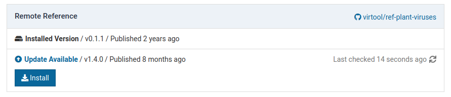

Click on the  **Install** button to install the update. The progress of the installation is shown below.

Once the installation is complete, you will see  **Up-to-date** under the **Remote Reference** heading.
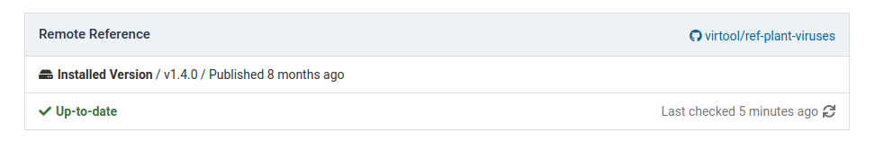

To check for other available updates click .

## Rebuild Index

After making an update on your remote reference there may be unbuilt changes on your index. To rebuild your index after the update click the **Indexes** tab on the detailed view page of your official reference.
 

Then click the blue **Rebuild the index** link. 

A **Rebuild Index** dialog box will appear that will list all the changes that are going to be made. 

To start making these changes and rebuilding the index, click  **Start** on the bottom of the dialog box.

Once the changes have been made, you will see a new index version that is now  **Active**.  
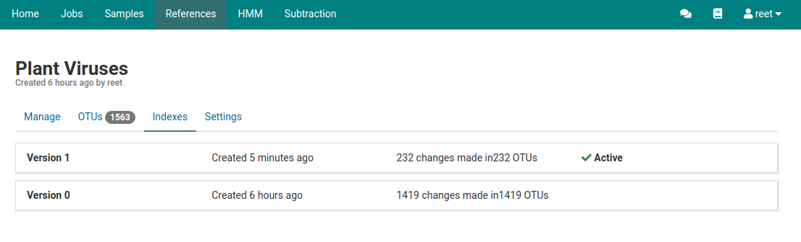

# Settings

## Source Types

Isolate names comprise a _source type_ and _source name_. Users can be forced to use certain source type values when creating isolates.

Source type restrictions do not affect viruses that are imported into the database.

Click the reference of interest under the **References** tab in the main navigation bar. In this example we will look at the **Clone of Plant Viruses** reference.
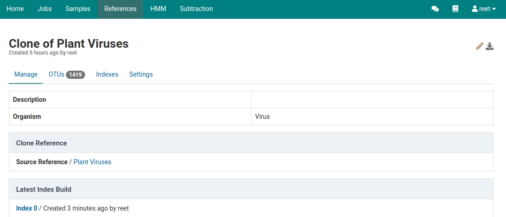

Click the blue **Settings** tab to see a list of **Source Types** that users are allowed to choose from to create an isolate.
 

## Adding a Source Type

Currenlty, the only source types that are allowed to be used in creating an isolate are **Isolate** and **Strain**.

To add a new source type, click on  **Enable** to disable the source type feature. 
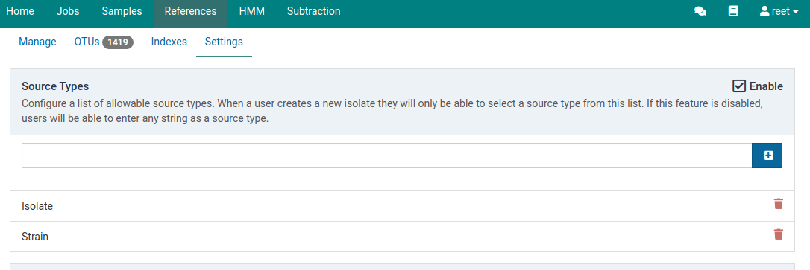

In the text bar that is now disabled, type the name of the new source type. 
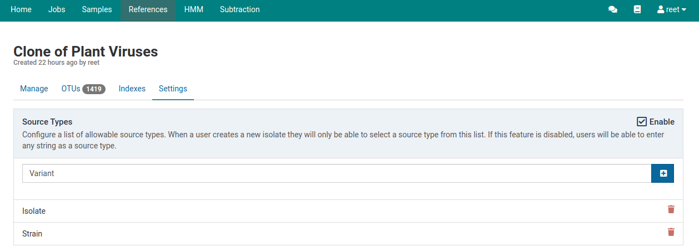

Click  to add the new source type to the list.
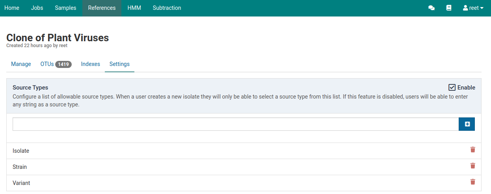

## Deleting a Source Type

Click on  **Enable** to disable the source type feature.

To delete a source type, click on  next to the source type you would like to delete. Here we will delete the source type **Variant**. 

Adding and deleting source types can also be done using the **Settings** link on the side bar under **References**.

## User Management

To add a new user that can manage a reference, click on **Add User** on the right of the **Users** heading. 
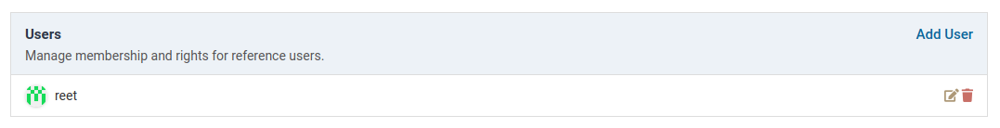

A dialog box like the one shown below will show up.
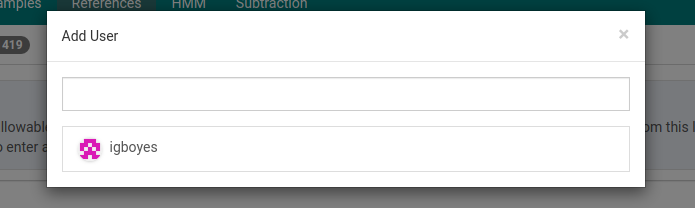

Click on the the user to add them on the users list.  

## Group Management

Similarly, to add a group click on **Add Group** on the right of the **Groups** heading.
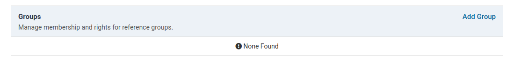

A dialog box like the one shown below will show up.

Click on the the group to add them on the groups list.  
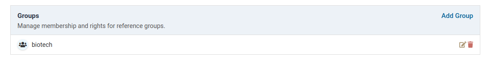

To remove a user or group from managing a reference, click on  next to the user or group you want to remove. Here we will remove the user we previously added.
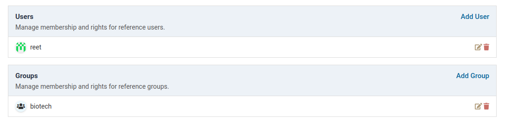

## Modifying Rights for Users and Groups

To modify rights for users and groups, click on  next to the user or groups whose rights you want to modify. A dialog box like the one below will show up.

Click on  next to the permissions you would like to assign the user or group and click **Add** 

# Internal Control

If you are using an internal control during your lab procedures, the control virus can be provided to Virtool. This setting is not currently in use, but may be used for scaling results or flagging irregular samples in the future.

## Selecting Internal Control

The internal control can be selected from the virus database by selecting the virus name in the dropdown text box.

## Disabling Internal Control

This can be done by clicking off the checkbox in the header of the **Internal Control** setting section. This has no effect for now.

