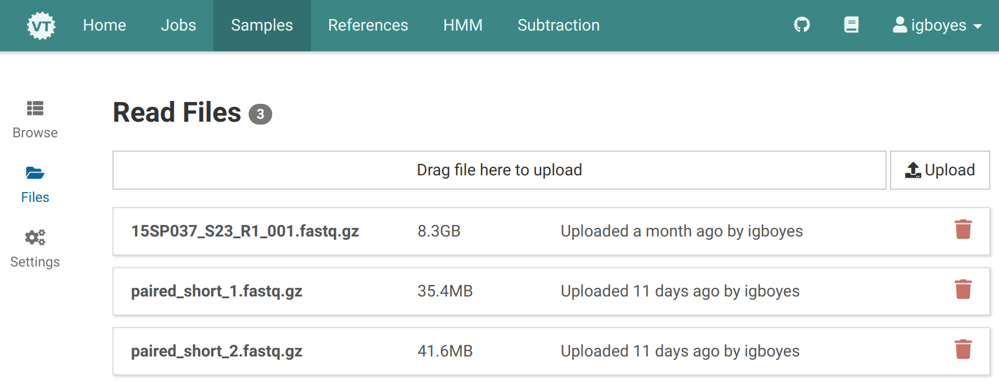
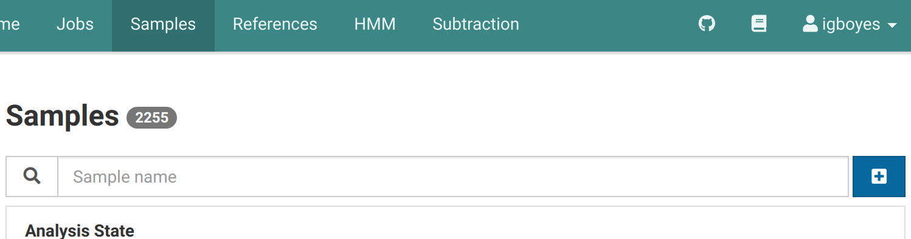
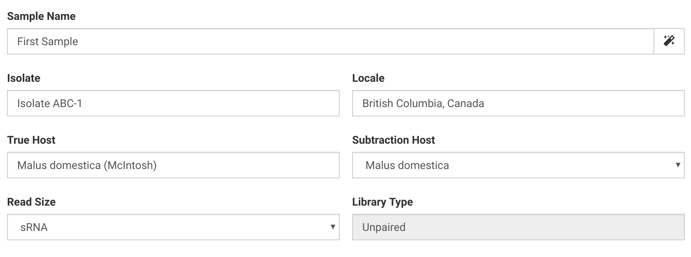
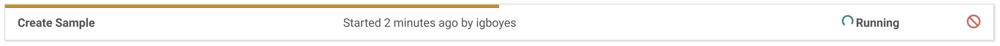
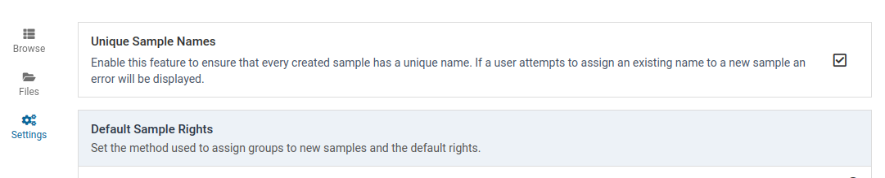
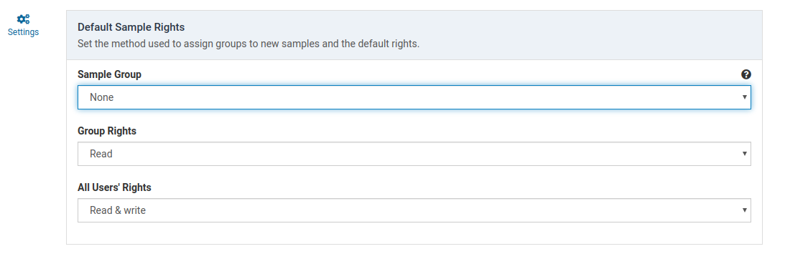

# Overview

Selecting _Samples_ on the top menu brings up the main sample managment view. Here, samples can be created, viewed, edited, analyzed, and removed.

# Browse Samples

Once you have imported one or more samples, they can be browsed in the main sample managment view.

## Searching

Using the search bar, samples can be filtered by their names or the name of the user that originally imported the sample.



It is also possible to search for samples based on the their analysis state.

For each workflow (Pathoscope, NuVs), the sample can have:

  - no analysis available
  - analysis in progress
  - at least one completed analysis
  
Set the checkboxes to match the profile of samples you are looking for.

Here is an example looking for samples matching the text query _14SP_ that have **no pathoscope analysis**.

Clicking on a sample item will navigate to a detailed description of the sample.

# Create a Sample

Upload your sample FASTQ files under **Samples | Files** if you haven't yet.

Click on the <i class="fas fa-plus-square"></i> button in the samples view to open the sample creation dialog.

The sample dialog will look something like this:

The sample creation dialog allows you to set optional metadata including _isolate_, _locale_, and _true host_.

You **must** set a unique sample _name_ and _read size_. _Read size_ can be set to either _normal_ or _sRNA_. Subsequent analysis workflows will run using significantly different parameters based on the _read size_ setting.

An appropriate _subtraction host_ must be selected. This should be the [subtraction genome](/docs/manual/ug_subtraction) most closely related to the _true host_ for your sample.

Here is an example using sRNA sequencing and _Malus domestica_ as a subtraction host:

Paired or unpaired FASTQ data can be used to create a sample.

Samples created from only one file are assumed to be unpaired. Paired samples must comprise two paired FASTQ files. **Interleaved FASTQ files are not currently supported**.

For paired data, make sure the file orientation labels (left and right) are correct before you create a sample. You can use the <i class="fas fa-retweet"></i> button too swap orientations.



Once required fields are populated and you have selected the files, click the <i class="fas fa-save"></i> **Save** button to create the sample. Your sample will immediately be listed in the samples list. However, it will take some time for the sample data to be imported and processed.

A job will appear in the **Jobs** view to track the process of creating your sample.

Your sample will look something like this when it is ready to use:

## What happens during sample creation?


Trimming was originally performed during sample creation.

Starting in 3.4.0, raw sample data is instead retained during sample creation. Trimming is deferred to each analysis run and trimmed data are cached to maintain performance.


Sample FASTQ files are copied into a new sample directory. The files will be compressed if necessary.

Quality information is calculated from the library using [FastQC](https://www.bioinformatics.babraham.ac.uk/projects/fastqc/) and committed to Virtool's database.

The FASTQ files and quality data are used for further analyses triggered by the user.

# Quick Analyze

Testing

# Rights

## Concepts {#concepts}

Virtool allows for fine control of the rights users have to view or modify samples.

### Management Levels

Rights can apply at four different levels.

|                  |                                                                                                                                                                    |
| ---------------- | ------------------------------------------------------------------------------------------------------------------------------------------------------------------ |
| _administrators_ |  Members of the special administrator group. These users have full read and write access to all samples as well as the ability to manage the rights on any sample. |
| _owner_          | The original sample creator. This user always has full read and write access to the sample as well as the ability to manage the rights on the sample.              |
| _group_          | The group that owns the sample. Read and write privileges can be independently set at this level.                                                                  |
| _all users_      | All users registered on the Virtool instance. Read and write privileges can be independently set at this level.                                                    |

### Group Ownership

Each sample can be owned by a specific user group. This allows multiple groups of diagnosticians or researchers to keep their data private or safe from one another while sharing a single Virtool instance.

Samples are not required to have an owner group. The group can be set to `None`. In this case, group rights settings will have no effect.

### Privileges

<table class="defs">
<tbody>

  The management level (_eg_. group, all users) cannot read or write the sample. included users will never see the sample in the sample management interface.  

  This privilege is useful for completely isolating samples between separate groups of users.



The management level (_eg_. group, all users) can only read the sample. The included users will see the sample in the sample management interface and be able to view its general information, quality, and analyses.

They will not be able to edit or remove the sample and they will not be able to create new analyses. The elements in the user interface associated with the described actions will be hidden.



The management level (_eg_. group, all users) can only read the sample. The included users will see the sample in the sample management interface and be able to view its general information, quality, and analyses.

They will also be able to edit and remove the sample and create new analyses.

</tbody>
</table>

## Management

The access rights for an existing sample can be easily changed by the sample owner or an administrator.

Access the rights management controls by clicking the <i class="fas fa-key"></i> tab in the sample detail view.

## Default Rights

Samples have their initial access rights configured when they are first created. How these rights are assigned can be configured in the adminstrative settings.

1. Go to the _Settings_ > _General_ view as an administrator.
   

# Settings {#settings}

## Unique Sample Names

By default, sample names must be unique to the sample manager. This prevents confusion with duplicately named samples. It is possible to disable this feature by clicking <i class="far fa-check-square"></i> **Enable**.

## Default Sample Rights

These settings determine how rights are assigned to newly created samples. Sample rights in Virtool are reminiscent of UNIX permissions.

### Sample Group

This determines how an owner group is applied to the sample when it is created.

|                 |                                                                                 |
| --------------- | ------------------------------------------------------------------------------- |
| _None_          | No group owner is assigned. Group rights do not apply                           |
| _Force Choice_  | The sample creator is forced to choose the owner group from their member groups |
| _Primary Group_ | The sample is automatically assigned the creators primary group                 |

### Group Rights

This setting determines how members of the owner group can interact with the sample. If the owner group is _None_, this setting has no effect.

### Group Rights

This setting determines how members of the owner group can interact with the sample. If the owner group is _None_, this setting has no effect. Rights can be changed by sample owners and administrators at any time.

|                |                                                                                                                     |
| -------------- | ------------------------------------------------------------------------------------------------------------------- |
| _None_         | Sample is not returned in searches and is not accessible by URL.                                                    |
| _Read_         | Sample is returned in searches and is viewable. All editing interfaces are disabled and analyses cannot be started. |
| _Read & Write_ | In addition to _Read_ rights, editing interfaces are enabled and analyses can be run.                               |

### All Users' Rights

This settings determines how any Virtool user can interact with the sample. Rights for all users behave exactly as they do in **Group Rights**. Rights can be changed by sample owners and administrators at any time.
