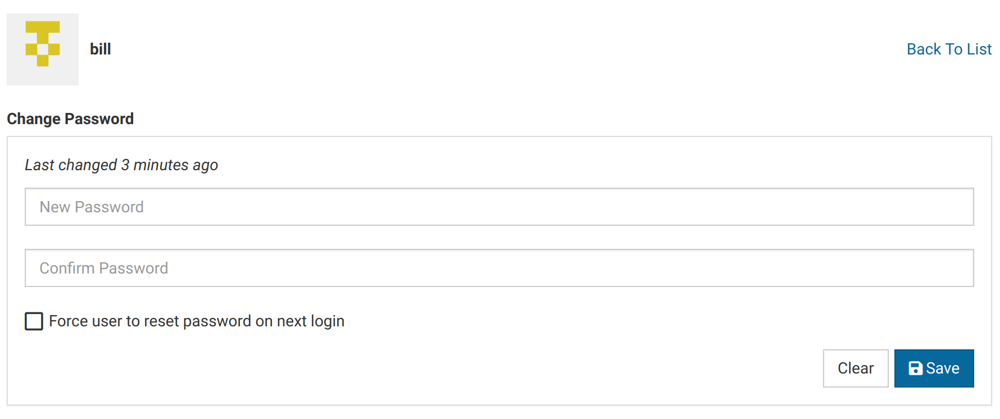

Virtool allows the creation of user accounts.

User accounts are used to control access to Virtool. They allow fine control of what actions users are allowed to perform and what resources they are allowed to access.

# Concepts {#users}

## Ownership

When users create new entities (_eg_. samples, references, jobs), their identities are automatically assigned

Users identities are tied to all actions they take and data they create. Samples are owned by their creating user by default. References are configured to extend full rights to their creator by default.

## Rights

Rights are properties of samples and references that control what actions specific users or user groups are allowed to perform on them.

## Permissions

Permissions are used to control what application-level actions users are allowed to perform. Permissions are inherited through group membership.

Administrators automatically pass all permission checks.

| Permissions          | Description                                  |
| -------------------- | -------------------------------------------- |
| `create_ref`         | can create references                        |
| `create_sample`      | can create samples                           |
| `modify_hmm`         | can add and modify hmm annotations and files |
| `modify_subtraction` | can add and modify subtractions              |
| `remove_file`        | can remove unused files                      |
| `remove_job`         | can remove cancelled and finished jobs       |
| `upload_file`        | can upload files                             |

## Groups

Groups allow setting rights and permissions for more than one user. Users that are members of a group will inherit its rights and permissions.

## Administrators

User accounts can either be administrative or limited.

Administrators automatically pass all permission and right checks. They can also access the [Administration Panel](/docs/manual/ug_administration).

# Create a User {#creating}

# Change a User's Password {#modifying}

Administrators can forcefully change a users's password.

This is useful when a user forgets their password or an old user account must be accessed.

1. Locate the _Change Password_ panel in the _Users_ tab.
   

2. Enter the new password.

# Change a User's Group Membership

Users' group membership can be changed easily.

This may affect what rights the user has one certain samples and references. It can also affect their application permissions.

1. Locate the _Groups_ panel in the _Users_ tab.
   

2. Click one of the group items to toggle membership in it.
   

3. Notice that the user's permissions are changed when group membership is toggled.
   <video autoplay muted loop><source src="toggle_group.mp4" type="video/mp4" /></video>

# Change a User's Primary Group

Samples a user creates can automatically be assigned to the creating user's primary user group.

How samples are assigned their initial user group is [configurable](/docs/manual/ug_samples/#settings). Depending on this application-level setting, users' primary group settings may be completely unused.

1. Location the _Primary Group_ panel under the _Users_ tab.
   ![Primary Group Panel](

# Creating Groups {#create_group}
